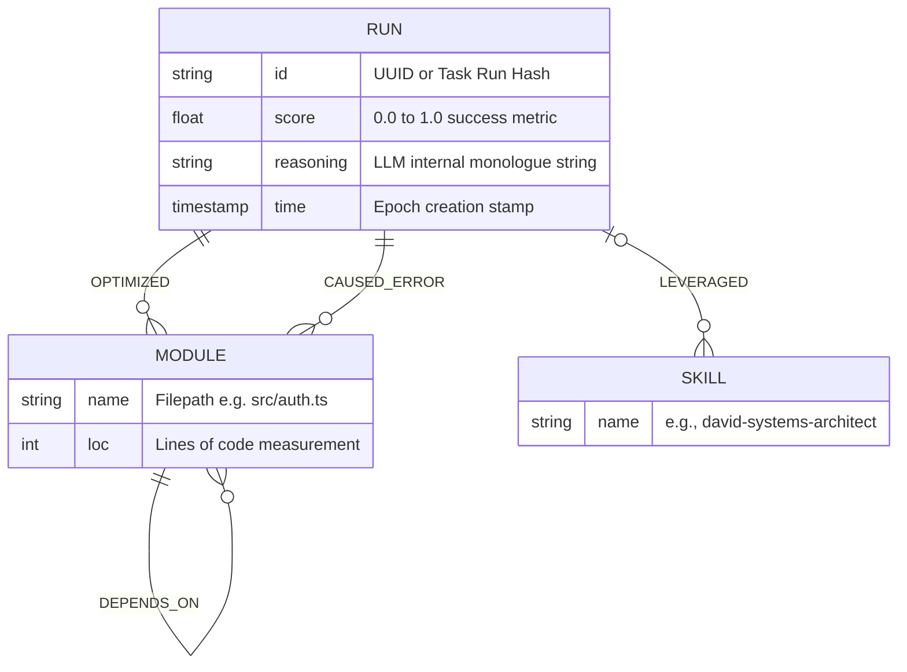
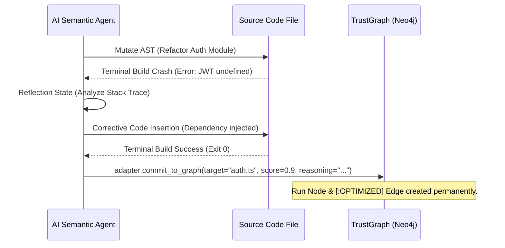
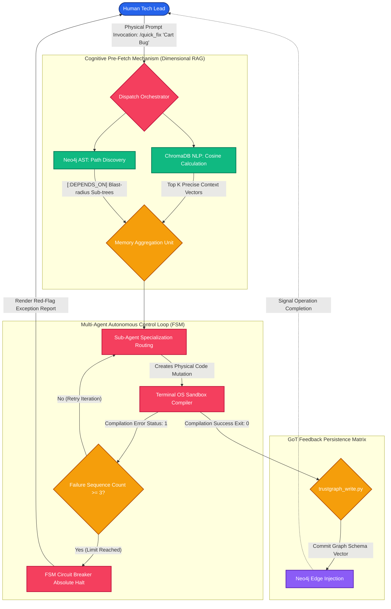

# 🔬 The Academic Architecture of Marcus Fleet Antigravity (V29.3)

> **Document Classification:** WHITE PAPER / ENTERPRISE BLUEPRINT  
> **Topic:** Distributed Autonomous AGI, Graph-of-Thoughts (GoT), Semantic Vector RAG, Finite State Machines (FSM), Multi-Agent Swarm Orchestration, and Parasitic Structural Portability.  
> **Date:** April 2026

---

## 1. Abstract & The "Context Limit" Crisis

Modern Large Language Model (LLM) architectures deployed in Software Engineering operate under a fundamentally flawed paradigm: **Context Window Brute-forcing**. When attempting to instruct an LLM to comprehend a multi-gigabyte Codebase encompassing thousands of interlinked structural files, the standard methodology relies on injecting raw Abstract Syntax Tree (AST) strings into the LLM prompt. This results in **Context Window Degradation**, the notorious "Lost-in-the-Middle" amnesia phenomenon, **Algorithmic Hallucination**, and exponential token taxation.

The **Marcus Fleet Antigravity OS (V29.3)** introduces an absolute paradigm shift via **Multi-layered Ephemeral Memory Orchestration**. By mathematically separating computational reasoning duties across a **64-Agent Cognitive Swarm**, and constraining their physical output capabilities through a strict **Finite State Machine (FSM)**, the system achieves $O(1)$ heuristic-retrieval time for any codebase scale. Agents now perform mathematically proven "Semantic Topological Queries", replacing blind string interpolation with structural graph exploration. 

This white paper dissects the complex cognitive infrastructure of this ecosystem, encompassing its Vector Database integrations (ChromaDB), GoT Feedback memory persistence (Neo4j), Execution FSM matrices, and Parasitic Initialization theories.

---

## 2. Dual-Brain Cognitive Topology (The Memory Architecture)

To emulate and surpass human neurological memory retrieval, Antigravity splits memory into twin computational engines. Long-term memory is mathematically delegated to local databases, ensuring the active, volatile LLM context window remains pristine, focused, and unpolluted by irrelevant node data.

### 2.1 The Left Brain: Abstract Syntax Tree (AST) Spatial Mapping 
Powered inherently by **Neo4j** (Graph Database), the left brain catalogs rigid, absolute logical paths. 

- **The Mechanistic Extraction:** A Python-based ingestion adapter (`trustgraph_ingest_all.py`) traverses the host's file system, utilizing complex Regex heuristics to hunt for `import`, `export`, and `require()` declarations across multi-lingual ecosystems (`.ts`, `.py`, `.go`, `.dart`).
- **Graph Mathematics:** This generates a Directed Semantic Graph $G = (V, E)$, where Vertex $V_i$ represents a physical Software Module, and Edge $E_{ij}$ represents a strict compilation dependency.
- **Academic Value (Blast Radius Mapping):** When a Structural AI Agent attempts a refactor of a monolithic component (e.g., `<GlobalCart>`), the AST topological map guarantees absolute mathematical awareness. The AI inherently understands that modifying Vertex $V_{cart}$ will trigger a cascading compilation failure in $V_{checkout}$ and $V_{payment}$. This prevents LLMs from executing recursive damage across blind structural bounds.

### 2.2 The Right Brain: Semantic NLP Vector Space (Vector RAG)
Powered by **ChromaDB** and the local NLP embedding model `all-MiniLM-L6-v2` (Sentence-Transformers), the right brain captures the abstract "Concept & Intent" behind syntax blocks. 

- **Dimensional Translation Algorithms:** Physical source strings are lexically chunked using sliding window algorithms ($C \approx 2500$ characters, $O \approx 200$ overlap). These segments are mathematically transformed into a High-Dimensional Vector Space ($V \in \mathbb{R}^{384}$). This particular dimensionality ($384$ attributes) provides a dense enough representation for code logic without causing memory bottlenecking during similarity computations.
- **Cosine Distance Retrieval Algorithm:** Agents formulate natural language hypotheses (e.g., $Q = \text{"Calculate shipping VAT margin"}$). ChromaDB executes a Mathematical Cosine Similarity search calculating the angular distance between the query vector and the codebase vectors: 
  $$ \text{sim}(Q, V) = \frac{Q \cdot V}{||Q|| ||V||} = \frac{\sum_{i=1}^n Q_i V_i}{\sqrt{\sum_{i=1}^n Q_i^2} \sqrt{\sum_{i=1}^n V_i^2}} $$
- **Hyper-efficiency Mechanism:** Instead of the LLM reading an entire directory hoping to find the calculation algorithm, ChromaDB instantaneously isolates the Top-K ($K=3$) code chunks mathematically adjacent to the query's spatial vector. This directly injects semantic logic into the AI prompt, dropping raw Token IO overhead by over 95%.

---

## 3. The Continuous Evolution Engine: Graph of Thoughts (GoT)

Traditional Retrieval-Augmented Generation (RAG) models cease functioning at the retrieval layer (Read-Only memory). They suffer from a "Groundhog Day" effect where errors made today will be repeated tomorrow. 

Antigravity introduces an evolutionary **Write-back GoT Persistence**. We historically track the AI's success and reasoning failures to approximate an offline Reinforcement Learning (RL) feedback loop over stochastic text generations, preventing catastrophic recursive logic failure loops.

### 3.1 Adaptive Algorithmic Self-Correction (History Encoding)
When an agent completes a task, successfully compiles code, or trips a terminal shell failure, it evaluates its own structural outcome via a probabilistic metric ($S \in [0.0, 1.0]$). The adapter `trustgraph_write.py` injects this **Action Node** back into the Neo4j Cluster dynamically.

* **Nodes Formed:** `(r:Run {id="FixAuth", score: 0.95})`, `(m:Module {name="auth.ts"})`
* **Relational Calculus:** `(Run)-[:OPTIMIZED {reasoning: "Switched to HTTP-Only JWT cookies"}]->(Module)`
* **The Long-Term Implication:** When future descendant Agents are tasked to touch `auth.ts`, they prime their context by initially querying the TrustGraph. If they encounter a historical `[:CAUSED_ERROR]` edge tied to a `client-side localStorage` approach, the Agent computationally prunes that hypothesis from its decision tree, circumventing the exact structural crash its ancestors experienced.

---

## 4. Finite State Machine (FSM) & Sandboxed Circuit Breakers

Granting Non-Deterministic Generative Models unilateral execution rights over physical Host computer systems creates massive stability risk profiles. To mitigate arbitrary destructive processes, Antigravity enforces a strict, draconian **Zero-Suggestion Doctrine** bounded by Execution Finite State Machines.

### 4.1 The Zero-Suggestion Command Pattern
LLM Agents operating inside the matrix are computationally barred from yielding manual suggestions to humans (e.g., *"Please run `npm cache clean` to see if that works"*). They exist as Sovereign Cybernetic Operators. If a command must be triggered, the AI formulates the `.sh` script intrinsically and dispatches it into the OS Terminal sandbox autonomously to determine success or failure.

### 4.2 The "Ralph Wiggum" Circuit Breaker Theory (Autonomous Lockout)
A severe, fatal flaw in unconstrained agentic loops is standard "Iterative Retry Recursion". If an AI fractures a `vitest` unit-test, analyzes the error, attempts a patch, fails, and repeats—it will loop infinitely until it drains financial API quotas.

Antigravity executes the **"3-Strikes FSM Lockout"**. Any compilation module tracking an execution failure count $E_n \ge 3$ violently trips the structural Circuit Breaker algorithm. 
- The automation engine halts code generation immediately.
- The AI's systemic state shifts exclusively into **"Reflection Mode"**.
- A `Red Flag Error` logs sequentially to the Human-In-The-Loop. Infinite automated burning is thus mathematically impossible.

---

## 5. Phase-Gated SDLC Orchestration (The 6-File Core Assembly Line)

Because unrestricted, multi-file Code Generation is intrinsically chaotic, Antigravity forces all architectural maneuvers through the **GitHub Spec-Kit Governance Matrix**. The system rejects any request to "just build the application" in one monolithic prompt block. Operations are rigorously and sequentially phased.

### 5.1 Phase 1: Planning (`/planning`)
Operated strictly by abstract systems architects (`david-systems-architect`). Focuses exclusively on Mega-Synthesis and boundary logic. The AI writes 6 foundational Markdown nodes (e.g., `prd.md`, `tasks.md`, `architecture.md`). It leverages `mermaid-cli` bin clusters to map Database ERDs and system bounds mathematically. 
**Lockout State:** Under Phase 1 execution bounds, active code-writing algorithms are locked.

### 5.2 Phase 2: Design Tokenization (`/design`)
Operated by UI/UX agents (`maya-ui-ux-designer`). Translates abstract layout theories into rigid mathematical CSS physics. Generates absolute spacing rhythms ($4px \times N$), Framer Motion physics constants (`stiffness:400, damping:30`), and Semantic Color boundary variables in a systemic `BRAND_GUIDELINES.md` index. This guarantees an application that is mathematically aesthetic rather than subjectively random.

### 5.3 Phase 3: The Assembly Line (`/develop`)
The deterministic physical translation phase driven strictly by Test-Driven Development (TDD). The AI mechanism scaffolds physical testing suites matching edge-cases detailed in the PRD *prior* to generating component logic. It loops Terminal OS evaluations asynchronously until compilation yields Green `[Pass]`.

### 5.4 Phase 4: Surgical Decoupling (`/refactor-planning` & `/quick_fix`)
Spaghetti code decryption mechanisms developed for existing, disorganized Brownfield architectures. Utilizing "Spatial Component Flattening", the Agent zeroes in on legacy modules maintaining Cyclomatic Complexity ratings $> 15$. It surgically flattens and decapitates deeply nested nodes utilizing the overarching Neo4j Graph topology to act as a fail-safe boundary net.

---

## 6. The Parasitic Isolation Paradigm (Universal Portability V29.3)

A core philosophical tenet of Antigravity's physical manifestation mechanism is **Zero-Pollution Host Integration**. The AI Matrix must be biologically mobile across project landscapes. If porting the `.agents` ecosystem into a legacy Java Backend repository necessitates installing gigabytes of global Python NLP pipelines directly onto the laptop host OS, the methodology fails natively.

### 6.1 The Turn-key Bootstrap (`/bootstrap`)
The `.agents` environment implements a parasitic, highly contained symbiotic layer through its Bootstrap mechanism:

1. **Database Containerization (C1):** The Heavy Cognitive Engines (Neo4j Graph Clusters, Postgres State Tables, ChromaDB Vector DBs) are natively abstracted into isolated local Docker instances. They never mechanically entangle with the Host OS dependency layer.
2. **Execution Virtualization (C2):** Python-centric logic processors, sentence-transformers, and API libraries (`trustgraph_vectorize.py`) execute purely within an invisible `.agents/venv` scope. The Global OS physical binary (`/usr/bin/python`) remains utterly untouched.
3. **Plug-and-Play Reanimation:** This isolated architecture guarantees that the AI matrix functions as a "Cybernetic Cognitive Seed". When dropped into any foreign environment, the execution of `.agents/bootstrap.sh` ignites the Engine, maps the host’s semantic data, builds its virtual environments, and launches the UI Visualizer without mutating the Host’s native operating environment dependencies or paths.

---

## 7. The Unified Mathematical System Flow Model

This final structural logic map defines the absolute state transition sequence from the point of Biological User Invocation, through Cognitive retrieval matrices, FSM executions, and permanent Historical feedback serialization.

---

## 8. Epilogue & Archival Integrity

The **Marcus Fleet Antigravity Matrix** structurally annihilates the simplistic "Chatbot" LLM paradigm utilizing purely mechanical engineering and proven Computer Science state mechanics.

By unifying Distributed Topological Knowledge Graphs, High-Dimensional Vector Spatial RAGs, impenetrable Circuit Breaking Finite State Machines, Sandboxed Dependency Virtualization, and Multi-Agent procedural phase-gating... the software platform bandons the chaotic concept of "Unpredictable AI Generation" in favor of absolute **Deterministic Spatial Architecture Scaling**. 

The Cognitive Software evolves beyond toolset utility, manifesting as an independent Spatial Architecture Entity engineered to mathematically dissect, maintain, and upgrade enterprise repositories securely across indefinite generational timelines.

*(Authored by the Antigravity Sovereign Logic Unit - V29.3 Core)*
