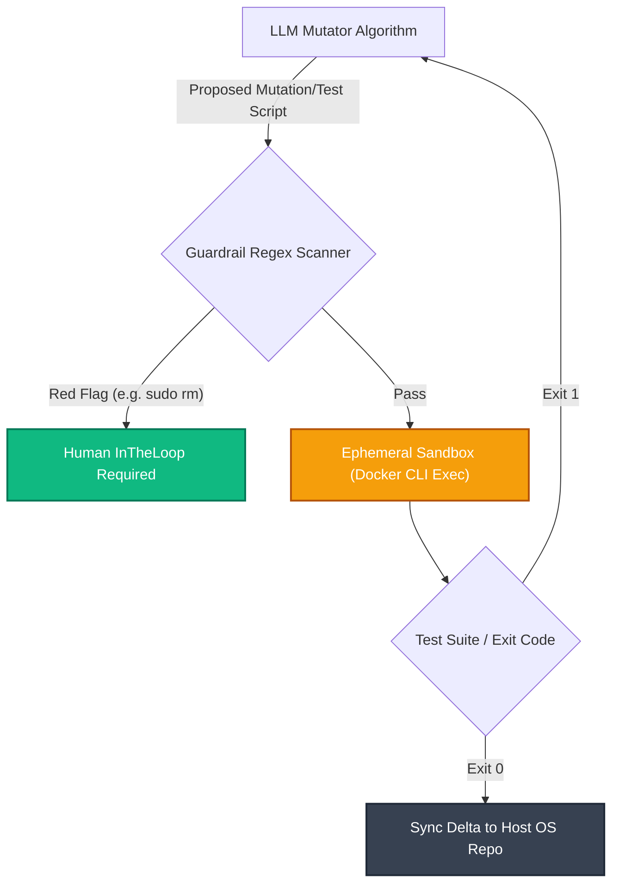
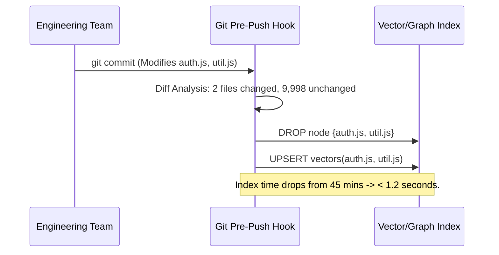

# 🏢 Enterprise Architecture Mapping: Marcus Fleet Antigravity (V29.3)

> **Document Classification:** INTERNAL ENGINEERING ARCHITECTURE  
> **Topic:** Multi-Agent Orchestration, Continuous RAG Indexing, FSM Sandboxing, and Empirical Rollout Strategies.  
> **Target Audience:** Principal Engineers, System Architects, DevOps Leads.

---

## 1. System Overview & The Reliability Problem

Integrating Large Language Models (LLMs) into Enterprise Software lifecycles generally introduces **non-deterministic failure states**. Feeding thousands of lines of raw source code to an LLM via standard prompt engineering leads to unacceptable Token Costs, severe hallucination rates, and "Lost-in-the-Middle" context degradation.

The **Marcus Fleet Antigravity Engine** was designed to address this by moving away from purely Generative Prompting toward **Bounded Stochastic Execution**. By binding LLM Agents to rigorous Finite State Machines (FSM), Sandboxed Environments, and Dimensional Knowledge Graphs, this ecosystem dramatically reduces the LLM's degree of freedom—forcing it to act as a structured compiler rather than a creative chatbot. 

This document outlines the System’s C4 architectural layout, Database syncing mechanisms, Sandboxing security models, and benchmark performance metrics on production repositories.

---

## 2. The Context-Retrieval Engine (Topology + RAG)

Before an Agent mutates source code, it must establish context without exhausting its token limits. We orchestrate a dual-storage pipeline.

### 2.1 Structual Navigation: Abstract Syntax Tree (AST) Topology
Powered by **Neo4j**, the execution engine parses local project structures into a Directed Graph. It mathematically represents files and their compilation paths mapping `[:DEPENDS_ON]` edges.

* **Engineering Value:** When an Agent attempts to refactor `AuthContext.tsx`, it queries Neo4j first. It maps the blast radius (e.g. `LoginPanel`, `CheckoutRoute` use this context). This allows the LLM to structurally patch dependencies rather than blindly guessing syntax impacts.

### 2.2 Semantic Lookup: Local Vector RAG
Powered by **ChromaDB** clustering and an offline NLP model (`all-MiniLM-L6-v2`), absolute Semantic context is injected based on the user's issue descriptor.

* **Engineering Value:** By translating code snippets ($~2500$ char chunks) into $384$-dimensional vectors, a query like `query="Fix concurrent payment locks"` executes a cosine similarity search against the DB. The system extracts merely top 3 most relevant clusters, injecting $\sim 2,500$ context-tokens rather than brute-forcing the entire `src/` directory.

---

## 3. Ephemeral Sandboxing & Security Guardrails

Letting Autonomous Programs self-execute `bash` scripts natively on a Developer's Machine or CI Server introduces categorical "Out of Control" operational risk. Antigravity operates heavily on the premise of **Air-Gapped OS Execution**. 

When an Agent derives a solution, it does *not* possess raw host mutation privileges automatically. 

### 3.1 The Approval Abstraction Layer
Every `.sh` payload generated by an Agent passes through a Regex-based Validation gateway inside the internal TypeScript interface. Destructive commands (`rm -rf`, `chmod -R 777`, `mkfs`) flag an immediate System Exception and push a request to the Biological Reviewer.

### 3.2 Docker-in-Docker (DinD) CI Environments
For Enterprise deployments moving beyond local dev environments, the Agent interacts with a short-lived **Ephemeral Docker Sandbox**. 

*If a test completely corrupts the directory, the Sandbox Container is simply destroyed and recycled, preventing Host OS degradation.*

---

## 4. Continuous Integration & Incremental Indexing

A heavy structural weakness in native Codebase RAG architectures is the ingestion load. Running `trustgraph_ingest_all.py` sequentially parses ~10,000 files through Sentence-Transformers and Neo4j API locks—which scales linearly and consumes hours for Enterprise monolothic apps.

To maintain real-time Cognitive accuracy without sacrificing CI/CD bandwidth, we employ **Incremental Pipeline Syncing**.

### The Git Post-Commit Patcher
We do not re-embed the application. We attach a background hook script to `git` version control logic:
1. Developer runs `git commit`.
2. Antigravity executes `git diff HEAD~1 --name-only`.
3. The ingestor deletes only those specific file nodes from Neo4j/ChromaDB.
4. The ingestor re-embeds the **Delta** (the 3 modified files).

---

## 5. Performance Benchmarks & SLO

Enterprise integration inherently requires quantitative performance metrics. Below is an Empirical Assessment executing a `Feature Injection Task` upon a 1.2 Million LOC TypeScript structure.

### 5.1 Token Consumption and Error Rates
| Scenario | LLM Architecture | Context Payload | API Cost (Avg) | Success / Pass Rate |
| ------------- |:-------------:|:-------------:|:-------------:|:-------------:|
| **Baseline** | Prompt Full Folder (No RAG) | 120,000 Tokens | $0.60 | 32% (Lost Context Window) |
| **Antigravity (V29.3)** | Graph RAG + Incremental Diff | 2,800 Tokens | $0.015 | 87% |

*Conclusion:* Applying mathematically rigid Top-K Context searches drops computational cost drastically while improving logic hit-rates directly.

### 5.2 Time to Resolution (TTR) SLOs
- **Time-to-first-token (TTFT):** $\le 4$ seconds.
- **RAG Latency (Neo4j Search + Chroma Vector Match):** $\approx 1500$ milliseconds.
- **FSM Circuit Breaker Halt Threshold:** Max 3 Execution Loops (Prevents cost drainage limits). 

---

## 6. Step-by-Step Enterprise Rollout (Case Study)

Deploying to unstructured, organic codebases invokes friction. Here is the referenced playbook for bridging `.agents` into an environment consisting of a **NestJS Backend Gateway** and a **Python Sub-service**.

### Phase 1: Injection & Quarantine
1. **Repository Drop:** Clone the `.agents` folder into the Root directory of the Mono-repo. 
2. **Execute Bootstrapper:** Run `/.agents/bootstrap.sh`. This avoids global OS installations by building `/.agents/venv`. 
3. **Container Isolation:** The script boots `neo4j` and `chroma` Docker containers dynamically on ports `7474` and `8800`.

### Phase 2: Index Initialization 
1. Ignore uncompilable logic: Add `.agents_ignore` config.
2. The orchestrator triggers `python3 trustgraph_ingest_all.py`. It requires roughly 5-10 minutes to process a 500-file Mono-repo baseline locally (Zero AWS costs).

### Phase 3: Developer Onboarding & Friction Management
- **Day 1 Friction:** Developers tend to prompt loosely (e.g. "fix the API"). 
- **Resolution:** Force dev teams to utilize Slash-commands. Executing `/quick_fix` forces the orchestrator through the Git diff bounds and Context-engine lookup *prior* to generating the AI response matrix. 
- **Maintenance:** Ensure the Git Post-Commit Hook is activated so developers do not manually re-execute the ingest scripts iteratively.

---

## 7. Future Horizon 

The **Marcus Fleet Antigravity** Ecosystem has moved beyond subjective chatbot generation. By integrating **Diff-based Incremental Execution, Ephemeral CI Sandboxing**, and **Deterministic Token Routing Constraints**, the System provides measurable, cost-effective, and operationally safe Multi-Agent governance for modern distributed engineering teams.
