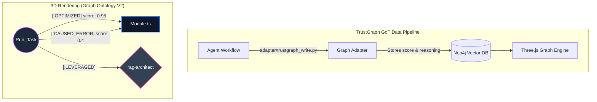

<div align="center">
  <h1>🚀 Marcus Fleet Enterprise Matrix (.agents)</h1>
  <p><strong>The Academic Distributed AGI Core for Feature-Sliced Design, Semantic RAG Routing, and Deterministic Autonomous DevOps.</strong></p>

  
  
  
  

  <p>
    <a href="#-enterprise-overview-v320">Overview</a> •
    <a href="#-system-architecture-topology">Architecture</a> •
    <a href="#-spec-driven-governance-layer">Spec Governance</a> •
    <a href="#-installation-provisioning--universal-portability-v320">Provisioning</a> •
    <a href="#execution-commands">Execution</a> •
    <a href="#academic-contributions">Contributions</a> •
    <a href="#sponsorship--support">Support/Donate</a>
  </p>
</div>

---

## 🔬 Enterprise Overview (V32.0)

The **Marcus Fleet Enterprise Matrix** represents a paradigm shift in Large Language Model (LLM) orchestration frameworks explicitly built for Enterprise Mono-repos. Distancing itself from monolithic unstructured chat, **Version 32.0** operates as a deterministic harness core bridging **Validated Slash-Command Contracts**, **Spec-Driven Governance**, **Deep Research Planning**, **Epic-First Development Ledgers**, **Brownfield Doc Reconciliation**, **Continuous Documentation Sync**, **Ephemeral Sandboxed Execution**, and **CI-ready release gates**.

By binding Agents to rigorous Finite State Machines (FSM) and forcing OS interactions through secure Ephemeral Sandboxes, the Antigravity ecosystem mitigates catastrophic automated failures, token exhaustion, and context window atrophy in codebases exceeding 1 million lines.

### The Bounded Stochastic Execution (Air-Gapped Sandbox & Multi-Tenant IAM)
The core system enforces execution guardrails. No LLM interfacing with the `.agents` ecosystem possesses authorization to run destructive CLI instructions arbitrarily. The matrix is strictly compelled to funnel high-risk bash generation through the `.agents/run_sandboxed.sh` wrapper, which rejects shell metacharacter chaining, applies an explicit command allow-list, and observes exit states to trigger OpenTelemetry Audit logs. Furthermore, all physical architecture alterations are gated by `.agents/iam_verify.sh` to enforce **Multi-Tenant Identity** isolation and CAB Role-Based Access Control (RBAC).

---

## 🏛️ System Architecture Topology

The following C4-styled data-flow layout outlines the cognitive processing, lexical retrieval routing, and execution mechanisms.


### 🧠 TrustGraph: Graph of Thoughts (GoT) RAG Schema

The most potent element of the Antigravity Brain is the Neo4j backend **TrustGraph**. As agents act, succeed, or fail, they emit Cognitive Vectors mapping their thought processes back into the knowledge graph. This self-healing topological memory is visualized natively via our **3D Particle Engine**.



---

## 🧾 Spec-Driven Governance Layer

Marcus Fleet now includes a local Spec Kit-inspired lifecycle for non-trivial
agent work. This layer is additive: it does not replace the skill swarm,
TrustGraph, O11y, sandboxing, or legacy `/planning` workflow.

Core artifacts:

```text
.agents/
├── memory/
│   └── constitution.md              # Stable principles and governance gates
├── templates/                       # Feature artifact templates
├── scripts/
│   ├── create_feature_spec.py        # Creates .agents/specs/NNN-slug/
│   ├── validate_specs.py             # Validates required files and gates
│   ├── validate_planning_research.py # Validates deep research ledgers
│   ├── audit_development_docs.py     # Inventories code/docs for brownfield reconciliation
│   ├── validate_design_readiness.py  # Validates `/design` planning inputs before Phase 2
│   ├── validate_design_outputs.py    # Validates `/design` output artifacts after Phase 2
│   ├── validate_marcus_init_outputs.py # Validates `/marcus_init` scaffold outputs
│   ├── validate_refactor_planning_readiness.py # Validates `/refactor-planning` brownfield readiness
│   ├── validate_refactor_planning_toolchain.py # Validates `/refactor-planning` local toolchain prerequisites
│   ├── validate_refactor_planning_outputs.py # Validates `/refactor-planning` closeout artifacts
│   ├── sync_project_mcp.py           # Publishes bundled MCP servers into project-root .mcp.json
│   ├── check_mcp_health.py           # Reports core vs optional MCP readiness and missing env keys
│   ├── print_update_brief.py         # Prints release highlights and onboarding suggestions after install/update
│   ├── run_harness_preflight.py      # One-command bootstrap or execution preflight
│   ├── run_harness_postflight.py     # One-command execution closeout replay
│   ├── validate_harness_contract.py  # Verifies docs/workflows/scripts stay aligned
│   ├── create_development_docs.py    # Creates /docs/development scaffolds
│   ├── validate_development_docs.py  # Validates code-phase knowledge notes
│   ├── create_doc_sync_note.py       # Creates per-code-slice sync notes
│   └── validate_doc_sync.py          # Validates docs kept pace with code
└── specs/
    └── 001-marcus-spec-foundation/   # First validated feature workspace
```

Typical usage:

```bash
python3 .agents/scripts/create_feature_spec.py "Feature Name" --prompt "Operator goal"
python3 .agents/scripts/validate_specs.py --feature .agents/specs/001-feature-name
python3 .agents/scripts/validate_execution_readiness.py --root . --feature .agents/specs/001-feature-name
```

### Script Invocation Map

Scripts under `.agents/scripts/` are not loaded magically. Agents understand and
run them only when all three layers agree:

- A workflow names the script and the exact phase where it must run.
- A validator or readiness gate fails if that script's artifact is missing or stale.
- A downstream artifact or workflow explicitly consumes the script output.

Current core map:

The canonical per-command mapping lives in `.agents/SLASH_COMMAND_REGISTRY.md`.
When README, `USAGE_GUIDE.md`, workflow files, or script chains change, rerun
`python3 .agents/scripts/validate_command_surface.py --root .` and treat any
failure as a public contract regression.

- `/marcus.specify`
  - `create_feature_spec.py`
  - Creates `.agents/specs/<feature-id>/` from templates.
- `/marcus.tasks`
  - `build_execution_brief.py`
  - Distills `spec.md`, `plan.md`, `tasks.md`, `verification.md`,
    `quickstart.md`, `agent-routing.md`, plus relevant `docs/development/`
    notes into `execution-brief.md`.
  - Optional dynamic inputs:
    `--changed-files "<comma-separated-files>"` and
    `--failing-evidence "<bounded-failure-summary>"` to foreground the
    current slice without widening default reads.
- `/marcus.review`
  - `build_execution_brief.py`
  - Rebuilds the brief after review findings changed scope or evidence.
  - Reuse `--changed-files` and `--failing-evidence` when the review narrows
    the active slice to specific files or failures.
- `/design`
  - `validate_design_readiness.py`
  - `validate_design_outputs.py`
  - Fails Phase 2 when planning inputs are missing or design artifacts are not produced.
- `/marcus_init`
  - `validate_marcus_init_outputs.py`
  - Fails project bootstrap closeout when the scaffolded workspace is missing required root artifacts.
- `/refactor-planning`
  - `validate_refactor_planning_readiness.py`
  - `validate_refactor_planning_toolchain.py`
  - `validate_refactor_planning_outputs.py`
  - Fails brownfield refactor planning when docs are unreconciled or closeout artifacts are missing.
- Execution-brief freshness gate
  - `validate_execution_brief_freshness.py`
  - Fails when `execution-brief.md` is older than the feature spec artifacts or
    the matched `docs/development/` notes.
- Harness bootstrap preflight
  - `run_harness_preflight.py --phase bootstrap`
  - Replays MCP sync, MCP health, update brief, harness freshness, and setup checks in one command.
- Harness execution preflight
  - `run_harness_preflight.py --phase execution`
  - Replays command-surface, routing, harness freshness, and optional feature readiness checks before edits.
  - Appends a structured JSONL event to `.agents/logs/harness/preflight.jsonl`
    with per-command status and the first failing command when present.
- Harness execution postflight
  - `run_harness_postflight.py --phase execution`
  - Replays command-surface, routing, harness freshness, repo contract audit, and optional feature readiness checks before closeout.
  - Appends a structured JSONL event to `.agents/logs/harness/postflight.jsonl`
    with per-command status and the first failing command when present.
- Repo-wide harness freshness gate
  - `validate_harness_contract.py`
  - Fails when README, USAGE, workflows, and wrapper scripts disagree about the supported harness chain.
- `/develop`
  - Consumes `execution-brief.md` first, then reads only the exact
  `docs/development/` notes listed there for the current slice.
- Readiness gate before `/develop`
  - `validate_specs.py`
  - `validate_execution_readiness.py`
- Routing regression gate
  - `validate_routing_regression.py`
- Slash-command surface gate
  - `validate_command_surface.py`
  - Fails when README, `USAGE_GUIDE.md`, `.agents/SLASH_COMMAND_REGISTRY.md`,
    and workflow files no longer agree about the published command chain.
- Code-phase ledger creation and sync
  - `create_development_docs.py`
  - `create_doc_sync_note.py`
  - `validate_development_docs.py`
  - `validate_doc_sync.py`
- Repo-wide spec contract audit
  - `audit_feature_contracts.py`
  - Reports which feature workspaces are current-contract vs legacy and which
    ones still fail validation.

If a new script is added but not wired into at least one workflow, one gate, and
one consumed artifact, treat it as dormant infrastructure rather than active
agent capability.

The strict workflow sequence is:

```text
/marcus.specify -> /marcus.clarify -> /marcus.plan -> /marcus.tasks -> /marcus.review -> /marcus.rehearse -> /marcus.verify
```

Command-surface contract:

- `/marcus.specify`
  - must create the feature workspace through `create_feature_spec.py`
- `/marcus.plan`
  - must end with a passing `validate_specs.py` for the target feature
  - must not claim execution readiness yet
- `/marcus.tasks`
  - must build `execution-brief.md` through `build_execution_brief.py`
  - must end with passing:
    - `validate_specs.py`
    - `validate_execution_brief_freshness.py`
    - `validate_execution_readiness.py`
- `/marcus.review`
  - must rebuild the brief if review findings change scope, evidence, or docs-to-read
  - must end with the same three passing gates as `/marcus.tasks`
- `/marcus.rehearse`
  - must refresh the brief again if rehearsal changes release signals or the active slice
  - must preserve a passing readiness gate before `/develop`
- `/develop`
  - should run `python3 .agents/scripts/run_harness_preflight.py --root . --phase execution --feature .agents/specs/<feature-id>` before behavior-changing edits
  - must read `execution-brief.md` first
  - must treat the brief's `Task Shape Decision`, `Required Reads`,
    `Forbidden Default Reads`, and `Expansion Triggers` as the current routing contract
  - must read only the `docs/development/` notes named by that brief before widening context
  - must stop if readiness or brief freshness fails
  - should run `python3 .agents/scripts/run_harness_postflight.py --root . --phase execution --feature .agents/specs/<feature-id>` before final closeout
- `/quick_fix`
  - if tied to a feature-scoped workspace, should run `python3 .agents/scripts/run_harness_preflight.py --root . --phase execution --feature .agents/specs/<feature-id>` before edits
  - if tied to a feature-scoped workspace, must read `execution-brief.md` first
  - must use the same brief subsections as a binding context contract
  - must stop if that workspace fails `validate_execution_readiness.py`
  - if behavior changes, must still create a sync note and pass `validate_doc_sync.py`

If a slash command in this public surface does not trigger its required script
and gate chain, treat that command as incorrectly wired.

Harness wrapper rule:

- `run_harness_preflight.py` is the preferred replayable entrypoint for bootstrap
  and behavior-changing execution setup.
- `run_harness_postflight.py` is the preferred replayable entrypoint for
  execution closeout.
- `validate_harness_contract.py` is the repo-wide freshness gate that proves the
  public docs and workflow chain still match the supported wrapper commands.
- Wrapper runs write additive JSONL logs under `.agents/logs/harness/`; treat
  those files as local observability evidence, not as a remote telemetry system.

This gives agents a concrete contract before code changes: `spec.md` captures
what and why, `plan.md` captures how, `tasks.md` captures ownership, and
`verification.md` captures evidence and release disposition.

Professional POC loop:

- `spec.md` must record review rounds before planning proceeds.
- `plan.md` must define the smallest credible POC slice, stop conditions, and
  proceed conditions.
- `tasks.md` must include review-loop tasks, not only implementation tasks.
- `verification.md` must include independent review findings and a final
  `GO`, `GO WITH RESIDUAL RISK`, or `NO-GO` recommendation.
- `quickstart.md` must describe the exact rehearsal path a reviewer can replay.

Execution is intentionally downstream of these artifacts. Behavior-changing work
must stop when the feature workspace is shallow, placeholder-heavy, or fails
validation. The `.agents` package is designed to act as a docs-first governance
and execution-control layer, not a prompt bundle that improvises missing
requirements at runtime.

Routing regression discipline:

- Use [ROUTING_REGRESSION_CHECKLIST.md](/Users/lequynhanh/marcus-fleet/.agents/ROUTING_REGRESSION_CHECKLIST.md) when changing `/develop`, `SKILLS_INDEX.md`, or routing-heavy skills.
- A release is not trustworthy if a narrow UI task drifts into Supabase, SQL,
  analytics, or infrastructure reads without explicit evidence.
- Use `python3 .agents/scripts/validate_routing_regression.py --root .` as the
  machine-checkable gate before trusting those routing changes.

### Backward Compatibility Contract

V30 is additive. The historical slash-command surface remains valid:

- `/planning` still emits the legacy `/docs` planning files.
- `/design` still consumes `/docs/planning/*` and emits visual guidance.
- `/develop` still consumes approved `/docs` artifacts before code generation.
- `/quick_fix` remains the low-latency path for localized fixes.

The new spec lifecycle and research ledgers strengthen acceptance criteria,
evidence tracking, and implementation readiness without replacing these flows.

### Code Phase Knowledge Ledger

V31 extends the V30.1 documentation contract for `/develop`. Code generation now has to
leave implementation memory behind, not only source files:

```text
docs/development/
├── development_manifest.json
├── index.md
├── E-001-feature-or-epic-name/
│   ├── epic.md
│   ├── issues.md
│   ├── features/F-001-001-feature-or-epic-name.md
│   ├── modules/M-001-001-feature-or-epic-name.md
│   ├── pages/P-001-001-feature-or-epic-name.md
│   ├── tasks/T-001-001-001-feature-or-epic-name.md
│   └── sync/
├── sync/
└── _archive/
```

The scaffold command is:

```bash
python3 .agents/scripts/create_development_docs.py --name "Feature Name" --feature-id "005-feature-name" --epic-number 001 --child-number 001 --task-number 001
python3 .agents/scripts/validate_development_docs.py --strict-counts
```

Each Markdown note must include frontmatter with `owner_skill`, `source_trace`,
and `verification`, plus the code or write scope it governs. Child notes must
also include `parent_epic`, and their frontmatter `id` must match the filename
stem exactly. This keeps epic, module, feature, page, and task knowledge
queryable by future agents.

Strict mode uses [DEVELOPMENT_DOCS_QUALITY_RUBRIC.md](./DEVELOPMENT_DOCS_QUALITY_RUBRIC.md)
to reject template-only output. Docs must include concrete code paths,
PM-visible impact, rationale, tradeoffs, evidence, residual risk, and Mermaid
diagrams. Behavior-changing code slices must also update at least one global
planning document under `/docs`.

V31.1 adds product-grade governance: docs are updated before code, every
epic/module/feature/page/task note carries Jira-style Story and Priority,
relationship labels, and a Work Log, and every epic carries a QA-reviewed
`issues.md` file.
Relationship labels include `DEPENDS_ON`, `BLOCKS`, `ENABLES`, `IMPLEMENTS`,
`USES`, `EXTENDS`, `CONFLICTS_WITH`, `SUPERSEDES`, `DUPLICATES`, and
`RELATES_TO`.

V31 uses epic-first documentation as the source of truth for new ledgers. Legacy
flat buckets remain readable for older projects, but new files should not be
created under root `epics/`, `modules/`, `features/`, `pages/`, or `tasks/`
unless legacy mode is explicitly requested.

### Continuous Documentation Sync

V30.2 adds a PM-grade continuity gate for long POC builds. After each material
code slice, agents create a sync note and patch only the affected documents:

```bash
python3 .agents/scripts/create_doc_sync_note.py --name "Checkout API slice" --changed-files "src/api/checkout.ts,tests/checkout.test.ts"
python3 .agents/scripts/validate_doc_sync.py --strict
```

For V31 ledgers, prefer epic-local sync notes:

```bash
python3 .agents/scripts/create_doc_sync_note.py --name "Checkout API slice" --epic-id "E-001-checkout" --changed-files "src/api/checkout.ts,tests/checkout.test.ts"
```

The sync note must include `## Docs Before Code` evidence: docs read, docs
updated, relationship map reviewed, and related features checked.

This keeps the original planning package, development ledger, and current code
aligned without replacing whole documents. New facts are appended, changed facts
are patched in place, and unchanged docs are explicitly marked as reviewed.

### Brownfield Docs Reconciliation

V31.2 (lineage) added `/doc_reconcile` for active projects whose docs drifted from code.
The command first inventories the whole codebase, then rebuilds or enriches
`/docs/development` into V31.1 epic-first docs with canonical names, real
content, relationship labels, Jira Story/Priority, epic `issues.md`, Mermaid,
and global docs sync.

```bash
python3 .agents/scripts/audit_development_docs.py --root .
python3 .agents/scripts/validate_development_docs.py --strict-counts
python3 .agents/scripts/validate_doc_sync.py --strict
```

Use `/doc_reconcile` before resuming `/develop` on a project whose development
docs contain flat buckets, duplicate names, empty templates, missing Mermaid,
stale planning docs, or unclear feature relationships.

This is now a strict routing rule, not a suggestion. For brownfield work,
missing planning docs, default boilerplate docs, stale `/docs/development/`,
template-only ledgers, or undocumented code reality all count as reconcile
blockers. `/develop`, `/quick_fix`, and implementation-oriented skills must
pause and reconcile first unless the operator explicitly overrides that risk.

The same gate now explicitly covers additional entry points:

- `/refactor-planning` must stop and route to `/doc_reconcile` before any
  brownfield refactor plan that would lead to material code edits when docs are
  missing, boilerplate-only, stale, or non-substantive.
- `/quick_fix` is only a valid bypass on a doc-ready project. Behavior-changing
  fixes on unreconciled brownfield code must fail closed into `/doc_reconcile`.
- `/bootstrap` guidance now points operators to `/doc_reconcile` whenever an
  existing project is brownfield and its docs package is not ready.
- CI now fails on source-changing diffs when `docs/development/` is missing and
  also when the required planning package files are missing.

### MCP Provisioning

Bundled MCP server definitions now live in `.agents/mcp/mcp.json`, but they are
also published into project-root `.mcp.json` during `install.sh`, `update.sh`,
`/bootstrap`, and `/init_brain`. This makes project-scoped servers such as
`playwright` available to MCP-compatible clients after setup instead of leaving
the config stranded inside `.agents/`.

Core vs optional MCP behavior:

- `playwright` and `drawio` are treated as core MCP servers and should be ready
  immediately after setup.
- `figma` is optional and key-gated via `FIGMA_ACCESS_TOKEN`.
- MCP health is checked after install, update, and bootstrap. Missing optional
  keys produce warnings, not fatal setup failures.
- OTA/update flow now prints release highlights and onboarding suggestions so
  existing users discover new capabilities instead of silently receiving them.

---

## ✨ Empirical System Features

- **Semantic RAG Vectoring:** Compresses the cognitive load by 95%. The system parses heuristic tags in a normalized `SKILLS_INDEX`, loading only the specific array of specialized computational frameworks required logically for the exact runtime sequence (e.g., `ada-qa-agent` + `benny-frontend-engineer`).
- **Deterministic Circuit Breaking:** Halts catastrophic infinite-execution edge cases. Any compilation module tracking $N \ge 3$ consecutive failures undergoes hardware-freeze lockouts.
- **Directed Acyclic Graph (DAG) Persistence:** Long-term memory logic overrides temporal dialog sessions by persistently serializing architectural alterations directly into file-system `.agents/brain/` components.
- **CAB Feature Flag Governance:** Introduces strict CI integration limits. AI output must be bounded within LaunchDarkly or equivalent Feature Flags, granting the central Change Advisory Board instantaneous Rollback authority.
- **Granular O11y Tracing:** Instead of flat JSON, the matrix operates a live Prometheus Exporter Daemon (:8000), broadcasting `rag_retrieval_latency_ms{tenant, repo}` to central Grafana arrays.
- **Multi-Level Fault Tolerance:** Ensures workflow resilience by gracefully degrading structural operations from Model Context Protocol (MCP) dependencies to natively embedded `grep`/Markdown functionalities during asynchronous API interruptions.

---

## 📦 Installation Provisioning & Universal Portability (V32.0)

Integrate the matrix framework into any local project directory securely via our automated One-Line cURL Installer.

```bash
# Execute this native pipeline to scaffold the AI cognitive engine
curl -sL https://raw.githubusercontent.com/huudangdev/.agents/main/install.sh | bash
```

### ⚡ The V30.2 Turn-Key Bootstrap
Once the repository is cloned, you must awaken the Cognitive Brain. From your AI chat window, simply command:
> `/bootstrap`
*(Or manually execute `./.agents/bootstrap.sh`)*

This Universal Portability script will:
1. Autonomously spin up Neo4j and ChromaDB Vector clusters via Docker.
2. Synthesize an isolated Python `venv` preventing host pollution.
3. Ingest and Vectorize your entire codebase for O(1) Semantic RAG retrieval.
4. Ignite the Next.js `trustgraph-viewer` automatically.

### 🔄 Upgrading Existing Environments (OTA Sync)

For teams running older versions of the Engine that do not yet have the `/update_brain` slash command integrated, execute the physical **Non-Destructive Update Protocol** directly in your terminal. This specifically protects the project's `agents.md` memory file (and preserves the legacy `.agents/agents.md` shim when present) while updating the system schemas around it:

```bash
# Safely pull the newest Intelligence updates directly over your existing local repository.
curl -sL https://raw.githubusercontent.com/huudangdev/.agents/main/update.sh | bash
```

> ⚠️ **CRITICAL DEPENDENCY:** Read the [ROUTING & OPERATIONAL MANUAL](./USAGE_GUIDE.md) to understand multi-agent parallel dispatch paradigms before transmitting commands.

---

## 🚀 Execution Commands (Macro Routing)

Command execution is handled algorithmically via direct prompts.

### 1. `/init_brain` (Global Ignition & Context Alignment)
**MANDATORY for cold-start environments.** This is the crucial bootstrap sequence for the Antigravity OS. Relying on an uninitialized LLM context window causes hallucination. When executed, the engine autonomously runs through absolute initialization stages:
1. **Hardware Ignition:** It executes a background script to boot the TrustGraph local database cluster (Neo4j, Chroma, Postgres) via Docker Compose, bridging local memory with semantic vector spaces.
2. **Lexical Binding:** It forces the AI to ingest the `.clinerules` protocol, enforcing all architectural boundaries and syntax limitations natively.
3. **Skill Indexing:** It parses the `SKILLS_INDEX.md` dictionary to prepare the O(1) semantic routing table for agent selection.
The AI is computationally restricted from generating code until this node returns a green success status.

### 2. `/planning` (Architecture & Requirements: Phase 1)
**The Matrix Genesis (Left-Brain Logic).** Triggers Phase 1 of the Software Development Life Cycle (SDLC). The system delegates control to Systems Architects, PM Agents, research critics, and synthesis agents.
1. **Deep Research Map-Reduce:** Splits discovery into product, security, architecture, data, operations, UX, and risk lanes with source and evidence ledgers.
2. **Legacy Output Preservation:** Still outputs the approved `/docs` set: `prd.md`, `tasks.md`, `knowledge.md`, `decisions.md`, `memory.md`, `planning/flows.md`, `planning/screens.md`, and `planning/diagrams.md`.
3. **Evidence Ledger Upgrade:** Adds `/docs/research/sources.jsonl`, `evidence.jsonl`, `claims.jsonl`, `contradictions.md`, and `research_manifest.json` for traceable claims.
4. **UML Cartography:** Uses Mermaid/Draw.io-ready diagrams for architecture, data flow, state flow, rollback/CAB path, and observability signals.
5. **Validation Gates:** Runs `.agents/scripts/validate_planning_research.py` when research ledgers exist and `.agents/scripts/validate_specs.py` when a feature workspace is attached.
**Execution Halt:** Code writing operations are securely locked. The System presents the `/docs` payload to the human operator for explicit architectural approval.

### 3. `/design` (UI/UX Aesthetic Tokenization: Phase 2)
**The Visual Blueprint (Right-Brain Creativity).** Initiates Phase 2 to prevent token-exhaustion bridging backend logic and aesthetic layout.
1. **Ingestion:** Reads the Screen Maps from the `/planning` sequence.
2. **Variable Formulation:** Orchestrates UI/UX specialists (`@maya-ui-ux-designer`, `@aris-designer`) to define specific Figma-equivalent Hex Color Arrays, CSS variables, and padding grids.
3. **Physical Constraints:** Enforces absolute geometry (4px/8px layout rhythms, Golden Ratio typography scaling).
4. **Interactive States:** Defines Framer Motion spring properties, hover mechanics, and Skeleton loaders.
**Execution Halt:** Yields the `BRAND_GUIDELINES.md` to the user. Iterative prompt tweaks to colors and fonts happen here without reloading the entire SDD architecture.

### 4. `/develop` (The Software Factory Execution: Phase 3)
**Deterministic Code Generation & Testing.** The engine executes a sequential factory protocol, consuming `/docs` schemas to construct the physical environment.
1. **Targeting (Cross-Platform Contextualization):** Intelligently probes root-level manifestations (`package.json`, `pubspec.yaml`, `Podfile`) to pivot its underlying toolchain (Next.js, Flutter, iOS Native, etc.).
2. **TDD Scaffolding:** Writes the Test Suites *first* based on Edge Cases documented in the PRD.
3. **Component Interpolation:** Melds the PRD logic schemas and the UI/UX `BRAND_GUIDELINES.md` to output the component files into the active workspace.
4. **Development Knowledge Ledger:** Creates or updates `/docs/development/` notes per epic, module, feature, page, and task before material code edits.
5. **Continuous Documentation Sync:** After each material code slice, creates `/docs/development/sync/*.md` and patches affected planning/development docs without wholesale replacement.
6. **Adversarial QA (Self-Healing Loop):** Boots the appropriate background daemon (`npm run dev`, `flutter run`, Xcode simulator) via Playwright or native XCTest. It runs rigorous automated tests. If a 500 Server Error or Hydration mismatch occurs, it analyzes the terminal stream, patches the bug autonomously, and restarts the check until compile outputs yield Green `[OK]`.

### 5. `/doc_reconcile` (Brownfield Docs Reconciliation)
**Product-grade documentation recovery.** Reviews the whole codebase, audits
existing docs, migrates or enriches `/docs/development` into V31.1 epic-first
structure, creates one `issues.md` per epic, labels feature relationships, and
updates global planning docs based on actual implementation. Use before
continuing `/develop` on in-progress projects. This is the mandatory route when
brownfield code has missing planning docs, boilerplate-only docs, absent or
template-only `docs/development/`, or implementation reality that is not yet
captured by the PM documentation package.

### 6. `/refactor-planning` (Spaghetti Code Decoupling)
**The Surgical Cleanse for Brownfield Architectures.** Designed specifically to decrease Cyclomatic Complexity in legacy codebases. It executes a 5-Stage deterministic loop to guarantee runtime safety:
1. **Persona Retrieval:** Queries the local GraphRAG database to inherit the user's historical coding patterns and avoid previous anti-patterns.
2. **Brownfield Readiness Gate:** Checks the project docs package before refactor planning. If the planning package is missing, `README.md` is still boilerplate, or `docs/development/` is absent or non-substantive, this flow must stop and route to `/doc_reconcile`.
3. **AST Parsing:** Triggers `npx understand-anything` to mathematically extract an N-dimensional Knowledge Graph mapping API dependencies, missing exports, and prop-drilling depth.
4. **Cyclomatic Reduction:** Detects monolithic modules (e.g., >300 LOC) and algorithmically decouples them following Feature-Sliced Design (FSD)—flattening states and enforcing `eslint --fix` or typing constraints.
5. **Adversarial QA Simulation:** Spins up the Localhost Dev Server to execute endpoint validations or headless UI tests. Compiles the refactored code and applies self-healing try-catch algorithms if the refactor fractured the structural integrity.
6. **State Syncing:** Commits the refactoring success directly into the Neo4j TrustGraph to orient future agents.

### 7. `/marcus.routecheck` (Routing Regression Replay)
**The Narrow-Task Guardrail.** Use after changing `/develop`, `SKILLS_INDEX.md`,
or routing-heavy skills.
1. **Checklist Binding:** Reads `.agents/ROUTING_REGRESSION_CHECKLIST.md`.
2. **Validator Gate:** Runs `python3 .agents/scripts/validate_routing_regression.py --root .`.
3. **Release Discipline:** Fails the release if a narrow task drifts into broad
database, analytics, infrastructure, or full-repo context without explicit
evidence.

### 8. `/quick_fix` (Micro-Mutation Bypass)
**Instantaneous Hotfix Protocol.** Bypasses the monolithic 3-Phase SDLC pipeline entirely only for truly localized work on a doc-ready project. Designed exclusively to execute granular logic tweaks (e.g., fixing a misaligned margin, swapping a deprecated parameter, tracing a discrete stack trace exception) with O(1) latency. Overall cognitive overhead targets execution under 240 seconds by binding exactly one active agent context. If a brownfield project is missing its planning package, relies on boilerplate docs, or lacks a substantive `docs/development/` ledger, `/quick_fix` must stop and route to `/doc_reconcile`. Behavior-changing hotfixes that remain in `/quick_fix` still create a `/docs/development/sync/*.md` note and run `validate_doc_sync.py` so PM documentation does not drift.

### 9. `/mobile_init` & `/marcus_init` (Ecosystem Bootstrapping)
**Native & Web Scaffolding Vectors.** Physical boilerplate constructors. 
- `/marcus_init` acts as the Web Genesis point, establishing baseline structural integrity for Next.js systems and injecting the `.clinerules` intelligence protocol into empty workspaces.
- `/mobile_init` initiates mobile doctrine, enforcing cross-platform physics (React Native/Flutter component boundaries, iOS Safe-Area adherence, mobile viewport limitations) to prepare the ground for the Planning phase.
- After `/bootstrap` on an existing brownfield project, the next command is not
  automatically `/planning` or `/refactor-planning`. If docs are missing,
  boilerplate-only, or stale, operators should route to `/doc_reconcile` first.

### 10. `/update_brain` (OTA Intelligence Upgrade)
**Non-Destructive Neural Sync.** Executes a physical `/update.sh` script to pull the latest Antigravity schemas from the remote `main` branch. Crucially, it uses differential `rsync` logic to overwrite and upgrade system prompts and agent capabilities *without* destroying the local project's `agents.md` memory matrix (or the legacy `.agents/agents.md` shim) or TrustGraph database.
> **SOP MANDATE:** It is strictly required to follow this command natively with `/init_brain`. This performs a "Soft Reboot" to purge the LLM's stale context, load the newly downloaded `.clinerules`, and re-ignite the TrustGraph stack.

---

## 🔬 Repository Architecture

```text
.agents/
├── README.md                      # Foundational system topology
├── USAGE_GUIDE.md                 # Heuristic routing and dispatch instructions
├── V32.0_RELEASE_NOTES.md         # Current harness + command-contract release notes
├── .clinerules                    # Foundational Constitution Protocol (FSM Limits)
├── trustgraph.env.example         # Shared Neo4j/Chroma runtime config template
├── install.sh                     # Directory genesis installer
├── update.sh                      # OTA non-destructive Rsync patcher
├── memory/                        # Constitution and durable governance
│   └── constitution.md
├── templates/                     # Spec-driven feature templates
│   ├── spec-template.md
│   ├── plan-template.md
│   ├── tasks-template.md
│   ├── development-*-template.*
│   └── planning-*-template.*
├── scripts/                       # Local creation and validation tools
│   ├── create_feature_spec.py
│   ├── audit_development_docs.py
│   ├── create_development_docs.py
│   ├── create_doc_sync_note.py
│   ├── validate_specs.py
│   ├── validate_development_docs.py
│   ├── validate_doc_sync.py
│   └── validate_planning_research.py
├── specs/                         # Feature-scoped source-of-truth artifacts
├── mcp/                           # Model Context Protocol constraints
├── workflows/                     # Declarative Workflow subroutines
│   ├── init_brain.md 
│   ├── marcus_specify.md
│   ├── marcus_clarify.md
│   ├── marcus_plan.md
│   ├── marcus_tasks.md
│   ├── marcus_verify.md
│   ├── planning.md
│   ├── design.md
│   ├── develop.md
│   ├── refactor-planning.md
│   ├── update_brain.md
│   └── quick_fix.md
├── trustgraph-viewer/
│   ├── app/api/health/route.ts    # Runtime health endpoint
│   ├── app/api/chroma/route.ts    # Shell-safe Chroma search bridge
│   ├── components/RuntimeStatus.tsx
│   └── lib/trustgraphConfig.ts    # Shared config reader
└── skills/                        # 64-Agent Cognitive Swarm Directory
    ├── SKILLS_INDEX.md            # Auto-compiled Semantic Pre-Index
    ├── ada-qa-agent/
    ├── david-systems-architect/
    └── benny-frontend-engineer/
```

---

## 🤝 Academic Contributions & Bug Reports

We rigorously welcome computational engineers focusing on Agentic Software AI, Semantic Routing, and Autonomous Testing.

1. **Bug Reports & Issues:** Encountering a runtime timeout or hallucination loophole? Please submit an [Issue Report](https://github.com/huudangdev/.agents/issues) detailing the LLM prompt, Context configuration, and local trace logs.
2. **Injecting New Entities:** When contributing a new Agent (Skill folder), name it identically to `{name}-{computational-role}` format. Provide your YAML Frontmatter, execute `tmp_skills.py` to regenerate the knowledge bank, and push the PR for internal network review.

---

## ☕ Sponsorship & Support

Engineering and maintaining an Advanced Distributed Agent Matrix takes prodigious computational hours and intensive R&D iterations. If this architectural framework has accelerated your enterprise, consider supporting our ongoing development:

[](https://www.buymeacoffee.com/huudangdev)  
[](https://github.com/sponsors/huudangdev)

---

## 📄 Licensing Status

Distributed unconditionally under the **MIT License**. Permissible for rigorous corporate modification, academic dissection, and commercial orchestration.
