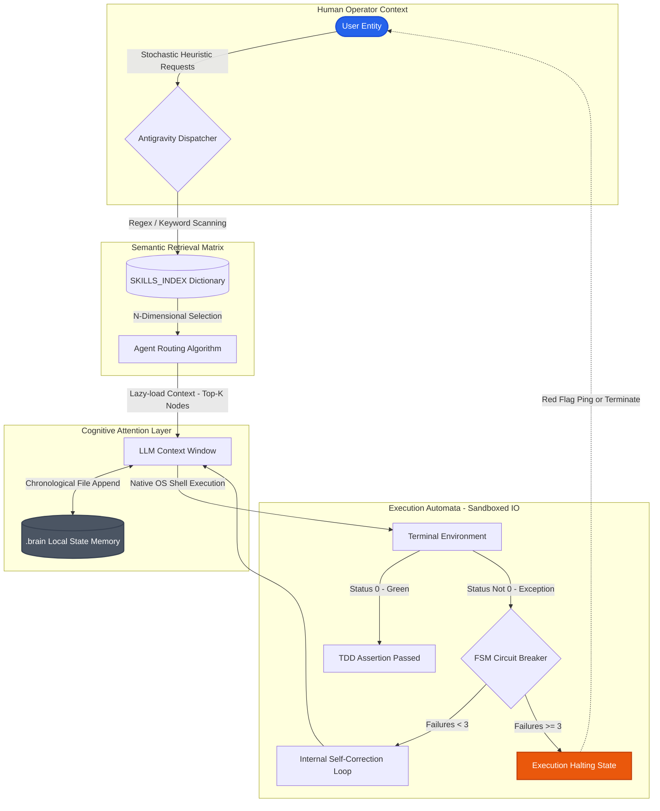

<div align="center">
  <h1>🚀 Marcus Fleet Enterprise Matrix (.agents)</h1>
  <p><strong>The Academic Distributed AGI Core for Feature-Sliced Design, Semantic RAG Routing, and Deterministic Autonomous DevOps.</strong></p>

  
  
  
  

  <p>
    <a href="#theoretical-overview">Overview</a> •
    <a href="#system-architecture">Architecture</a> •
    <a href="#installation-provisioning">Provisioning</a> •
    <a href="#execution-commands">Execution</a> •
    <a href="#academic-contributions">Contributions</a> •
    <a href="#sponsorship--support">Support/Donate</a>
  </p>
</div>

---

## 🔬 Theoretical Overview

The **Marcus Fleet Enterprise Matrix** represents a paradigm shift in Large Language Model (LLM) orchestration frameworks. Distancing itself from monolithic static-prompt environments, **Version 29.1** operates as an intelligent computational hive-mind composed of **64 Specialized Elite Agents**.

Through the implementation of **Semantic Retrieval-Augmented Generation (RAG)** and **Finite State Machine (FSM) Failure Limitations**, the Antigravity operating system mitigates critical flaws present in contemporary autonomous systems: context window atrophy, algorithmic hallucination, and runaway API expenditure loops.

### The Zero-Suggestion Doctrine
The core system enforces absolute autonomic determinism. No LLM interfacing with the `.agents` ecosystem possesses authorization to output manual CLI instructions (e.g., "Copy this terminal command"). The matrix is strictly compelled to autonomously instantiate native terminal processes, validate I/O streams, and resolve unit-test failures symmetrically prior to returning Human-In-The-Loop feedback vectors.

---

## 🏛️ System Architecture Topology

The following C4-styled data-flow layout outlines the cognitive processing, lexical retrieval routing, and execution mechanisms.



---

## ✨ Empirical System Features

- **Semantic RAG Vectoring:** Compresses the cognitive load by 95%. The system parses heuristic tags in a normalized `SKILLS_INDEX`, loading only the specific array of specialized computational frameworks required logically for the exact runtime sequence (e.g., `ada-qa-agent` + `benny-frontend-engineer`).
- **Deterministic Circuit Breaking:** Halts catastrophic infinite-execution edge cases. Any compilation module tracking $N \ge 3$ consecutive failures undergoes hardware-freeze lockouts.
- **Directed Acyclic Graph (DAG) Persistence:** Long-term memory logic overrides temporal dialog sessions by persistently serializing architectural alterations directly into file-system `.agents/brain/` components.
- **Multi-Level Fault Tolerance:** Ensures workflow resilience by gracefully degrading structural operations from Model Context Protocol (MCP) dependencies to natively embedded `grep`/Markdown functionalities during asynchronous API interruptions.

---

## 📦 Installation Provisioning

Integrate the matrix framework into any local project directory securely via our automated One-Line cURL Installer.

```bash
# Execute this native pipeline to scaffold the AI cognitive engine
curl -sL https://raw.githubusercontent.com/huudangdev/.agents/main/install.sh | bash
```

> ⚠️ **CRITICAL DEPENDENCY:** Read the [ROUTING & OPERATIONAL MANUAL](./USAGE_GUIDE.md) to understand multi-agent parallel dispatch paradigms before transmitting commands.

---

## 🚀 Execution Commands (Macro Routing)

Command execution is handled algorithmically via direct prompts.

| Operational Command | Sphere of Action | Technical Intent |
|---|---|---|
| `/init_brain` | **Global Boot** | **MANDATORY for cold-start environments.** Ingests constitutional guardrails and provisions the lexical `SKILLS_INDEX` mapping. |
| `/planning` | **Architecture (Phase 1)** | Initiates Phase 1 of the SDLC. Blueprints Feature-Sliced Architecture (C4), synthesizes Business Logic & PRD into `/docs`. Halts for User Approval. |
| `/design` | **UI/UX & Branding (Phase 2)** | Initiates Phase 2 of the SDLC. Consumes PRD to emit strict Figma-equivalent CSS variables, Typography rules, and Color palettes. Halts for iterative reviews. |
| `/develop` | **Code Generation (Phase 3)** | Initiates Phase 3 of the SDLC. Ingests all `/docs` and rigorously executes TDD Backend scaffolding, Frontend UI rendering, and E2E QA simulation. |
| `/refactor_project` | **Legacy Mutaion**| Computes Cyclomatic Complexity and drafts deterministic Knowledge Graphs (`npx understand-anything`) before breaking down monolithic spaghetti networks. |
| `/quick_fix` | **Surgical Injection** | Circumvents macro-planning. Target isolates 1 specific sub-component for variable adjustments in O(1) latency under 240 seconds. |
| `/mobile_init` | **IOS/Android Core**| Bootstraps rigorous iOS and React Native/Flutter design constraints (e.g., Tailwind boundaries, continuous spring animations, Safe-Area strict adherence). |

---

## 🔬 Repository Architecture

```text
.agents/
├── README.md                      # Foundational system topology
├── USAGE_GUIDE.md                 # Heuristic routing and dispatch instructions
├── V29.1_RELEASE_NOTES.md         # Advanced academic paper / changelogs
├── .clinerules                    # Foundational Constitution Protocol (FSM Limits)
├── mcp/                           # Model Context Protocol constraints
├── workflows/                     # Declarative Workflow subroutines
│   ├── init_brain.md 
│   ├── planning.md
│   ├── design.md
│   ├── develop.md
│   └── quick_fix.md
└── skills/                        # 64-Agent Cognitive Swarm Directory
    ├── SKILLS_INDEX.md            # Auto-compiled Semantic Pre-Index
    ├── ada-qa-agent/
    ├── david-systems-architect/
    └── benny-frontend-engineer/
```

---

## 🤝 Academic Contributions & Bug Reports

We rigorously welcome computational engineers focusing on Agentic Software AI, Semantic Routing, and Autonomous Testing.

1. **Bug Reports & Issues:** Encountering a runtime timeout or hallucination loophole? Please submit an [Issue Report](https://github.com/huudangdev/.agents/issues) detailing the LLM prompt, Context configuration, and local trace logs.
2. **Injecting New Entities:** When contributing a new Agent (Skill folder), name it identically to `{name}-{computational-role}` format. Provide your YAML Frontmatter, execute `tmp_skills.py` to regenerate the knowledge bank, and push the PR for internal network review.

---

## ☕ Sponsorship & Support

Engineering and maintaining an Advanced Distributed Agent Matrix takes prodigious computational hours and intensive R&D iterations. If this architectural framework has accelerated your enterprise, consider supporting our ongoing development:

[](https://www.buymeacoffee.com/huudangdev)  
[](https://github.com/sponsors/huudangdev)

---

## 📄 Licensing Status

Distributed unconditionally under the **MIT License**. Permissible for rigorous corporate modification, academic dissection, and commercial orchestration.
