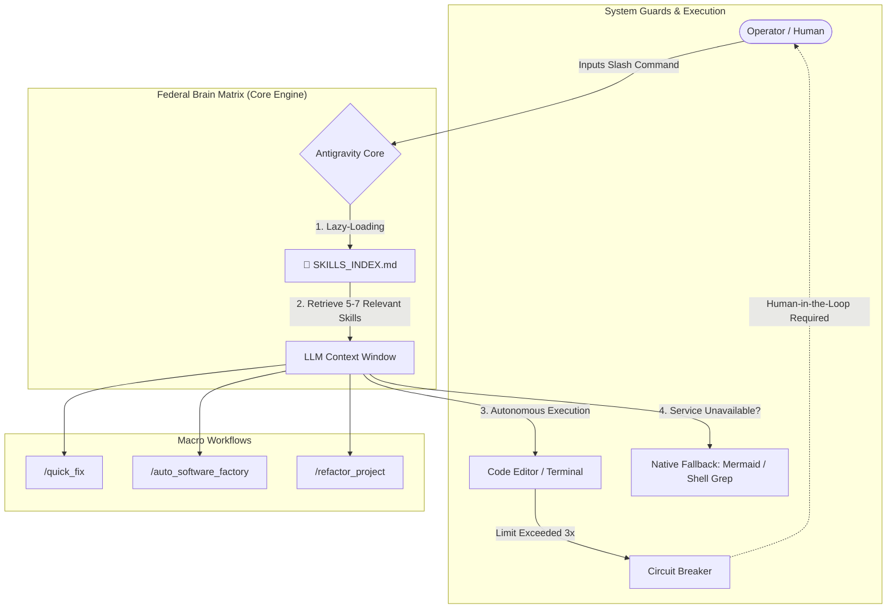

<div align="center">
  <h1>🚀 Marcus Fleet Enterprise Matrix (.agents)</h1>
  <p><strong>The Ultimate AGI Core for Software Architecture, FSD/DDD Coding, Pixel-Perfect UI/UX, and Autonomous DevOps.</strong></p>

  
  
  
  

  <p>
    <a href="#overview">Overview</a> •
    <a href="#architecture">Architecture</a> •
    <a href="#installation">Installation</a> •
    <a href="#quick-start">Quick Start</a> •
    <a href="#repository-structure">Structure</a> •
    <a href="./USAGE_GUIDE.md">Usage Guide</a>
  </p>
</div>

---

## 📖 Overview

The **Marcus Fleet Enterprise Matrix** is an advanced, distributed Autonomous AI Core designed to orchestrate the entire software development lifecycle. Moving beyond traditional static reasoning models, **Version 29.1** has evolved into a "Dynamic Sandbox". It seamlessly transitions between high-level architectural macro-workflows and razor-sharp, targeted micro-tasks.

By utilizing **Dynamic Semantic RAG (Retrieval-Augmented Generation)**, the environment lazy-loads specific skill sets out of an arsenal of **64 Elite Agents** tailored exactly to your runtime request.

### Core Philosophy: The Zero-Suggestion Policy
Any LLM interfacing with the `.agents` ecosystem is permanently revoked of its ability to offer manual commands ("Suggestions"). The AI is **STRICTLY PROHIBITED** from generating bash code inside markdown blocks and instructing the user to "Copy and paste this into your terminal". It **MUST** utilize native OS terminal tools to type, build, and debug autonomously, returning control to the user only upon successful validation.

---

## 🏗️ Architecture Workflow



---

## ✨ Features

- **Semantic RAG Lazy-Loading:** Dynamically parses knowledge graphs, avoiding context-window bloat, and increasing operational speed by 80%.
- **The 3-Strike Circuit Breaker:** Protects your token budget. If an AI fails to fix a terminal error 3 consecutive times, the system autonomously halts execution and requests human intervention.
- **Micro-Brain Persistence:** State memory is persistently tracked in `.brain/` folders, overcoming limitations of isolated LLM chat boundaries.
- **Multi-Fallback Resilience:** Automatically degrades from complex MCP integrations (e.g., Draw.io) to pure Text-Native solutions (e.g., Markdown/Mermaid) during outages.

---

## 📦 Installation

To utilize this AGI core in your own environment, clone the matrix as a hidden directory (`.agents`) inside your master workspace.

```bash
# 1. Create your primary workspace directory
mkdir corporate-workspace && cd corporate-workspace

# 2. Clone the Marcus Fleet AI Core 
git clone https://github.com/huudangdev/.agents.git .agents

# 3. Open the codebase in your AI IDE (Cursor / Antigravity / OpenClaw)
```

> **🔥 CRITICAL NEXT STEP:** Before executing prompts, you **MUST** read our [ROUTING & USAGE GUIDE](./USAGE_GUIDE.md) to comprehend Swarm delegation.

---

## 🚀 Quick Start (Slash Commands)

Initiate enterprise pipelines by typing the following commands directly into the AI console.

| Command | Environment | Description |
|---|---|---|
| `/init_brain` | **Global** | **MANDATORY for new sessions.** Boots the AI matrix, enforces constitutional rules, and stages the Semantic RAG Index. |
| `/quick_fix` | **Global** | Designed for microscopic patches. Uses targeted retrieval to fix a component in under 4 minutes, skipping heavy PRD/UML generation. |
| `/auto_software_factory` | **Monorepo** | The 9-Phase orchestrator. Builds Architecture, C4 Diagrams, Backend TDD, Playwright automated testing, and CI/CD pipelines. |
| `/refactor_project` | **Legacy Code**| Audits cyclomatic complexity and builds codebase Knowledge Graphs (`npx understand-anything`) before breaking down monolithic systems. |
| `/mobile_init` | **Mobile App**| Specifically injects the iOS/Tailwind doctrine, enforcing Safe-Area environments and spring-touch animations for React Native/Flutter. |

---

## 📂 Repository Structure

```text
.agents/
├── README.md                      # This documentation
├── USAGE_GUIDE.md                 # Routing guidelines for Human & AI
├── V29.1_RELEASE_NOTES.md         # Deep-dive architectural changelog
├── .clinerules                    # The Supreme Constitution protocol for LLMs
├── mcp/                           # Model Context Protocol configurations
├── workflows/                     # Declarative Workflow definitions
│   ├── init_brain.md 
│   ├── auto_software_factory.md
│   └── quick_fix.md
└── skills/                        # The 64-Agent Galaxy Swarms
    ├── SKILLS_INDEX.md            # Auto-generated Semantic RAG Engine target
    ├── ada-qa-agent/
    ├── david-systems-architect/
    ├── benny-frontend-engineer/
    └── ...
```

---

## 🤝 Contributing & Extending the Matrix

If you wish to forge a new specialized Agent (Skill) to append to the 64-Agent Galaxy:

1. Create a new directory in `skills/` using the semantic format: `{name}-{role}` (e.g., `charlie-database-admin`).
2. Add a `SKILL.md` containing the agent's identity, protocols, and boundaries.
3. Your agent's `SKILL.md` MUST include standard YAML Frontmatter (`description`).
4. Re-run `python3 tmp_skills.py` internally to inject your agent into the global `SKILLS_INDEX.md` memory bank.
5. Submit a Pull Request.

---

## 📄 License

This project operates beneath the **MIT License**. For full rights and permissions regarding replication, study, and corporate utilization, refer to the underlying OS guidelines.
