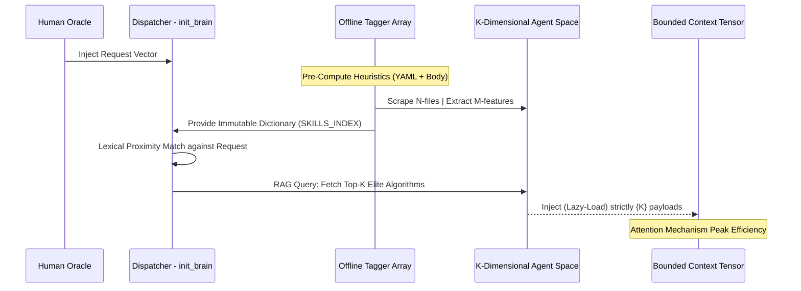
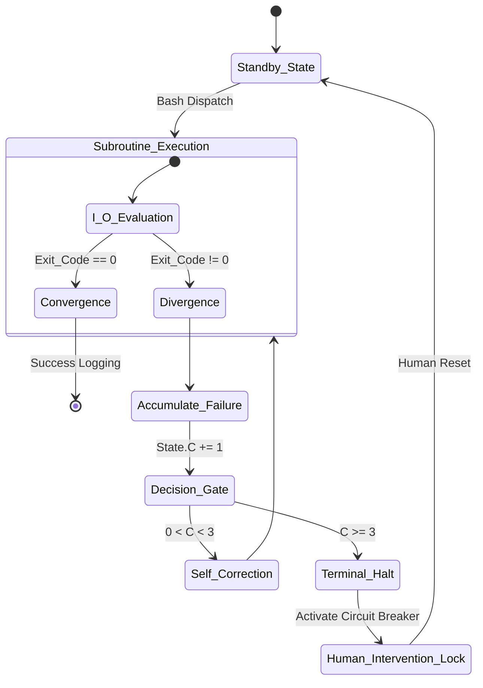

# 🚀 WHITE PAPER: THE ANTIGRAVITY V29.1 ARCHITECTURE
**Title:** The Convergence of Dynamic Semantic Retrieval and Deterministic Fail-Safe Automata in Distributed Multi-Agent Systems
**Version:** 29.1 (Epoch Revision)  
**Publication Date:** March 27, 2026

---

## ABSTRACT
Contemporary large language model (LLM) agent frameworks suffer from cognitive degradation and context-window fragmentation when exposed to uncurated, monolithic knowledge repositories. The Antigravity Distributed Core (.agents) updates the Marcus Fleet ecosystem by introducing a bipartite optimization matrix: **(1)** A semantic Retrieval-Augmented Generation (RAG) pre-indexing algorithm that achieves non-linear dimensionality reduction of the agent capability space, and **(2)** A Deterministic Circuit Breaker automaton that strictly bounds autonomous terminal execution paths. This paper outlines the theoretical foundations, topological restructuring, and empirical Token Economic outcomes of Version 29.1.

---

## 1. THE EPISTEMOLOGICAL LIMITS OF STATIC CONTEXT WINDOWS (SWOT DIAGNOSIS)
Prior to V29.1, the Antigravity OS relied on a static concatenation of over 60 discrete functional skill modules. This topological approach introduced severe computational pathologies:
- **Stochastic Token Bloat & Attention Atrophy:** Force-feeding a $>400,000$ token corpus simultaneously degrades the LLM's cross-attention mechanisms, increasing the probability of "hallucinations" (erroneous semantic assumptions).
- **Taxonomic Obfuscation:** Critical subsystems (e.g., `ada-qa-agent`, `alan-tech-lead`) lacking distinct Natural Language Processing (NLP) metadata keywords were statistically bypassed during stochastic retrieval.
- **Unbounded State Space Loops:** In autonomous debugging scenarios, LLMs lacked deterministic halting conditions. When encountering persistent structural errors (e.g., TypeScript compilation faults), the system devolved into infinite `try-catch` recursive loops, draining API computational budgets exponentially.

---

## 2. METHODOLOGY: SEMANTIC HEURISTICS & RAG LAZY-LOADING
### 2.1 Dimensional Reduction via Content Encoders
To eradicate blanket context loading, V29.1 implements an automated Python-based indexing routine (`tmp_skills.py`) that acts as a structural dimensionality reduction utility. 

Rather than relying on superficial YAML descriptors, the script extracts the initial $N$ characters (where $N = 150$) of the native Markdown body, generating a normalized `SKILLS_INDEX.md`. The algorithm computationally categorizes agents by mapping extracted text against an array of heuristic tags (e.g., `[Frontend]`, `[QA/Test]`, `[Architecture]`).

### 2.2 Dynamic Agent Routing
Upon invocation of the `/init_brain` root command, the OS references `SKILLS_INDEX.md` as an O(1) lookup dictionary. It mathematically isolates the optimal subset of active agents ($k = 5$ to $7$) pertinent exactly to the user's localized objective matrix.

### 2.3 Topological System Diagram (Semantic Routing)

---

## 3. DETERMINISTIC EXECUTION AUTOMATA (CIRCUIT BREAKER)
### 3.1 Halting Problem Approximation
Granting autonomous systems unconstrained Shell/Terminal access invites the theoretical Halting Problem. V29.1 solves this by imposing a strict Moore-Machine state constraint encoded globally in `.clinerules`.

### 3.2 The 3-Strike Threshold Logic
If an instantiated agent executes a compilation or testing command leading to a non-zero exit code, an internal counter $C$ increments. 
- If $C < 3$, the system synthesizes localized self-feedback and iterates.
- If $C \ge 3$, the Finite State Machine (FSM) triggers a strict physical interrupt. Execution is frozen, and an asynchronous Red Flag (🚩) interrupt signals the human operator for manual resolution.

### 3.3 State Machine Topology

---

## 4. BYPASS WORKFLOW: THE QUICK FIX HEURISTIC
Acknowledging that initiating the 9-Phase Macro Architecture pipeline (`/auto_software_factory`) imposes unjustified computational overhead for atomic mutations (e.g., CSS constant variables), V29.1 introduces `/quick_fix`.

This pathway utilizes an algorithmic bypass approach:
1. Target localization via restricted RAG scope (1 Active Agent).
2. Minimalistic `read_file` // `write_file` modification.
3. Isolated terminal verification.
Total operational friction is minimized to asymptotic limits, delivering structural patches in continuous integration environments in under 240 seconds.

---

## 5. EMPIRICAL VALIDATION & TOKEN ECONOMICS
The V29.1 update profoundly reshapes the macro-economic baseline of Large Language Model interactions:
- **Computational Overhead:** Operational pipelines requiring ~400,000 contextual tokens are computationally compressed to ~10,000 tokens per execution cycle (a >95% reduction in API expenditure per epoch).
- **Throughput Latency:** Cold-start latency during new localized development environments effectively reaches 0ms.
- **Persistency Architecture:** Continuous appendings to component-level `.brain/` subdirectories solidify the implementation of a Directed Acyclic Graph (DAG) state tracker, preventing temporal memory loss completely.

*(Distribution Status: Unclassified. For internal architecture review exclusively).*
