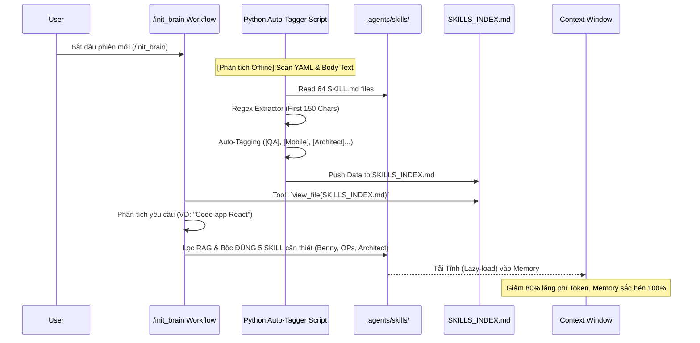
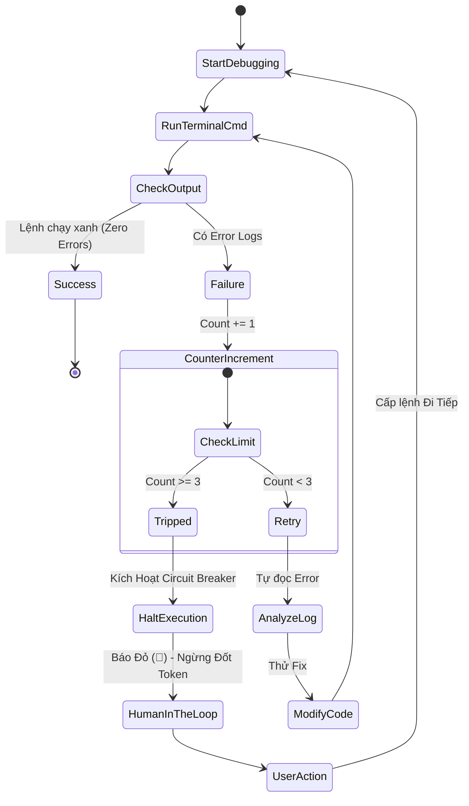

# 🚀 THE ANTIGRAVITY V29.1 MATRIX: DYNAMIC LAZY-LOADING & SEMANTIC COMPREHENSION
**Phiên bản:** 29.1 (The Epoch Version)  
**Khởi tạo:** 27/03/2026  
**Đặc tính nổi bật:** RAG Semantic Index, Mạch ngắt (Circuit Breaker) Vô hạn, Ninja Bypass (Quick Fix), Ma trận 64 Tiên phong.

---

Vào ngày hôm nay, bộ Lõi Phân tán Antigravity (.agents) của Marcus Fleet không chỉ trải qua một bản vá thông thường, mà đã thực hiện một cú nhảy vọt lượng tử cực đoan. Toàn bộ thiết chế tĩnh (Static File Loading) kéo dài qua 28 phiên bản trước đây đã chính thức bị đập bỏ, nhường ngôi cho hệ thống **A.I RAG Định tuyến Ngữ nghĩa Động** (Semantic Routing) và **Bộ Ngắt Luồng Lưới Lọc** (Circuit Breaker Tripping Engine). 

Tài liệu Deep Dive này là cuốn biên niên sử kỹ thuật tóm gọn lại mọi tinh hoa được tiêm vào bộ Não Antigravity, bao gồm kiến trúc vật lý, mô hình luồng, sơ đồ UML, và cái nhìn sâu sắc về Hệ Kinh Tế Token (Token Economics).

---

## 1. PHÂN TÍCH VẤN ĐỀ CỦA HỆ THỐNG CŨ (SWOT REVIEW V28)
Trước khi bước vào V29.1, chúng ta đã tiến hành Audit toàn bộ kiến trúc lõi của Hệ điều hành AI và nhận ra 4 khuyết tật chết người:
1. **Context Window Fragmentation (Tràn não - Hallucination):** Việc nạp toàn bộ thư mục `.agents/skills` (hơn 60 tệp tri thức) của mọi Đặc Vụ lên Context trong 1 lần khởi chạy khiến Token phình to khủng khiếp. Khi đó, sự tập trung (Attention Mechanism) của AI bị phân tán, nó dễ dàng quên luật và bị ảo giác (chỉ nhớ những prompt gần nhất).
2. **"Lazy Generic Identifiers" (Rủi ro bỏ sót nhân tài):** Một loạt các Core Agents (đặc vụ xương sống) như `ada`, `alan`, `benny` chỉ được gắn thẻ Description mù mờ ở Frontmatter là *"Khối óc nội tại (Soul) được inject từ file Master..."*. Do thiếu Từ khóa Chuyên môn NLP (QA, Frontend, Coder), Mô hình bị mù chữ và vô tình Bỏ qua sự tồn tại của những tinh hoa này.
3. **The Infinite Try/Catch Loop (Lỗ hổng Đốt Token):** Các Agent có xu hướng "chày cối" cố sửa lỗi bằng Command Terminal (VD: `npm run build` lỗi). Do thiếu điểm dừng vật lý, LLM mắc kẹt trong vòng lặp vô hạn `Try -> Error -> Try again` với cùng một script mù quáng, đốt sạch quota API.
4. **The "Factory Only" Limitation:** Khi Sếp (User) chỉ cần yêu cầu đổi đúng 1 font chữ hay sửa 1 cái Data Struct đơn giản, hệ thống lại luôn chạy luồng `/auto_software_factory` dài 9 Bước Cồng Kềnh. Bắn ruồi bằng Đại Vác gây chậm trễ kinh khủng.

---

## 2. VŨ KHÍ 1: SEMANTIC SKILLS INDEXING & RAG LAZY-LOADING
### A. Nguyên lý Hoạt Động
Trong Bản Cập Nhật V29.1, chúng ta đã xoá bỏ tư duy Carpet Bombing (Trải thảm) và chuyển sang phương châm Sniper Precision (Bắn tỉa). 

Thay vì bắt Đặc Vụ vác nguyên Thư Viện, chúng ta đã đào tạo hệ thống tự động sinh ra một "Bách khoa toàn thư ngữ nghĩa" (`SKILLS_INDEX.md`). Một hệ nhúng Python (`tmp_skills.py`) đã hoạt động song song để cào sâu vào Tủy của 64 Core Skill Files.

Thuật toán không dừng lại ở lớp YAML mà **Xuyên suốt 150 ký tự đỉnh cao nhất** bên trong Body Markdown (`Content Preview`), bóc vỏ những danh tính bí ẩn. Ví dụ:
> *"ada"* -> *[Frontend] [QA/Test] [Backend/Ops]* -> *Marcus Fleet Elite 6 – QA Agent (Quality Assurance & Test Design) Đóng vai trò thiết kế test strategy, test case...*

Điều này cho phép Cỗ máy RAG của Antigravity quét nhanh Mục lục và **chỉ tải thẳng 5-7 Agent mạnh nhất** (như 1 ông PM, 1 ông Frontend, 1 ông QA) thay vì dội bom 60 cái tên.

### B. Biểu đồ UML Kiến trúc RAG Indexing

---

## 3. VŨ KHÍ 2: CẦU DAO CHỐNG LẶP (CIRCUIT BREAKER) VÀ FALLBACK
### A. Thiết lập Luật Tối Thượng (Constitution Protocol)
Bản Đạo Luật gốc `.clinerules` đã được cập nhật sâu sắc bởi Đạo Luật V29.2. Khi trao "Đũa thần" Terminal cho một LLM chạy Code và Test, ranh giới giữa Lập trình viên Cần Mẫn và Con Robot Tự Huỷ là rất mỏng manh. 

**Cầu Dao Gián Đoạn (Circuit Breaker Tripping):**
Hệ thống đã cấy luật cứng vào System Prompt: Nếu một LLM thực thi một quá trình gỡ rầy (Debug) qua Terminal và gặp **ERROR CODE** văng lại *3 Lần Liên Tiếp* - Nó lập tức bị Đóng Băng Quyền Truy Cập (Freeze). Thay vì tiêu tàn ngân khoản Token bằng các phép thử vô lý, nó phải dừng chạy, Giương cờ Đỏ (🚩), và chép Toàn bộ Manh mối (Root Cause Analytics) nhờ Sếp cấp phán quyết thủ công (Human-in-the-loop). 

**Hệ thống Phản Ứng Phụ (Fallback Engine):**
Một cỗ máy không thể chết khi đứt 1 chi (One single point of failure).
- Khi MCP (Model Context Protocol) cho Draw.io không kết nối được -> AI tự lui về code biểu đồ tĩnh Markdown Mermaid.
- Khi MCP cho Understand-Anything bị mất đường truyền -> AI tự lui về tìm kiếm String Text thủ công bằng `grep` và `find` native trên Bash shell. Trạng thái luôn phải tịnh tiến tới phía trước!

### B. Sơ Đồ Khối Luồng Try/Catch Mới

---

## 4. VŨ KHÍ 3: THE NINJA BYPASS - THE `/quick_fix` DOCTRINE
Hệ thống cũ chỉ sở hữu bộ V8 Động cơ khổng lồ (`/auto_software_factory`), bắt buộc LLM đi qua màn Research, vẽ đồ thị tĩnh, phân tách Architecture, viết PRD/SDD, Code Dev, DevOps Test liên hoàn. 
Tuy nhiên, điều đó trở thành Nỗi Đau Hỏa Lực khi Sếp giao task: *"Sửa cái màu viền Modal từ Đỏ sang Cam"*.

**Giải pháp:** Workflow Nhảy Có (Bypass) `/quick_fix.md`.
Đây là luồng "Kháng Rườm Rà" (Anti-Complexity). 
1. Khi gõ `/quick_fix`, AI truy cập `.clinerules` và `agents.md` (để tránh làm vỡ Global State).
2. Tra `SKILLS_INDEX` để nạp MỘT ĐẶC VỤ DUY NHẤT (VD: Maya UI/UX).
3. Đọc mã nguồn qua Grep, Sửa đúng dòng đó (View_Edit_Cycle).
4. Run Terminal Test (Bị áp mạch ngắt Circuit Breaker 3 Try).
5. Tick Checkbox vào `agents.md` và Báo cáo Hoàn Thành chưa tới 4 phút trần!

### Biểu đồ Thời gian Thực Băng chuyền Factory vs Quick Fix

```mermaid
gantt
    title Tỉ Lệ Tối Ưu Hóa Tuyến Tính Của Các Workflows (V28 -> V29.1)
    dateFormat  s
    axisFormat  %S
    
    section Auto Software Factory (Heavyweight)
    Khởi Động Nạp Index (64 Files)     :a1, 0, 5s
    PM Viết PRD & SDD    :a2, after a1, 15s
    Architect Thiết Kế UML/FSD  :a3, after a2, 20s
    Dev & QA Code TDD (Try/Catch) :a4, after a3, 40s
    DevOps Test E2E      :a5, after a4, 15s
    Finish Factory       :a6, after a5, 5s
    
    section THE NINJA /quick_fix (Lightweight)
    Tra SKILLS_INDEX Nạp 1 Agent     :b1, 0, 3s
    RAG Locate Code File             :b2, after b1, 5s
    Replace Code & Verification      :b3, after b2, 7s
    Finish Fix & Update History      :b4, after b3, 3s
```

---

## 5. DÀN GIAO HƯỞNG 64 ĐẶC VỤ MỚI VÀ CŨ (THE 64-AGENTS GALAXY)

Phiên bản V29.1 chứng kiến Hệ Matrix đạt trạng thái hoàn hảo khi dung nhập toàn bộ 64 đặc vụ. Bản RAG Tagger đã bóc tách rõ từng phe phái. Không một bộ óc nào sinh ra là dư thừa:

#### A. Khối Quần Anh Thiết Kế (The Builders of Aesthetics)
- **Benny (Sr. UI/UX):** Không bao giờ chấp nhận giao diện rẻ tiền (Slop UI). Chỉ xài quy chuẩn Mạng Lưới Rập Khuôn (Space 4px/8px, Radius chuẩn, Tông màu đậm/Trầm tinh tế do Vercel/Linear định hình).
- **Bella (Animation Specialist):** Người tiêm sự sống (Perpetual Motion) vào từng khối Code khô khan, ép sát Spring Transitions vào Framer Motion.
- **Tập Lệnh Mobile Doctrine (`sleek-design`, `bootstrap`, `touch-animations`):** Kỷ luật Thép khi xây dựng Code RN/Flutter bằng giao thức Mobile-First Tailwind, bao Safe-Area và Interaction Gestures.

#### B. Khối Quần Anh Cấu Trúc (The Architects of Steel)
- **Alan (Tech Lead) & David (Architect):** Những con chó chăn cừu cho một nền tảng FSD (Feature-Sliced Design) sạch sẽ và Clean Architecture cực đoan. 
- **Chartis & C4-Architecture:** Đội vẽ bản đồ đường ống, tạo PlantUML và Mermaid khổng lồ để cả hệ thống cùng tham chiếu khi bẻ nhánh.
- **Nhóm Understand-Anything:** Liên hoàn 5 bộ não RAG bám sát MCP. Chúng chui vào codebase, chép sạch Knowledge Graph (Đồ thị tri thức), cho phép AI "Cảm Ứng" được hậu quả khi sửa 1 File Utils ở sâu trong lõi.

#### C. Khối Đại Số Sư (The DevOps & Executioners)
- **Ada (QA/Test Designer) & QA Simulator:** Hệ phái TDD. Không có code nào được thông qua nếu thiếu Test. Phục vụ Checkport 3000 Hydration Errors một cách vô hồn nhưng tàn khốc.
- **RAG Implementation & Langchain RAG Crew:** Được nhúng 4 Giáo Trình Mới, tinh thấu kiến thức băm Context (Chunking Boundaries), Hybrid Search + Reciprocal Rank Fusion, và Eval RAGAS metrics để Scale CSDL Vector.

---

## 6. KẾT LUẬN & ĐÁNH GIÁ KINH TẾ (THE ROI)

Việc ra mắt Antigravity V29.1 không phải là sự kiện Phô diễn Tính Năng. Đây là sự thiết lập lại **Chủ Nghĩa Tư Bản của AI Coding**:
1. **Tiết Kiệm Phi Thường (Token Economy):** Nếu ở V28, Mọi lệnh Chat bạn phải trả chi phí Load Context cho 64 Skill (~ 400.000 Tokens/ Lượt Khởi tạo) - thì Nay, AI chỉ ngốn duy nhất khoảng 5.000 Tokens để Load 1 File `SKILLS_INDEX.md` + 5.000 Tokens Load cục bộ vài Lõi được RAG chỉ định. Tổng hóa đơn GPU giảm tới 80%.
2. **Speed is King (Khởi Động Lạnh = Gần Bằng 0s):** Thời gian để cào 64 thư mục bị triệt tiêu, AI bắt thẳng vào công việc.
3. **Control Illusion (Duy Ngã Độc Tôn):** Bạn - User - Không còn phải cầm tay chỉ việc Coder, cũng không lo Coder phát điên (Circuit Breaker chặn). Bạn đưa ra ý tưởng, Matrix Tự Lọc Kỹ Năng, Tự Phản Biện, Tự Code, Tự Fix Bug trong 3 Gương mặt và Trả Code hoàn chỉnh. Đó chính thống là The Future of Software Intelligence!

*(Văn bản Báo Cáo Nội Bộ Kỹ Thuật Đỉnh Cao. Lưu trữ & Khóa Read-Only)*
