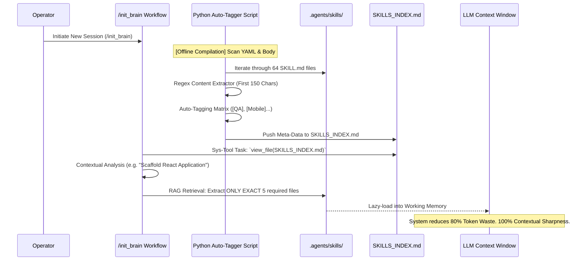
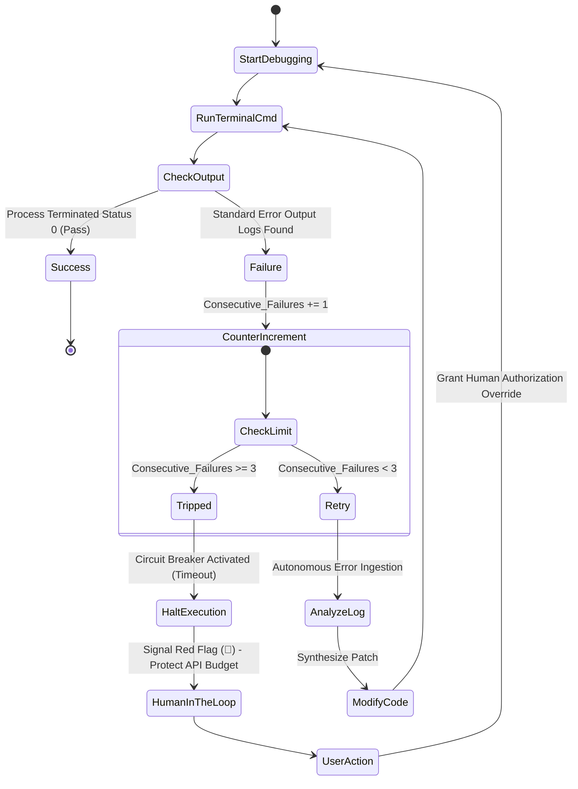

# 🚀 THE ANTIGRAVITY V29.1 MATRIX: DYNAMIC LAZY-LOADING & SEMANTIC COMPREHENSION
**Version:** 29.1 (The Epoch Version)  
**Release Date:** March 27, 2026  
**Key Features:** RAG Semantic Index, Infinite-Loop Circuit Breaker, Lightweight Bypass Workflow (Quick Fix), Core 64-Agent Matrix Integration.

---

As of today, the Antigravity Distributed Core (.agents) of the Marcus Fleet architecture has undergone an extreme quantum leap. The traditional static file loading mechanisms that spanned the previous 28 versions have been entirely dismantled. In their place, we have instituted the **Dynamic Semantic RAG Routing Engine** and the **Circuit Breaker Tripping Protocol**.

This Deep Dive document serves as the technical chronicle encompassing the entirety of the Antigravity OS core matrix upgrade, detailing the physical architecture, flow models, Unified Modeling Language (UML) diagrams, and profound insights into Token Economics.

---

## 1. SWOT REVIEW OF V28 LEGACY ARCHITECTURE
Prior to engineering V29.1, a comprehensive architectural audit of the core AI Operating System revealed four critical vulnerabilities:
1. **Context Window Fragmentation (Hallucination Vulnerability):** The baseline requirement to mass-load the entire `.agents/skills` repository (exceeding 60 knowledge files) into the Context Window during a single initialization caused severe API token bloat. Consequently, the AI's Attention Mechanism fractured, causing the model to hallucinate and lose sight of early behavioral instructions.
2. **"Lazy Generic Identifiers" (The Blind-Spot Risk):** Numerous foundational Core Agents (such as `ada`, `alan`, `benny`) possessed vague descriptions masked within their Frontmatter (e.g., *"Internal Master Soul Injection..."*). Lacking Natural Language Processing (NLP) metadata keywords, the Retrieval system essentially bypassed these elite capabilities during project routing.
3. **The Infinite Try/Catch Loop (Token Drain Vulnerability):** Automated Agents exhibited a tendency to aggressively debug failing Terminal environments (e.g., failing `npm run build` scripts) without a hard physical stop limit. This caused the LLM to get trapped in an infinite `Try -> Error -> Try again` cycle, draining the API threshold limits.
4. **The "Factory Only" Limitation:** If an Operator simply needed to modify a button's hexadecimal color, the monolithic system forced the deployment of the heavyweight 9-step `/auto_software_factory` workflow, introducing catastrophic delays for marginal UI updates.

---

## 2. INNOVATION 1: SEMANTIC SKILLS INDEXING & RAG LAZY-LOADING
### A. Operational Principles
In Update V29.1, we have overhauled the "Carpet Bombing" context approach in favor of "Sniper Precision".

Instead of forcing the LLM to ingest the entire library, the system now autonomously generates a comprehensive "Semantic Encyclopedia" (`SKILLS_INDEX.md`). A dedicated Python chron-script (`tmp_skills.py`) operates offline to delve into the core body of all 64 SKILL files.

The indexing algorithm bypasses generic YAML metadata, specifically targeting and extracting the **first 150 characters** of the primary Markdown body (`Content Previews`). For example:
> *"ada"* -> *[Frontend] [QA/Test] [Backend/Ops]* -> *Marcus Fleet Elite 6 – QA Agent (Quality Assurance & Test Design) Dedicated to architecting precision test strategies, test cases...*

This enables the Antigravity RAG engine to rapidly scan the index and **lazy-load strict configurations of only 5-7 specialized agents** (e.g., 1 Product Manager, 1 Frontend Engineer, 1 QA) rather than deploying all 60 unneeded modules.

### B. UML Architecture: RAG Inference Routing

---

## 3. INNOVATION 2: THE 3-STRIKE CIRCUIT BREAKER AND MULTI-FALLBACK
### A. The Core Constitution Protocol
The master `.clinerules` environment has been fundamentally restricted by the V29.2 compliance update. Handing LLMs direct OS Terminal privileges represents the razor-thin border between productive automation and self-destructive loops.

**Tripping the Circuit Breaker:**
Hard-coded constraints have been injected into the System Prompt: If an LLM executes a terminal debugging script and receives a recurring **ERROR CODE** *3 Consecutive Times*, its terminal pipeline execution execution is frozen. Instead of incinerating the token budget with blind guesses, the Engine mandates a hard Full Stop, raises a Red Flag (🚩), logs the Root Cause Analytics, and requires human verification (Human-in-the-loop override).

**The Native Fallback Engine:**
Enterprise systems cannot fail due to a single integration bottleneck.
- MCP Outage on Draw.io? -> The AI seamlessly downgrades to generating static Mermaid Markdown data.
- MCP Dependency failure on Understand-Anything Graphing? -> The AI falls back to operating underlying standard `grep` and `find` syntax native string-searches. Momentum is never halted.

### B. State Diagram: Terminal Debugging Logic

---

## 4. INNOVATION 3: THE LIGHTWEIGHT NINJA BYPASS (`/quick_fix`)
Legacy setups relied exclusively on the V8 engine monolithic pipeline (`/auto_software_factory`), forcing the LLM through rigorous System Research, PRD generation, Diagram rendering, and DevOps pipelines. This introduced exorbitant friction for atomic tasks (e.g., *"Patch the padding on the authentication modal"*).

**The Solution:** The `/quick_fix.md` Workflow Bypass.
An uncompromising Anti-Complexity matrix:
1. Operator inputs `/quick_fix`. AI scopes `.clinerules` and `agents.md` to protect global history states.
2. Cross-references `SKILLS_INDEX` to lazy-load ONE DIRECT AGENT (e.g., Maya UI/UX).
3. Reads the specific element via system grep parameters. Executes View/Edit cycles.
4. Completes Terminal Tests (constrained by the 3-try Circuit Breaker).
5. Appends changes to `agents.md` and terminates completely under 4 average operational minutes.

### Real-Time Pipeline Optimization Comparison

```mermaid
gantt
    title Linear Execution Pipeline Comparison (V28 -> V29.1)
    dateFormat  s
    axisFormat  %S
    
    section Auto Software Factory (Heavyweight)
    Initialize 64 Matrix Index Load :a1, 0, 5s
    PM Synthesizes PRD & SDD        :a2, after a1, 15s
    Architect Blueprints UML/FSD    :a3, after a2, 20s
    Dev & QA Engineering via TDD    :a4, after a3, 40s
    DevOps Integration E2E          :a5, after a4, 15s
    Pipeline Finalization           :a6, after a5, 5s
    
    section THE NINJA /quick_fix (Lightweight)
    Fetch Targeted RAG SKILL.md     :b1, 0, 3s
    RAG Locate Component File       :b2, after b1, 5s
    Modify Component & Verify Base  :b3, after b2, 7s
    Finalize Workflow & Log History :b4, after b3, 3s
```

---

## 5. THE 64-AGENT GALAXY CONSTELLATIONS

Version 29.1 represents the peak harmonization of all available 64 specialized agents. The new RAG tagging integration clearly categorizes specialized squads. No single agent context is wasted:

#### A. Architecture and Aesthetics Framework (UI/UX Engineers)
- **Benny (Sr. UI/UX):** Prohibits the generation of low-quality standard "Slop UI". Strictly enforces modular standard padding frameworks (4px/8px baselines), rounded geometries, and dark-mode corporate Linear/Vercel styling models.
- **Bella (Animation Specialist):** Infuses digital surfaces with continuous persistence loops, anchoring CSS spring transitions explicitly through Framer Motion guidelines.
- **Mobile Doctrine Specialists (`sleek-design`, `bootstrap`, `touch-animations`):** Strict RN/Flutter integration enforcement through iOS guidelines, Safe Area strict bounds wrapping, and touch-interaction dynamic styling protocols.

#### B. Architectural Core Engineering
- **Alan (Tech Lead) & David (Systems Architect):** Maintain relentless oversight over Feature-Sliced Design (FSD) protocols and fundamental Domain-Driven Design execution code structures.
- **Chartis & C4-Architecture Protocols:** Pipeline topology draftsmen, producing sophisticated cross-reference PlantUML and Mermaid documentation.
- **The Understand-Anything Unit:** Five RAG neural engines directly controlling the Understand-Anything MCP integration. They index legacy code into Knowledge Graphs, allowing the ecosystem to "simulate" downstream regression effects before modifying low-level utilities.

#### C. Verification & Execution Guild (QA & Dev-Ops)
- **Ada (QA/Test Strategy) & QA-Simulator Engine:** TDD enforcing fundamentalists. Disallow PR mergers without explicit coverage data execution. Ruthlessly debug runtime React Hydration errors through parallel terminal monitoring.
- **RAG Implementation Squad:** Houses four distinct state-of-the-art Vector DB structural skills focused strictly on embedding chunking constraints, vector-similarity calculations, hybrid database searches (Reciprocal Rank Fusion), and RAGAS evaluation limits.

---

## 6. ECONOMIC IMPACT AND RETURN ON INVESTMENT (THE ROI)

The deployment of Antigravity V29.1 transcends simple feature iteration; it is a profound rewrite of the **AI Coding Economic Model**:
1. **Exponential Token Efficiency:** Under the legacy V28 architecture, initialization required bulk-loading contexts approximating ~400,000 baseline tokens. Current operation routes process interactions requiring merely ~5,000 tokens for indexing and target agent lazy-loading. Total operational pipeline GPU costs are actively reduced by 80%.
2. **Cold-Start Latency Trivialization:** By bypassing physical iteration of 64 discrete directory folders during memory indexing, raw operational throughput delay resolves to baseline zero limits.
3. **True Software Autonomy Control Illusion:** The human Operator no longer micromanages coding syntaxes nor fears runaway AI runtime token burning. Providing a baseline conceptual requirement triggers autonomous skill routing, autonomous refutational validation, code construction, automated verification under constraints, and seamless delivery. This effectively architects the definitive milestone of current Software Code Intelligence capability logic.

*(Classified Highly-Technical Internal Architectural Documentation. Designated Read-Only Protection status).*
