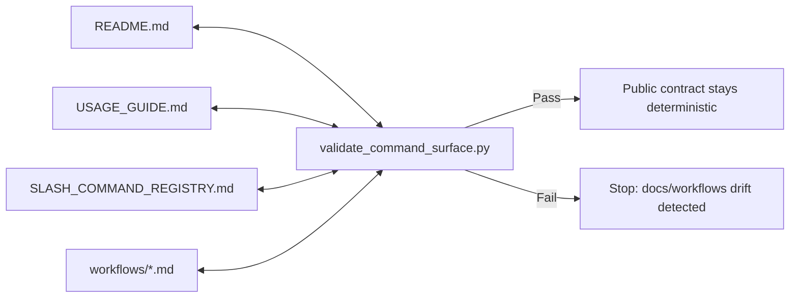

# Marcus Fleet V32.0 Release Notes

## Focus

V32.0 upgrades `.agents` from "docs and workflows" into a deterministic harness:
slash commands become enforceable contracts, and the harness provides replayable
gates that any model can follow without improvisation.

This release is designed to be a drop-in core you can copy into other projects.

## Executive Summary

- Deterministic command surface: public slash commands are now a validated
  contract across README, `USAGE_GUIDE.md`, registry, and workflow files.
- Harness wrappers: preflight/postflight provide a single replayable gate chain
  with JSONL evidence logs.
- Reduced context drift: execution briefs can foreground changed files and
  bounded failing evidence without widening default reads.

## Major Changes

- Harness engineering layer:
  - Added wrapper-based execution gates:
    - `.agents/scripts/run_harness_preflight.py`
    - `.agents/scripts/run_harness_postflight.py`
  - Added harness contract validation:
    - `.agents/scripts/validate_harness_contract.py`
  - Added structured observability logs:
    - `.agents/logs/harness/preflight.jsonl`
    - `.agents/logs/harness/postflight.jsonl`
- Public slash-command contract:
  - Added canonical registry:
    - `.agents/SLASH_COMMAND_REGISTRY.md`
  - Hardened public surface enforcement:
    - `.agents/scripts/validate_command_surface.py`
  - README, `USAGE_GUIDE.md`, registry, and workflow files are now enforced
    together as one public contract.
- Dynamic context execution briefs:
  - `.agents/scripts/build_execution_brief.py` now supports:
    - `--changed-files "<comma-separated-files>"`
    - `--failing-evidence "<bounded-failure-summary>"`
  - This reduces context drift by biasing models toward the current slice.

## Architecture Diagrams

### Harness Replay Flow

```mermaid
flowchart TD
    A[/Slash Command/] --> B[Workflow file]
    B --> C[Preflight wrapper]
    C --> D[Repo-wide gates]
    D --> E[Feature gates (optional)]
    E --> F[Execution]
    F --> G[Postflight wrapper]
    G --> H[Repo-wide gates replay]
    H --> I[(JSONL evidence logs)]

    D -.-> D1[validate_command_surface.py]
    D -.-> D2[validate_harness_contract.py]
    D -.-> D3[validate_routing_regression.py]
    H -.-> H1[audit_feature_contracts.py]
```

### Slash-Command Contract Topology



## Slash Command Hardening

- `/design` is now script-backed and deterministic:
  - Preflight readiness gate:
    - `.agents/scripts/validate_design_readiness.py`
  - Output closeout gate:
    - `.agents/scripts/validate_design_outputs.py`
- `/marcus_init` is now script-backed with a deterministic closeout:
  - Output gate:
    - `.agents/scripts/validate_marcus_init_outputs.py`
- `/refactor-planning` is now script-backed with explicit gates:
  - Brownfield readiness gate:
    - `.agents/scripts/validate_refactor_planning_readiness.py`
  - Toolchain prerequisite gate (fails fast on missing Node toolchain / ESLint):
    - `.agents/scripts/validate_refactor_planning_toolchain.py`
  - Closeout artifacts gate:
    - `.agents/scripts/validate_refactor_planning_outputs.py`

## Feature and Hotfix Rollup (V32 Lineage)

This release bundles the spec-driven hardening work delivered as features:

- `011-harness-auto-enforcement-and-freshness`
  - Wrapper-based preflight/postflight and harness contract validation baseline.
- `012-harness-observability-and-dynamic-context`
  - JSONL logging and dynamic execution-brief inputs.
- `013-slash-command-workflow-contract-hardening`
  - Canonical slash-command registry and public contract enforcement.
- `014-design-command-readiness-hardening`
  - `/design` readiness + output gates wired into public surface.
- `015-marcus-init-output-contract-hardening`
  - `/marcus_init` deterministic scaffold output closeout gate.
- `016-refactor-planning-command-gates`
  - `/refactor-planning` readiness + closeout gates and deterministic wiring.
- `017-refactor-planning-toolchain-gate`
  - `/refactor-planning` prerequisite toolchain gate before runtime-heavy steps.

## Hot Fixes and Reliability

- `.agents` scripts now resolve roots consistently when run from the `.agents`
  repo root or from a project root that contains `.agents/`.
- Bootstraps and validators fail closed with explicit, actionable errors instead
  of stack traces for common missing-file conditions.

## OTA / Update Behavior

- OTA update (`update.sh`) pulls the latest `main.zip` and then prints release
  highlights via `.agents/scripts/print_update_brief.py`, sourced from
  `release_manifest.json`.
- V32.0 updates `release_manifest.json` so `install.sh` and `update.sh` both
  onboard users into the new harness/command-contract behavior immediately.

## Upgrade Notes

- Recommended first replay after install/update:
  - `python3 .agents/scripts/validate_command_surface.py --root .`
  - `python3 .agents/scripts/run_harness_preflight.py --root . --phase execution --feature .agents/specs/<feature-id>`
- `/refactor-planning` now fails earlier when prerequisites are missing:
  - Ensure ESLint exists either globally (`eslint` in PATH) or locally at
    `node_modules/.bin/eslint*` under the target project root.

## V32.0.1 Addendum: Index-First Routing Hotfix

This hotfix addresses a common enterprise failure mode: models repeatedly
re-reading large doc/code trees, wasting tokens, and drifting into unrelated
context. V32 now provides a deterministic alternative:

- Build a shallow context index under `.agents/index/`:
  - `python3 .agents/scripts/build_context_index.py --root .`
  - `python3 .agents/scripts/validate_context_index.py --root .`
- Route reads through the generated entrypoints before opening large trees:
  - `.agents/index/architecture_graph.mmd`
  - `.agents/index/docs_index.md`
  - `.agents/index/code_index.md`
  - `.agents/index/skills_index.md`

The harness execution preflight now builds and validates this index before
repo-wide gates, so models get an explicit, low-cost routing map by default.

## V32.0.2 Addendum: Docs Substance Gate Hotfix

This hotfix addresses a release feedback failure: models could create many
Markdown files that were technically non-empty but still only scaffold,
heading-only, `TBD`, `pending`, or copied template instructions.

Root cause:

- Several output validators only checked file existence and non-empty content.
- `create_development_docs.py` created valid scaffolds but printed a success-like
  message that weaker models could misread as completed documentation.
- Harness postflight did not include a repo-wide docs-substance check, so
  template-only docs could escape if the workflow stopped before specialized
  validators ran.

Hotfix:

- Added `.agents/scripts/validate_docs_substance.py`.
- Wired the docs-substance gate into:
  - `/planning`
  - `/develop`
  - `/quick_fix`
  - `/doc_reconcile`
  - `/marcus.verify`
  - execution postflight wrapper
- Upgraded existing validators to reject shallow generated docs:
  - `validate_planning_research.py`
  - `validate_design_outputs.py`
  - `validate_marcus_init_outputs.py`
  - `validate_refactor_planning_outputs.py`
- Changed `create_development_docs.py` closeout messaging to mark generated
  files as `DRAFT SCAFFOLD ONLY` until strict docs validators pass.

New closeout gate examples:

```bash
python3 .agents/scripts/validate_docs_substance.py --root . --strict-planning --require-docs
python3 .agents/scripts/validate_docs_substance.py --root . --include-development
python3 .agents/scripts/validate_docs_substance.py --root . --strict-planning --include-development --require-docs
```

## Recommended Validation

```bash
python3 .agents/scripts/validate_command_surface.py --root .
python3 .agents/scripts/validate_harness_contract.py --root .
python3 .agents/scripts/validate_routing_regression.py --root .
python3 .agents/scripts/audit_feature_contracts.py --root .
```
