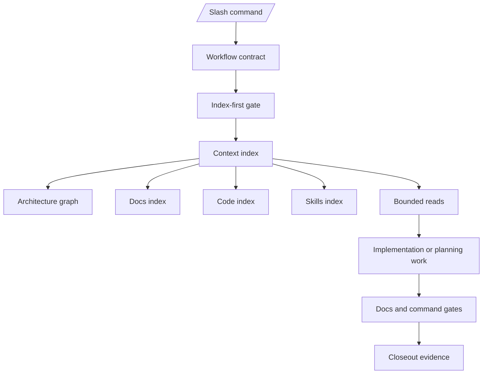
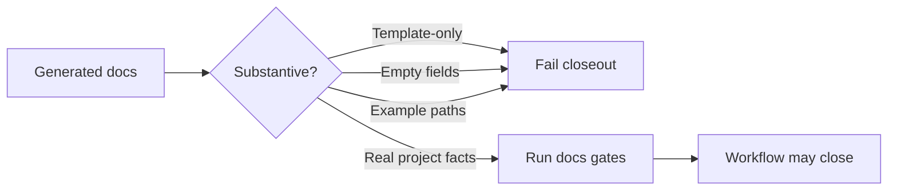
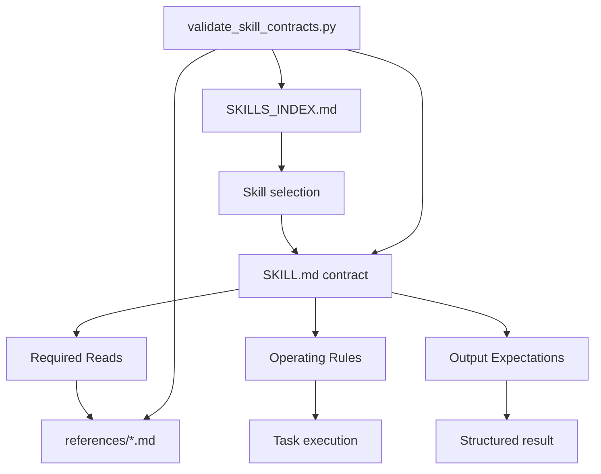

# Marcus Fleet V33.0 Release Notes

## Focus

V33.0 promotes `.agents` from a deterministic harness into an enterprise context
operating layer. The release focuses on making any capable model follow the same
bounded workflow: route through indexes first, load skills through explicit
contracts, create real development documentation instead of scaffolds, and close
work only after replayable gates pass.

This release is intended as the portable core for copying `.agents` into other
projects without relying on the parent repository.

## Executive Summary

- Index-first execution is now a first-class workflow requirement for broad code
  or docs work.
- All local skills are normalized into a compact contract format with dedicated
  reference files and a validator.
- Slash commands, workflows, README, usage docs, and registry entries are checked
  as one public command contract.
- Development documentation can no longer pass as template-only output.
- `/refactor-planning` is hardened for brownfield repositories with readiness,
  toolchain, output, docs, and index gates.
- Install/update onboarding now introduces the V33 workflow surface through
  `release_manifest.json` and `print_update_brief.py`.

## Major Changes

### 1. Index-First Context Harness

V33 reduces token waste and context drift by requiring models to consult a
generated context map before opening large trees.

Core scripts:

- `.agents/scripts/build_context_index.py`
- `.agents/scripts/validate_context_index.py`

Generated entrypoints:

- `.agents/index/architecture_graph.mmd`
- `.agents/index/docs_index.md`
- `.agents/index/code_index.md`
- `.agents/index/skills_index.md`

Bound workflows:

- `/develop`
- `/quick_fix`
- `/refactor-planning`
- harness execution preflight

### 2. Skill Contract Standardization

All local skills are now normalized to a predictable structure so models can
discover and apply skills without reading unrelated material.

Each skill now has:

- `Required Reads`
- `Operating Rules`
- `Output Expectations`
- `references/*.md`

New release gate:

```bash
python3 .agents/scripts/validate_skill_contracts.py --root .
```

The gate is wired into `/marcus.routecheck` so skill and routing changes cannot
ship without replaying the skill contract validator.

### 3. Anti-Template Development Docs Gate

V33 closes the release feedback gap where `/docs/development` could contain many
Markdown files but little useful content.

Strict development docs validation now rejects:

- empty labeled fields such as `Acceptance owner:`, `Evidence:`,
  `Expected output:`, or `Actual output:`
- `TBD`, `pending`, and unchecked scaffold markers
- copied template instructions such as `Write 2-4 paragraphs`
- example paths such as `src/example.ts`
- placeholder IDs such as `F-001-001-example` and `ISSUE-E-001-001`
- generic relationship or issue rows that do not describe real project facts

Required closeout examples:

```bash
python3 .agents/scripts/validate_development_docs.py --strict-counts
python3 .agents/scripts/validate_docs_substance.py --root . --include-development
python3 .agents/scripts/run_required_docs_gates.py --root . --mode execution
```

### 4. Slash Command Contract Enforcement

The public command surface is deterministic. A command is not considered
supported unless the workflow, registry, README, usage guide, and validator
agree.

Primary validator:

```bash
python3 .agents/scripts/validate_command_surface.py --root .
```

This prevents scripts from becoming decorative docs. If a script matters, it has
to be named by the slash command workflow and verified by the command surface
gate.

### 5. `/refactor-planning` Brownfield Hardening

`/refactor-planning` now fails closed before runtime-heavy refactoring when the
project is not ready.

Gate chain:

- `build_context_index.py --root .`
- `validate_context_index.py --root .`
- `validate_refactor_planning_readiness.py --root .`
- `validate_refactor_planning_toolchain.py --root .`
- `validate_refactor_planning_outputs.py --root .`
- `run_required_docs_gates.py --root . --mode auto`

If docs are missing, stale, shallow, or template-only, the workflow must route to
`/doc_reconcile` instead of improvising refactor context.

## Architecture Diagrams

### V33 Context Harness



### Docs Substance Gate



### Skill Contract Topology



## Upgrade Notes

After installing or updating:

```bash
python3 .agents/scripts/validate_command_surface.py --root .
python3 .agents/scripts/build_context_index.py --root .
python3 .agents/scripts/validate_context_index.py --root .
python3 .agents/scripts/validate_skill_contracts.py --root .
python3 .agents/scripts/run_required_docs_gates.py --root . --mode auto
```

For existing brownfield projects, run `/doc_reconcile` before `/develop`,
`/quick_fix`, or `/refactor-planning` when planning docs or development ledgers
are missing, stale, shallow, or template-only.

## Recommended Release Validation

```bash
python3 .agents/scripts/validate_command_surface.py --root .
python3 .agents/scripts/validate_harness_contract.py --root .
python3 .agents/scripts/validate_routing_regression.py --root .
python3 .agents/scripts/validate_skill_contracts.py --root .
python3 .agents/scripts/validate_context_index.py --root .
python3 .agents/scripts/validate_docs_substance.py --root . --include-development
python3 .agents/scripts/run_required_docs_gates.py --root . --mode execution
python3 .agents/scripts/audit_feature_contracts.py --root .
```
