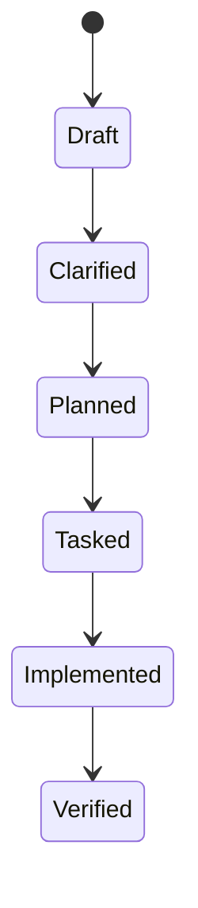

# Data Model: Marcus Spec Foundation

> Feature ID: `001-marcus-spec-foundation`

## Entities

| Entity | Fields | Owner | Notes |
| --- | --- | --- | --- |
| Constitution | version, ratified date, articles, amendments | `sophia-product-manager` | Stored at `.agents/memory/constitution.md`. |
| Feature | id, title, status, source prompt | `marcus-ai-orchestrator` | Directory under `.agents/specs/`. |
| SpecArtifact | filename, purpose, required flag | `david-systems-architect` | Markdown files generated from templates. |
| Task | id, owner, scope, verification, parallel flag | `marcus-ai-orchestrator` | Stored in `tasks.md`. |
| VerificationEvidence | date, check, result, notes | `ada-qa-agent` | Stored in `verification.md`. |

## State Transitions

## Validation Rules

- Feature ids must match `NNN-slug`.
- Required files must exist and be non-empty.
- Unresolved `[NEEDS CLARIFICATION]` markers fail validation unless explicitly
  allowed for draft mode.
- Completed tasks require verification evidence before closure.
