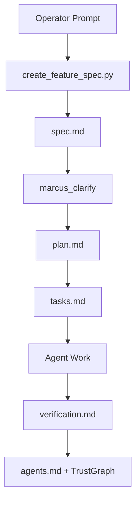

# Implementation Plan: Marcus Spec Foundation

> Feature ID: `001-marcus-spec-foundation`
> Spec: `spec.md`
> Constitution: `.agents/memory/constitution.md`

## 1. Technical Summary

Implement the first Marcus Fleet spec-driven foundation as an additive layer
inside `.agents`. This plan creates durable governance and feature-scoped
artifacts while preserving existing workflows and skills.

The implementation is intentionally small and local:

- Markdown constitution and templates.
- Python standard-library scripts for feature creation and validation.
- Workflow docs that map the new lifecycle to Marcus Fleet agents.
- A sample feature folder proving the process works.

## 2. Constitution Gates

- [x] Specification has no unresolved `[NEEDS CLARIFICATION]` markers, or the
      operator accepted the residual risk.
- [x] Contracts are defined before implementation.
- [x] Verification method is named before implementation.
- [x] No shell `eval` or unbounded command execution is introduced.
- [x] No hardcoded production secret is introduced.
- [x] TypeScript changes avoid `any` unless justified in Complexity Tracking.
- [x] Rollback path is documented for user-facing or operational changes.

## 3. Architecture

### 3.1 Current State

- Existing modules: `.agents/workflows`, `.agents/skills`,
  `.agents/adapters`, root `agents.md`.
- Current coupling: workflows depend on global `/docs` artifacts and skill
  routing depends on `SKILLS_INDEX.md`; neither provides feature-scoped
  acceptance criteria.
- Known constraints: preserve current commands and avoid network-dependent
  tooling in this step.

### 3.2 Target State

- New or changed modules:
  - `.agents/memory/constitution.md`
  - `.agents/templates/*.md`
  - `.agents/scripts/create_feature_spec.py`
  - `.agents/scripts/validate_specs.py`
  - `.agents/workflows/marcus_*.md`
  - `.agents/specs/001-marcus-spec-foundation/*`
- Data flow: operator prompt -> feature spec -> plan/contracts -> tasks ->
  implementation evidence -> `agents.md` and TrustGraph.
- Operational flow: agents use legacy workflows for execution but use
  feature-scoped specs as the source of truth for non-trivial work.

### 3.3 Mermaid Diagram

## 4. Contracts

| Contract | Purpose | Producer | Consumer |
| --- | --- | --- | --- |
| `contracts/spec-workspace.md` | Defines required files and pass/fail gates for a feature workspace. | `david-systems-architect` | All workflow agents |

## 5. Data Model

The data model is filesystem-based. Core entities: Constitution, Feature,
SpecArtifact, Task, VerificationEvidence.

## 6. Agent Routing

| Workstream | Primary Agent | Output | Verification |
| --- | --- | --- | --- |
| Specification | `sophia-product-manager` | `spec.md` | no unresolved clarifications |
| Architecture | `david-systems-architect` | `plan.md`, `contracts/` | constitution gates |
| Orchestration | `marcus-ai-orchestrator` | `agent-routing.md` | owners and write scopes |
| QA | `ada-qa-agent` | `verification.md` | evidence table |

## 7. Migration and Rollback

- Migration steps:
  1. Add constitution, templates, scripts, workflow docs.
  2. Generate first feature workspace.
  3. Validate feature workspace.
  4. Update `agents.md` and TrustGraph memory.
- Rollback steps:
  1. Remove `.agents/memory/constitution.md`.
  2. Remove `.agents/templates/`, `.agents/scripts/`, new `marcus_*.md`
     workflows, and `.agents/specs/001-marcus-spec-foundation/`.
  3. Revert the `agents.md` session entry.
- Compatibility notes: legacy `/planning`, `/design`, `/develop`, and
  `/quick_fix` remain available.

## 8. Complexity Tracking

Use this section only when a constitution gate fails or a new abstraction is
introduced.

| Decision | Reason | Alternative Rejected | Review Needed |
| --- | --- | --- | --- |
| Add new spec scripts instead of installing upstream Spec Kit CLI | Keep Marcus Fleet self-contained and offline-friendly | Pulling external CLI into the project | Low |
