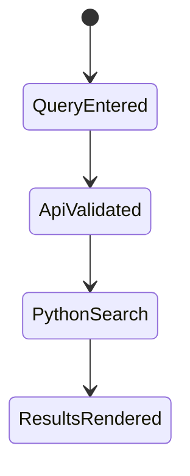

# Data Model: Viewer Type Safety

> Feature ID: `002-viewer-type-safety`

## Entities

| Entity | Fields | Owner | Notes |
| --- | --- | --- | --- |
| GraphNode | id, type, group, properties, val, incomingCount, outgoingCount, coordinates | `benny-frontend-engineer` | Represents Neo4j graph nodes in viewer. |
| GraphLink | source, target, type, properties | `benny-frontend-engineer` | Source/target may be ids or hydrated node objects. |
| GraphData | nodes, links | `benny-frontend-engineer` | Input to 3D graph. |
| VectorSearchResult | source, chunk_id, distance, content | `alan-tech-lead` | Result row from Chroma adapter. |
| VectorSearchResponse | query, results | `alan-tech-lead` | API response consumed by UI. |

## State Transitions

## Validation Rules

- Query must be a non-empty string.
- Vector API error responses must be JSON.
- Graph property display must normalize non-string values before rendering in
  string-only attributes.
