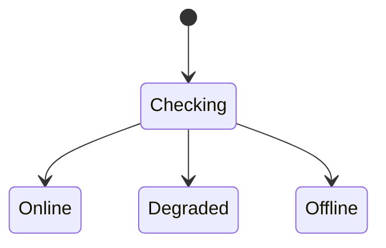

# Data Model: TrustGraph Runtime Health

> Feature ID: `003-trustgraph-runtime-health`

## Entities

| Entity | Fields | Owner | Notes |
| --- | --- | --- | --- |
| RuntimeServiceHealth | status, latencyMs, error | `alan-tech-lead` | Per-service state for Neo4j and Chroma. |
| RuntimeHealthResponse | status, checkedAt, services | `alan-tech-lead` | Aggregate response from `/api/health`. |

## State Transitions

## Validation Rules

- Aggregate status is `online` only when both services are online.
- Aggregate status is `degraded` when exactly one service is online.
- Aggregate status is `offline` when no service is online or the UI cannot fetch
  health.
