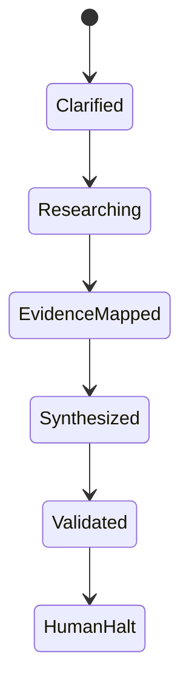

# Data Model: Planning Deep Research V30

> Feature ID: `004-planning-deep-research-v30`

## Entities

| Entity | Fields | Owner | Notes |
| --- | --- | --- | --- |
| Source | source_id, title, url, publisher, dates, source_type, trust_tier, domains | `arthur-search-agent` | Stored in `docs/research/sources.jsonl`. |
| Evidence | evidence_id, source_id, claim_area, locator, quote_or_summary, supports, confidence | `elite6-research` | Stored in `docs/research/evidence.jsonl`. |
| Claim | claim_id, claim, output_file, evidence_ids, status, risk | `sage-research-synthesis` | Stored in `docs/research/claims.jsonl`. |
| Contradiction | id, topic, source refs, conflict, decision, owner | `cyrus-research-critic` | Stored in `docs/research/contradictions.md`. |
| ResearchManifest | run_id, dates, mode, required outputs, quality gates | `marcus-ai-orchestrator` | Stored in `docs/research/research_manifest.json`. |
| PlanningOutput | path, purpose, validation status | `david-systems-architect` | The 8 legacy files under `/docs`. |

## State Transitions

## Validation Rules

- Supported claims must reference known evidence ids.
- Evidence rows must reference known source ids.
- The 8 legacy output files remain required for strict validation.
- Research ledger rows must be valid JSONL objects.
