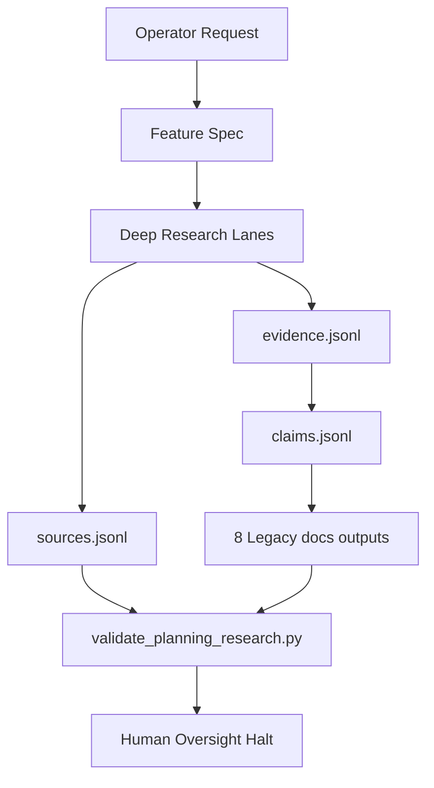

# Implementation Plan: Planning Deep Research V30

> Feature ID: `004-planning-deep-research-v30`
> Spec: `spec.md`
> Constitution: `.agents/memory/constitution.md`

## 1. Technical Summary

Upgrade `/planning` as an additive V30 workflow:

- Replace shallow map-reduce instructions with a deep-research evidence pipeline.
- Preserve the 8 legacy `/docs` outputs exactly.
- Add `/docs/research/*` ledgers and templates.
- Add `validate_planning_research.py` for local validation.
- Keep code generation forbidden and preserve human oversight halt.

## 2. Constitution Gates

- [x] Specification has no unresolved `[NEEDS CLARIFICATION]` markers, or the
      operator accepted the residual risk.
- [x] Contracts are defined before implementation.
- [x] Verification method is named before implementation.
- [x] No shell `eval` or unbounded command execution is introduced.
- [x] No hardcoded production secret is introduced.
- [x] TypeScript changes avoid `any` unless justified in Complexity Tracking.
- [x] Rollback path is documented for user-facing or operational changes.

## 3. Architecture

### 3.1 Current State

- Existing modules: `.agents/workflows/planning.md`, `.agents/templates`,
  `.agents/scripts`, `.agents/specs`.
- Current coupling: `/planning` outputs global `/docs` files and is used as
  project-level genesis. That contract must remain stable.
- Known constraints: no third-party dependencies; no removal of legacy files.

### 3.2 Target State

- New or changed modules:
  - `.agents/workflows/planning.md`
  - `.agents/templates/planning-*-template.*`
  - `.agents/scripts/validate_planning_research.py`
  - `.agents/specs/004-planning-deep-research-v30/*`
- Data flow: operator request -> feature spec -> research lanes -> source ledger
  -> evidence ledger -> claims ledger -> contradictions -> legacy `/docs` files
  -> validators -> human halt.
- Operational flow: `/planning` initializes ledgers, gathers evidence, refines
  outline, writes the 8 legacy outputs, validates, updates memory, halts.

### 3.3 Mermaid Diagram

## 4. Contracts

List files under `contracts/` and summarize each contract.

| Contract | Purpose | Producer | Consumer |
| --- | --- | --- | --- |
| `contracts/planning-output-contract.md` | Defines required legacy outputs and added research files. | `david-systems-architect` | `/planning` agents |

## 5. Data Model

Entities are listed in `data-model.md`: Source, Evidence, Claim,
Contradiction, ResearchManifest, PlanningOutput.

## 6. Agent Routing

Summarize ownership from `agent-routing.md`.

| Workstream | Primary Agent | Output | Verification |
| --- | --- | --- | --- |
| Workflow rewrite | `marcus-ai-orchestrator` | V30 `planning.md` | spec validation |
| Research templates | `sage-research-synthesis` | planning ledger templates | file checks |
| Validator | `ada-qa-agent` | `validate_planning_research.py` | AST parse |

## 7. Migration and Rollback

- Migration steps:
  1. Add research ledger templates.
  2. Add planning research validator.
  3. Rewrite `/planning` instructions while preserving output contract.
  4. Validate specs and scripts.
- Rollback steps:
  1. Restore previous `.agents/workflows/planning.md`.
  2. Remove planning research templates and validator if not wanted.
- Compatibility notes: `/docs` output names remain unchanged.

## 8. Complexity Tracking

Use this section only when a constitution gate fails or a new abstraction is
introduced.

| Decision | Reason | Alternative Rejected | Review Needed |
| --- | --- | --- | --- |
| Add research validator rather than full citation verifier | Keeps this step dependency-free and local | Pull in third-party deep-research scripts immediately | Low |
