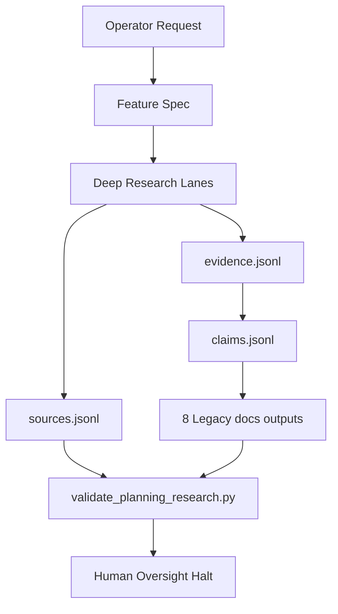

# Implementation Plan: Planning Deep Research V30

> Feature ID: `004-planning-deep-research-v30`
> Spec: `spec.md`
> Constitution: `.agents/memory/constitution.md`

## 1. Technical Summary

Upgrade `/planning` as an additive V30 workflow:

- Replace shallow map-reduce instructions with a deep-research evidence pipeline.
- Preserve the 8 legacy `/docs` outputs exactly.
- Add `/docs/research/*` ledgers and templates.
- Add `validate_planning_research.py` for local validation.
- Keep code generation forbidden and preserve human oversight halt.

## 2. Constitution Gates

- [x] Specification has no unresolved `[NEEDS CLARIFICATION]` markers, or the
      operator accepted the residual risk.
- [x] Contracts are defined before implementation.
- [x] Verification method is named before implementation.
- [x] No shell `eval` or unbounded command execution is introduced.
- [x] No hardcoded production secret is introduced.
- [x] TypeScript changes avoid `any` unless justified in Complexity Tracking.
- [x] Rollback path is documented for user-facing or operational changes.

## 3. Architecture

### 3.1 Current State

- Existing modules: `.agents/workflows/planning.md`, `.agents/templates`,
  `.agents/scripts`, `.agents/specs`.
- Current coupling: `/planning` outputs global `/docs` files and is used as
  project-level genesis. That contract must remain stable.
- Known constraints: no third-party dependencies; no removal of legacy files.

### 3.2 Target State

- New or changed modules:
  - `.agents/workflows/planning.md`
  - `.agents/templates/planning-*-template.*`
  - `.agents/scripts/validate_planning_research.py`
  - `.agents/specs/004-planning-deep-research-v30/*`
- Data flow: operator request -> feature spec -> research lanes -> source ledger
  -> evidence ledger -> claims ledger -> contradictions -> legacy `/docs` files
  -> validators -> human halt.
- Operational flow: `/planning` initializes ledgers, gathers evidence, refines
  outline, writes the 8 legacy outputs, validates, updates memory, halts.

### 3.3 Mermaid Diagram

## 4. Contracts

| Contract | Purpose | Producer | Consumer |
| --- | --- | --- | --- |
| `planning-output-contract.md` | Feature-specific contract consumed by the current slash-command surface. | feature owner | `/develop`, `/quick_fix`, and reviewers |

## 5. Data Model

Entities are listed in `data-model.md`: Source, Evidence, Claim,
Contradiction, ResearchManifest, PlanningOutput.

## 6. Agent Routing

| Workstream | Primary Agent | Output | Verification |
| --- | --- | --- | --- |
| Workflow rewrite | `marcus-ai-orchestrator` | V30 `planning.md` | spec validation |
| Research templates | `sage-research-synthesis` | planning ledger templates | file checks |
| Validator | `ada-qa-agent` | `validate_planning_research.py` | AST parse |

Execution monitoring:

- Blocking gates before implementation: spec validation, execution-brief rebuild, and readiness validation must all pass.
- Evidence checkpoints during implementation: python3 .agents/scripts/validate_specs.py --feature .agents/specs/004-planning-deep-research-v30; python3 -m py_compile .agents/scripts/validate_planning_research.py.
- Escalation condition after repeated failure: if the same validator or verification command fails three times without new evidence, stop widening scope and repair the package or code path that actually failed.

Execution monitoring:

- Blocking gates before implementation: spec validation, execution-brief rebuild, and readiness validation must all pass.
- Evidence checkpoints during implementation: python3 .agents/scripts/validate_specs.py --feature .agents/specs/004-planning-deep-research-v30; python3 -m py_compile .agents/scripts/validate_planning_research.py.
- Escalation condition after repeated failure: if the same validator or verification command fails three times without new evidence, stop widening scope and repair the package or code path that actually failed.

Execution monitoring:

- Blocking gates before implementation: spec validation, execution-brief rebuild, and readiness validation must all pass.
- Evidence checkpoints during implementation: python3 .agents/scripts/validate_specs.py --feature .agents/specs/004-planning-deep-research-v30; python3 -m py_compile .agents/scripts/validate_planning_research.py.
- Escalation condition after repeated failure: if the same validator or verification command fails three times without new evidence, stop widening scope and repair the package or code path that actually failed.

## 7. Migration and Rollback

- Migration steps:
  1. Reconcile the feature package to the current contract.
  2. Rebuild `execution-brief.md` for the active task shape.
  3. Re-run spec and readiness validation before downstream execution.
- Rollback steps:
  1. Restore the previous `004-planning-deep-research-v30` docs package if the contract upgrade proves misleading.
  2. Revert only the additive governance sections; do not silently discard verified implementation evidence.
- Compatibility notes: preserve the implemented behavior and existing contracts while making the feature package consumable by the current slash-command surface.

## 8. Complexity Tracking

| Decision | Reason | Alternative Rejected | Review Needed |
| --- | --- | --- | --- |
| Add research validator rather than full citation verifier | Keeps this step dependency-free and local | Pull in third-party deep-research scripts immediately | Low |

## 9. POC Slice and Review Cadence

- POC slice boundary: prove `004-planning-deep-research-v30` end-to-end using the smallest professional slice that exercises the main contract and verification path.
- Success evidence for the slice: python3 .agents/scripts/validate_specs.py --feature .agents/specs/004-planning-deep-research-v30; python3 -m py_compile .agents/scripts/validate_planning_research.py plus updated review-loop and release-recommendation artifacts.
- What remains intentionally unproven after the slice: broader product rollout, unrelated modules, and any live services the current feature explicitly left as residual risk.
- Review cadence:
  - Draft architecture review: after the package is reconciled to the current contract.
  - Challenge review: after tasks, routing, and quickstart replay are concrete.
  - Final readiness review: after verification evidence and release recommendation are updated.
- Stop conditions: readiness fails, review findings expose hidden scope growth, or the replay steps cannot be followed from docs alone.
- Proceed conditions: spec validation passes, execution-brief freshness passes, readiness passes, and the verification package names a clear release recommendation.
