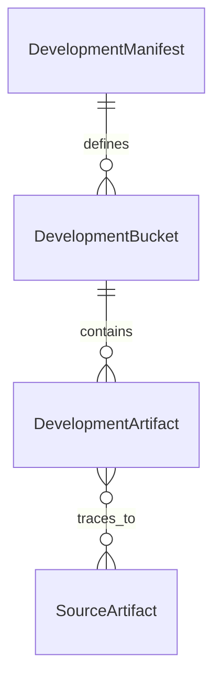

# Data Model: Develop Knowledge Ledger

> Feature ID: `005-develop-knowledge-ledger`

## Entities

### Entity: DevelopmentManifest

| Field | Type | Required | Notes |
| --- | --- | --- | --- |
| `version` | string | yes | Manifest schema version |
| `phase` | string | yes | Must be `develop` |
| `feature_id` | string | no | Related `.agents/specs/<feature-id>` |
| `source_artifacts` | string[] | yes | Planning/spec sources used by code phase |
| `buckets` | object | yes | Bucket path and minimum counts |
| `quality_gates` | object | yes | Validation flags |

### Entity: DevelopmentBucket

| Field | Type | Required | Notes |
| --- | --- | --- | --- |
| `path` | string | yes | Bucket folder under `docs/development/` |
| `minimum_count` | integer | yes | Required count in strict validation |

### Entity: DevelopmentArtifact

| Field | Type | Required | Notes |
| --- | --- | --- | --- |
| `id` | string | yes | Stable artifact id |
| `type` | string | yes | `epic`, `module`, `feature`, `page`, or `task` |
| `status` | string | yes | Draft/in-progress/verified |
| `owner_skill` | string | yes | Primary skill accountable for the note |
| `source_trace` | string[] | yes | Planning/spec files this artifact derives from |
| `verification` | string[] | yes | Evidence or pending checks |

## Relationships

## Validation Rules

- Every bucket path in the manifest must exist.
- Strict validation requires bucket counts to meet `minimum_count`.
- Markdown artifacts must include required frontmatter fields.
- Modules/features/tasks must include code or write scope.
