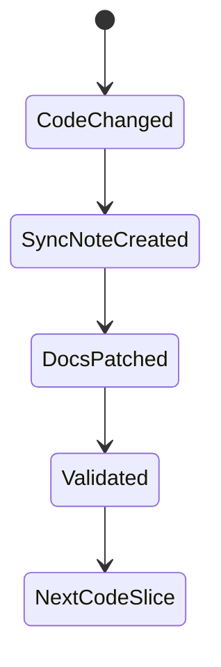

# Data Model: Continuous Documentation Sync

> Feature ID: `006-continuous-documentation-sync`

## Entities

| Entity | Fields | Owner | Notes |
| --- | --- | --- | --- |
| `SyncManifest` | `version`, `policy`, `required_doc_targets`, `quality_gates` | `knowledge-work-architecture` | Defines sync policy |
| `SyncNote` | `id`, `changed_files`, `doc_decisions`, `verification` | `marcus-ai-orchestrator` | One note per code slice |
| `ChangedSourceFile` | `path`, `reason`, `impact` | owner skill | Links code change to docs |
| `DocDecision` | `path`, `updated_or_unchanged`, `reason` | owner skill | Records append/patch/no-change decision |

## State Transitions

## Validation Rules

- Source files changed during `/develop` require at least one sync note.
- Latest sync note must have no unchecked targeted-patch policy items in strict mode.
- Latest sync note must include decisions for legacy docs and development ledger docs.
- Strict mode expects source changes and doc changes to appear together.
