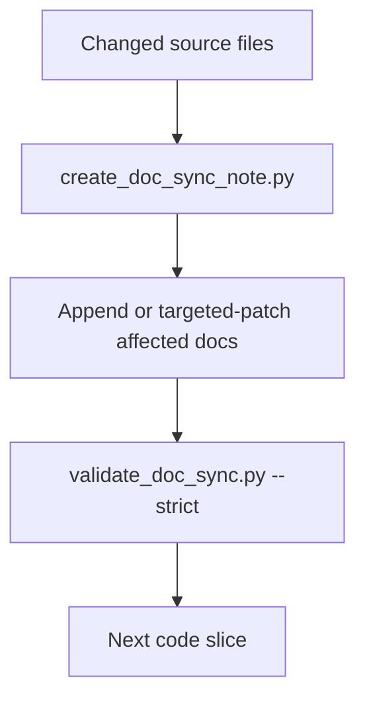

# Implementation Plan: Continuous Documentation Sync

> Feature ID: `006-continuous-documentation-sync`
> Spec: `spec.md`
> Constitution: `.agents/memory/constitution.md`

## 1. Technical Summary

Add a continuous documentation sync gate to `/develop` so code changes and PM
docs evolve together. The implementation adds sync templates, a sync note
creator, strict validation, workflow gates, and documentation policy updates.

## 2. Constitution Gates

- [x] Specification has no unresolved `[NEEDS CLARIFICATION]` markers, or the
      operator accepted the residual risk.
- [x] Contracts are defined before implementation.
- [x] Verification method is named before implementation.
- [x] No shell `eval` or unbounded command execution is introduced.
- [x] No hardcoded production secret is introduced.
- [x] TypeScript changes avoid `any` unless justified in Complexity Tracking.
- [x] Rollback path is documented for user-facing or operational changes.

## 3. Architecture

### 3.1 Current State

- Existing modules: `/develop`, development ledger templates, development docs
  validator, CI template, README, usage guide, `.clinerules`.
- Current coupling: code phase docs exist, but no per-code-slice sync gate
  ensures repeated implementation cycles keep PM docs current.
- Known constraints: do not replace legacy docs wholesale.

### 3.2 Target State

- New or changed modules: sync templates, `create_doc_sync_note.py`,
  `validate_doc_sync.py`, `/develop` Node 6.5, docs/CI governance updates.
- Data flow: changed source files -> sync note -> targeted doc updates ->
  strict validation -> next code slice.
- Operational flow: run sync after code slice, update affected docs, validate,
  then continue.

### 3.3 Mermaid Diagram

## 4. Contracts

List files under `contracts/` and summarize each contract.

| Contract | Purpose | Producer | Consumer |
| --- | --- | --- | --- |
| `contracts/doc-sync-contract.md` | Defines sync note and validation behavior | `/develop` | PM docs, CI, future agents |

## 5. Data Model

Summarize entities from `data-model.md`.

## 6. Agent Routing

Summarize ownership from `agent-routing.md`.

| Workstream | Primary Agent | Output | Verification |
| --- | --- | --- | --- |
| TBD | TBD | TBD | TBD |

## 7. Migration and Rollback

- Migration steps:
- Rollback steps:
- Compatibility notes:

## 8. Complexity Tracking

Use this section only when a constitution gate fails or a new abstraction is
introduced.

| Decision | Reason | Alternative Rejected | Review Needed |
| --- | --- | --- | --- |
| TBD | TBD | TBD | TBD |
