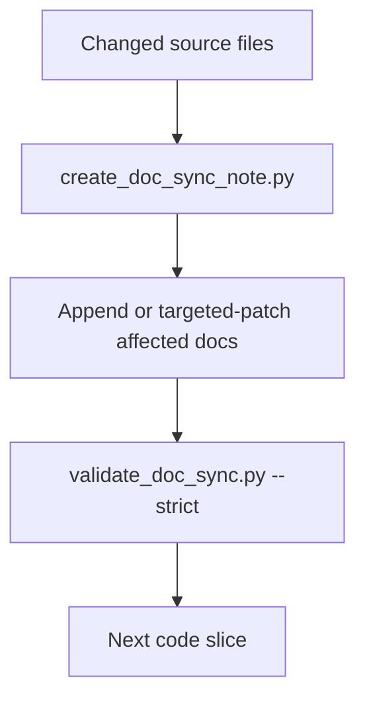

# Implementation Plan: Continuous Documentation Sync

> Feature ID: `006-continuous-documentation-sync`
> Spec: `spec.md`
> Constitution: `.agents/memory/constitution.md`

## 1. Technical Summary

Add a continuous documentation sync gate to `/develop` so code changes and PM
docs evolve together. The implementation adds sync templates, a sync note
creator, strict validation, workflow gates, and documentation policy updates.

## 2. Constitution Gates

- [x] Specification has no unresolved `[NEEDS CLARIFICATION]` markers, or the
      operator accepted the residual risk.
- [x] Contracts are defined before implementation.
- [x] Verification method is named before implementation.
- [x] No shell `eval` or unbounded command execution is introduced.
- [x] No hardcoded production secret is introduced.
- [x] TypeScript changes avoid `any` unless justified in Complexity Tracking.
- [x] Rollback path is documented for user-facing or operational changes.

## 3. Architecture

### 3.1 Current State

- Existing modules: `/develop`, development ledger templates, development docs
  validator, CI template, README, usage guide, `.clinerules`.
- Current coupling: code phase docs exist, but no per-code-slice sync gate
  ensures repeated implementation cycles keep PM docs current.
- Known constraints: do not replace legacy docs wholesale.

### 3.2 Target State

- New or changed modules: sync templates, `create_doc_sync_note.py`,
  `validate_doc_sync.py`, `/develop` Node 6.5, docs/CI governance updates.
- Data flow: changed source files -> sync note -> targeted doc updates ->
  strict validation -> next code slice.
- Operational flow: run sync after code slice, update affected docs, validate,
  then continue.

### 3.3 Mermaid Diagram

## 4. Contracts

| Contract | Purpose | Producer | Consumer |
| --- | --- | --- | --- |
| `doc-sync-contract.md` | Feature-specific contract consumed by the current slash-command surface. | feature owner | `/develop`, `/quick_fix`, and reviewers |

## 5. Data Model

The data model remains the feature-specific entities already captured in `data-model.md`.

## 6. Agent Routing

Every workstream needs one primary owner. Supporting agents may challenge, verify, or contribute evidence, but they must not rewrite unrelated scopes without updating this routing contract.

| Workstream | Primary Skill | Supporting Skills | Write Scope | Output |
| --- | --- | --- | --- | --- |
| Workflow gate | `marcus-ai-orchestrator` | `sophia-product-manager` | `.agents/workflows/develop.md` | Node 6.5 sync checkpoint |
| Knowledge policy | `knowledge-work-architecture` | `architecture-decision-records` | templates and docs | Append/patch policy |
| Script implementation | `alan-tech-lead` | `ada-qa-agent` | `.agents/scripts/create_doc_sync_note.py`, `.agents/scripts/validate_doc_sync.py` | CLI tools |
| PM docs | `sophia-product-manager` | `marcus-ai-orchestrator` | README, USAGE, release notes | Operator guidance |
| QA gate | `ada-qa-agent` | `eve-qa-approver` | CI template and verification | Repeatable checks |

Execution monitoring:

- Blocking gates before implementation: spec validation, execution-brief rebuild, and readiness validation must all pass.
- Evidence checkpoints during implementation: python3 .agents/scripts/validate_specs.py --feature .agents/specs/006-continuous-documentation-sync; python3 .agents/scripts/validate_doc_sync.py --strict.
- Escalation condition after repeated failure: if the same validator or verification command fails three times without new evidence, stop widening scope and repair the package or code path that actually failed.

## 7. Migration and Rollback

- Migration steps:
  1. Reconcile the feature package to the current contract.
  2. Rebuild `execution-brief.md` for the active task shape.
  3. Re-run spec and readiness validation before downstream execution.
- Rollback steps:
  1. Restore the previous `006-continuous-documentation-sync` docs package if the contract upgrade proves misleading.
  2. Revert only the additive governance sections; do not silently discard verified implementation evidence.
- Compatibility notes: preserve the implemented behavior and existing contracts while making the feature package consumable by the current slash-command surface.

## 8. Complexity Tracking

| Decision | Reason | Alternative Rejected | Review Needed |
| --- | --- | --- | --- |
| Upgrade `006-continuous-documentation-sync` in place instead of replacing it wholesale | Preserves existing evidence and reduces migration risk | Rewriting the entire feature package from scratch | Medium |

## 9. POC Slice and Review Cadence

- POC slice boundary: prove `006-continuous-documentation-sync` end-to-end using the smallest professional slice that exercises the main contract and verification path.
- Success evidence for the slice: python3 .agents/scripts/validate_specs.py --feature .agents/specs/006-continuous-documentation-sync; python3 .agents/scripts/validate_doc_sync.py --strict plus updated review-loop and release-recommendation artifacts.
- What remains intentionally unproven after the slice: broader product rollout, unrelated modules, and any live services the current feature explicitly left as residual risk.
- Review cadence:
  - Draft architecture review: after the package is reconciled to the current contract.
  - Challenge review: after tasks, routing, and quickstart replay are concrete.
  - Final readiness review: after verification evidence and release recommendation are updated.
- Stop conditions: readiness fails, review findings expose hidden scope growth, or the replay steps cannot be followed from docs alone.
- Proceed conditions: spec validation passes, execution-brief freshness passes, readiness passes, and the verification package names a clear release recommendation.
