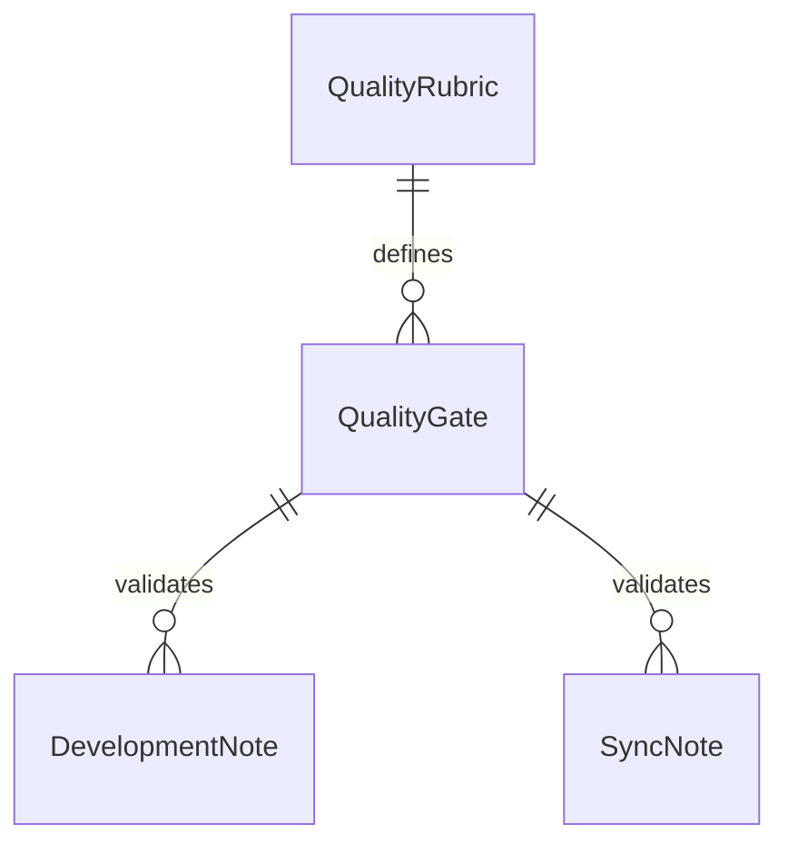

# Data Model: Substantive Development Docs Quality

> Feature ID: `007-substantive-development-docs-quality`

## Entities

| Entity | Fields | Owner | Notes |
| --- | --- | --- | --- |
| `QualityRubric` | `rejected_content`, `required_content`, `minimum_depth` | `knowledge-work-architecture` | Shared rules for all code-phase docs |
| `QualityGate` | `name`, `enabled`, `error_message` | `ada-qa-agent` | Validator rule |
| `DevelopmentNote` | `body`, `frontmatter`, `code_paths`, `evidence` | owner skill | Artifact being validated |
| `SyncNote` | `changed_files`, `doc_decisions`, `verification` | owner skill | Per-code-slice sync audit |

## Relationships

## Validation Rules

- Placeholder residue fails.
- Shallow body depth fails.
- Missing code path fails for module, feature, and task notes.
- Missing rationale markers fails.
- Unchecked boxes fail.
