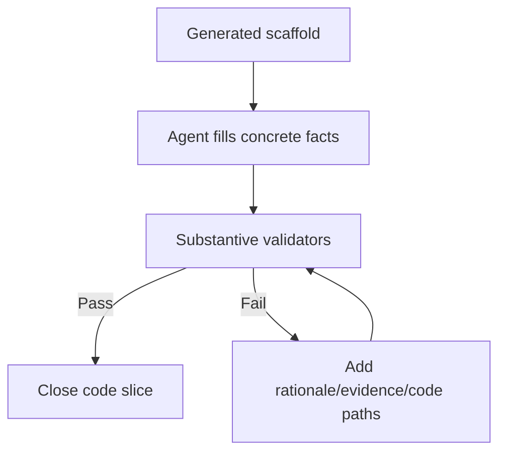

# Implementation Plan: Substantive Development Docs Quality

> Feature ID: `007-substantive-development-docs-quality`
> Spec: `spec.md`
> Constitution: `.agents/memory/constitution.md`

## 1. Technical Summary

Add hard quality gates to development documentation. The implementation updates
validators, templates, workflow rules, and PM-facing docs so scaffolded template
output fails until agents provide concrete implementation knowledge.

## 2. Constitution Gates

- [x] Specification has no unresolved `[NEEDS CLARIFICATION]` markers, or the
      operator accepted the residual risk.
- [x] Contracts are defined before implementation.
- [x] Verification method is named before implementation.
- [x] No shell `eval` or unbounded command execution is introduced.
- [x] No hardcoded production secret is introduced.
- [x] TypeScript changes avoid `any` unless justified in Complexity Tracking.
- [x] Rollback path is documented for user-facing or operational changes.

## 3. Architecture

### 3.1 Current State

- Existing modules: development templates, sync templates,
  `validate_development_docs.py`, `validate_doc_sync.py`, `/develop`.
- Current coupling: validators checked structure but not substantive content.
- Known constraints: scaffold templates will intentionally fail strict validation
  until agents fill them with real facts.

### 3.2 Target State

- New or changed modules: quality rubric, stricter validators, richer templates,
  workflow quality gate, release/docs updates.
- Data flow: scaffold -> agent writes substantive note -> strict validator
  rejects placeholders/shallow output -> closeout.
- Operational flow: templates are drafts, quality pass happens after real docs.

### 3.3 Mermaid Diagram

## 4. Contracts

List files under `contracts/` and summarize each contract.

| Contract | Purpose | Producer | Consumer |
| --- | --- | --- | --- |
| `contracts/substantive-doc-quality-contract.md` | Defines hard documentation quality gates | `/develop` | validators and PM review |

## 5. Data Model

Summarize entities from `data-model.md`.

## 6. Agent Routing

Summarize ownership from `agent-routing.md`.

| Workstream | Primary Agent | Output | Verification |
| --- | --- | --- | --- |
| TBD | TBD | TBD | TBD |

## 7. Migration and Rollback

- Migration steps:
- Rollback steps:
- Compatibility notes:

## 8. Complexity Tracking

Use this section only when a constitution gate fails or a new abstraction is
introduced.

| Decision | Reason | Alternative Rejected | Review Needed |
| --- | --- | --- | --- |
| TBD | TBD | TBD | TBD |
