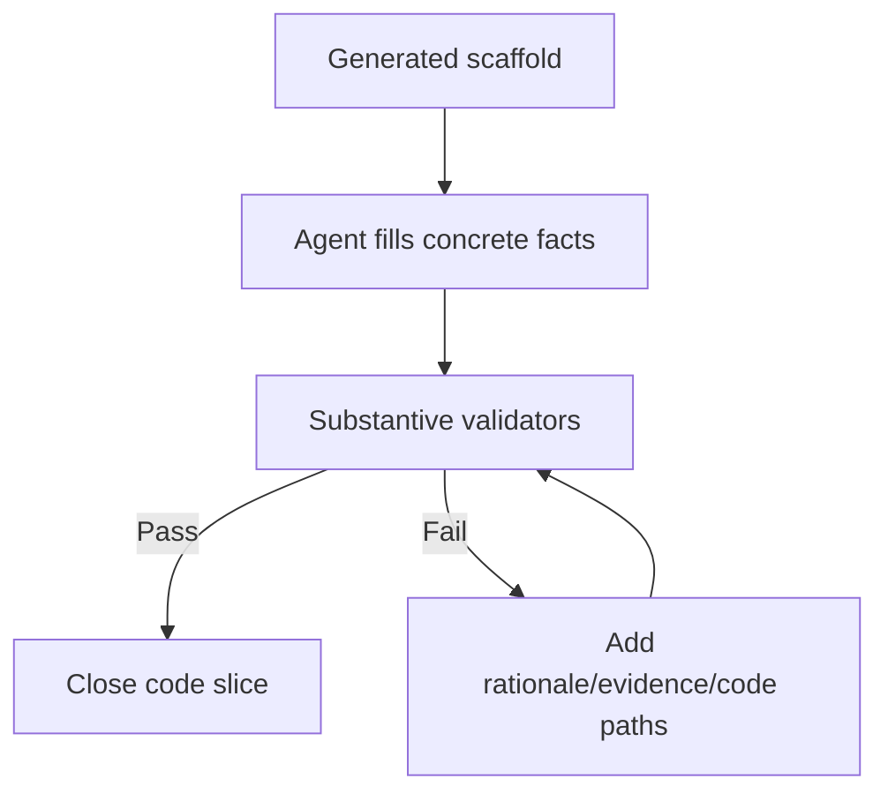

# Implementation Plan: Substantive Development Docs Quality

> Feature ID: `007-substantive-development-docs-quality`
> Spec: `spec.md`
> Constitution: `.agents/memory/constitution.md`

## 1. Technical Summary

Add hard quality gates to development documentation. The implementation updates
validators, templates, workflow rules, and PM-facing docs so scaffolded template
output fails until agents provide concrete implementation knowledge.

## 2. Constitution Gates

- [x] Specification has no unresolved `[NEEDS CLARIFICATION]` markers, or the
      operator accepted the residual risk.
- [x] Contracts are defined before implementation.
- [x] Verification method is named before implementation.
- [x] No shell `eval` or unbounded command execution is introduced.
- [x] No hardcoded production secret is introduced.
- [x] TypeScript changes avoid `any` unless justified in Complexity Tracking.
- [x] Rollback path is documented for user-facing or operational changes.

## 3. Architecture

### 3.1 Current State

- Existing modules: development templates, sync templates,
  `validate_development_docs.py`, `validate_doc_sync.py`, `/develop`.
- Current coupling: validators checked structure but not substantive content.
- Known constraints: scaffold templates will intentionally fail strict validation
  until agents fill them with real facts.

### 3.2 Target State

- New or changed modules: quality rubric, stricter validators, richer templates,
  workflow quality gate, release/docs updates.
- Data flow: scaffold -> agent writes substantive note -> strict validator
  rejects placeholders/shallow output -> closeout.
- Operational flow: templates are drafts, quality pass happens after real docs.

### 3.3 Mermaid Diagram

## 4. Contracts

| Contract | Purpose | Producer | Consumer |
| --- | --- | --- | --- |
| `substantive-doc-quality-contract.md` | Feature-specific contract consumed by the current slash-command surface. | feature owner | `/develop`, `/quick_fix`, and reviewers |

## 5. Data Model

The data model remains the feature-specific entities already captured in `data-model.md`.

## 6. Agent Routing

Every workstream needs one primary owner. Supporting agents may challenge, verify, or contribute evidence, but they must not rewrite unrelated scopes without updating this routing contract.

| Workstream | Primary Skill | Supporting Skills | Write Scope | Output |
| --- | --- | --- | --- | --- |
| Quality rubric | `knowledge-work-architecture` | `sophia-product-manager` | `.agents/DEVELOPMENT_DOCS_QUALITY_RUBRIC.md` | PM-grade documentation bar |
| Development validator | `ada-qa-agent` | `alan-tech-lead` | `.agents/scripts/validate_development_docs.py` | Strict content validation |
| Sync validator | `ada-qa-agent` | `knowledge-work-architecture` | `.agents/scripts/validate_doc_sync.py` | Strict sync note validation |
| Templates | `knowledge-work-architecture` | `marcus-ai-orchestrator` | `.agents/templates/development-*` | Quality-bar prompts |
| Workflow/docs | `marcus-ai-orchestrator` | `sophia-product-manager` | `/develop`, README, USAGE, `.clinerules` | Visible enforcement |

Execution monitoring:

- Blocking gates before implementation: spec validation, execution-brief rebuild, and readiness validation must all pass.
- Evidence checkpoints during implementation: python3 .agents/scripts/validate_specs.py --feature .agents/specs/007-substantive-development-docs-quality; python3 .agents/scripts/validate_development_docs.py --strict-counts.
- Escalation condition after repeated failure: if the same validator or verification command fails three times without new evidence, stop widening scope and repair the package or code path that actually failed.

## 7. Migration and Rollback

- Migration steps:
  1. Reconcile the feature package to the current contract.
  2. Rebuild `execution-brief.md` for the active task shape.
  3. Re-run spec and readiness validation before downstream execution.
- Rollback steps:
  1. Restore the previous `007-substantive-development-docs-quality` docs package if the contract upgrade proves misleading.
  2. Revert only the additive governance sections; do not silently discard verified implementation evidence.
- Compatibility notes: preserve the implemented behavior and existing contracts while making the feature package consumable by the current slash-command surface.

## 8. Complexity Tracking

| Decision | Reason | Alternative Rejected | Review Needed |
| --- | --- | --- | --- |
| Upgrade `007-substantive-development-docs-quality` in place instead of replacing it wholesale | Preserves existing evidence and reduces migration risk | Rewriting the entire feature package from scratch | Medium |

## 9. POC Slice and Review Cadence

- POC slice boundary: prove `007-substantive-development-docs-quality` end-to-end using the smallest professional slice that exercises the main contract and verification path.
- Success evidence for the slice: python3 .agents/scripts/validate_specs.py --feature .agents/specs/007-substantive-development-docs-quality; python3 .agents/scripts/validate_development_docs.py --strict-counts plus updated review-loop and release-recommendation artifacts.
- What remains intentionally unproven after the slice: broader product rollout, unrelated modules, and any live services the current feature explicitly left as residual risk.
- Review cadence:
  - Draft architecture review: after the package is reconciled to the current contract.
  - Challenge review: after tasks, routing, and quickstart replay are concrete.
  - Final readiness review: after verification evidence and release recommendation are updated.
- Stop conditions: readiness fails, review findings expose hidden scope growth, or the replay steps cannot be followed from docs alone.
- Proceed conditions: spec validation passes, execution-brief freshness passes, readiness passes, and the verification package names a clear release recommendation.
