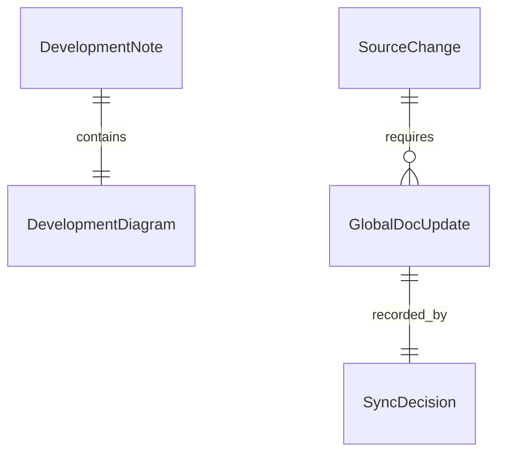

# Data Model: Feature Docs Mermaid Global Sync

> Feature ID: `008-feature-docs-mermaid-global-sync`

## Entities

| Entity | Fields | Owner | Notes |
| --- | --- | --- | --- |
| `DevelopmentDiagram` | `bucket`, `diagram_type`, `purpose`, `source_note` | `knowledge-work-architecture` | Mermaid diagram inside a development note |
| `GlobalDocUpdate` | `path`, `reason`, `changed_fact`, `evidence` | `sophia-product-manager` | Required PM-facing global docs update |
| `SyncDecision` | `doc_path`, `decision`, `because` | owner skill | Records why global docs changed |

## Relationships

## Validation Rules

- Development notes require Mermaid.
- Source behavior changes require at least one global doc update.
- Sync notes require an `updated because` global-doc decision.
