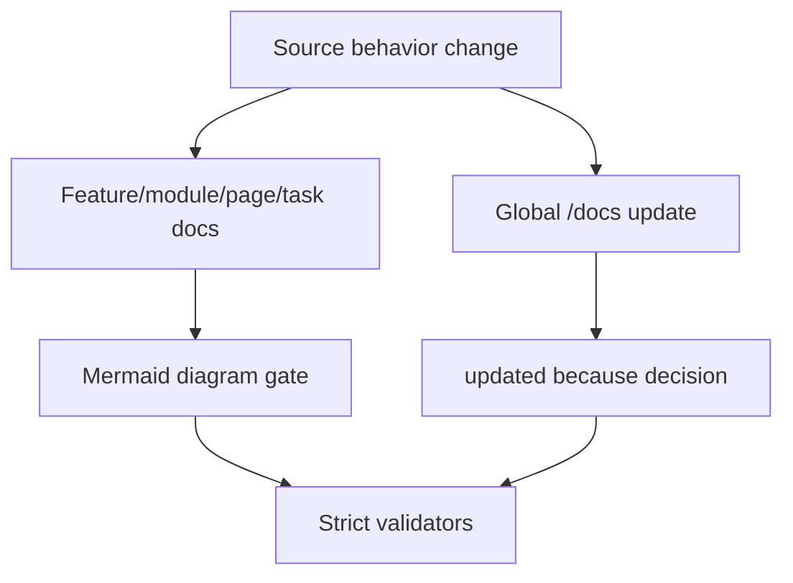

# Implementation Plan: Feature Docs Mermaid Global Sync

> Feature ID: `008-feature-docs-mermaid-global-sync`
> Spec: `spec.md`
> Constitution: `.agents/memory/constitution.md`

## 1. Technical Summary

Extend V30.3 docs quality gates with mandatory Mermaid diagrams and mandatory
global planning doc updates. Validators, templates, rubric, and `/develop` now
make diagrams and global docs synchronization non-optional.

## 2. Constitution Gates

- [x] Specification has no unresolved `[NEEDS CLARIFICATION]` markers, or the
      operator accepted the residual risk.
- [x] Contracts are defined before implementation.
- [x] Verification method is named before implementation.
- [x] No shell `eval` or unbounded command execution is introduced.
- [x] No hardcoded production secret is introduced.
- [x] TypeScript changes avoid `any` unless justified in Complexity Tracking.
- [x] Rollback path is documented for user-facing or operational changes.

## 3. Architecture

### 3.1 Current State

- Existing modules: `validate_development_docs.py`, `validate_doc_sync.py`,
  development templates, `/develop`, quality rubric.
- Current coupling: docs quality checks exist but did not require Mermaid or a
  global docs update per behavior-changing code slice.
- Known constraints: strict mode should fail missing diagrams by design.

### 3.2 Target State

- New or changed modules: Mermaid validation, global docs update validation,
  template diagram sections, rubric/workflow/docs updates.
- Data flow: feature docs -> Mermaid gate; source changes -> global docs gate.
- Operational flow: fill feature docs with real diagrams, patch global docs, run
  strict validators.

### 3.3 Mermaid Diagram

## 4. Contracts

List files under `contracts/` and summarize each contract.

| Contract | Purpose | Producer | Consumer |
| --- | --- | --- | --- |
| `contracts/mermaid-global-docs-contract.md` | Defines diagram and global docs enforcement | `/develop` | validators and PM review |

## 5. Data Model

Summarize entities from `data-model.md`.

## 6. Agent Routing

Summarize ownership from `agent-routing.md`.

| Workstream | Primary Agent | Output | Verification |
| --- | --- | --- | --- |
| TBD | TBD | TBD | TBD |

## 7. Migration and Rollback

- Migration steps:
- Rollback steps:
- Compatibility notes:

## 8. Complexity Tracking

Use this section only when a constitution gate fails or a new abstraction is
introduced.

| Decision | Reason | Alternative Rejected | Review Needed |
| --- | --- | --- | --- |
| TBD | TBD | TBD | TBD |
