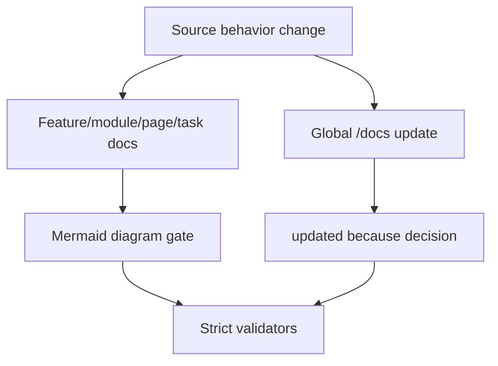

# Implementation Plan: Feature Docs Mermaid Global Sync

> Feature ID: `008-feature-docs-mermaid-global-sync`
> Spec: `spec.md`
> Constitution: `.agents/memory/constitution.md`

## 1. Technical Summary

Extend V30.3 docs quality gates with mandatory Mermaid diagrams and mandatory
global planning doc updates. Validators, templates, rubric, and `/develop` now
make diagrams and global docs synchronization non-optional.

## 2. Constitution Gates

- [x] Specification has no unresolved `[NEEDS CLARIFICATION]` markers, or the
      operator accepted the residual risk.
- [x] Contracts are defined before implementation.
- [x] Verification method is named before implementation.
- [x] No shell `eval` or unbounded command execution is introduced.
- [x] No hardcoded production secret is introduced.
- [x] TypeScript changes avoid `any` unless justified in Complexity Tracking.
- [x] Rollback path is documented for user-facing or operational changes.

## 3. Architecture

### 3.1 Current State

- Existing modules: `validate_development_docs.py`, `validate_doc_sync.py`,
  development templates, `/develop`, quality rubric.
- Current coupling: docs quality checks exist but did not require Mermaid or a
  global docs update per behavior-changing code slice.
- Known constraints: strict mode should fail missing diagrams by design.

### 3.2 Target State

- New or changed modules: Mermaid validation, global docs update validation,
  template diagram sections, rubric/workflow/docs updates.
- Data flow: feature docs -> Mermaid gate; source changes -> global docs gate.
- Operational flow: fill feature docs with real diagrams, patch global docs, run
  strict validators.

### 3.3 Mermaid Diagram

## 4. Contracts

| Contract | Purpose | Producer | Consumer |
| --- | --- | --- | --- |
| `mermaid-global-docs-contract.md` | Feature-specific contract consumed by the current slash-command surface. | feature owner | `/develop`, `/quick_fix`, and reviewers |

## 5. Data Model

The data model remains the feature-specific entities already captured in `data-model.md`.

## 6. Agent Routing

Every workstream needs one primary owner. Supporting agents may challenge, verify, or contribute evidence, but they must not rewrite unrelated scopes without updating this routing contract.

| Workstream | Primary Skill | Supporting Skills | Write Scope | Output |
| --- | --- | --- | --- | --- |
| Mermaid validation | `ada-qa-agent` | `knowledge-work-architecture` | `validate_development_docs.py` | Diagram gate |
| Global docs validation | `ada-qa-agent` | `sophia-product-manager` | `validate_doc_sync.py` | Global docs gate |
| Templates and rubric | `knowledge-work-architecture` | `chartis-data-visualizer` | templates, rubric | Mermaid guidance |
| Workflow/docs | `marcus-ai-orchestrator` | `sophia-product-manager` | `/develop`, README, USAGE, release notes | Operator-visible rule |

Execution monitoring:

- Blocking gates before implementation: spec validation, execution-brief rebuild, and readiness validation must all pass.
- Evidence checkpoints during implementation: python3 .agents/scripts/validate_specs.py --feature .agents/specs/008-feature-docs-mermaid-global-sync; python3 .agents/scripts/validate_doc_sync.py --strict.
- Escalation condition after repeated failure: if the same validator or verification command fails three times without new evidence, stop widening scope and repair the package or code path that actually failed.

## 7. Migration and Rollback

- Migration steps:
  1. Reconcile the feature package to the current contract.
  2. Rebuild `execution-brief.md` for the active task shape.
  3. Re-run spec and readiness validation before downstream execution.
- Rollback steps:
  1. Restore the previous `008-feature-docs-mermaid-global-sync` docs package if the contract upgrade proves misleading.
  2. Revert only the additive governance sections; do not silently discard verified implementation evidence.
- Compatibility notes: preserve the implemented behavior and existing contracts while making the feature package consumable by the current slash-command surface.

## 8. Complexity Tracking

| Decision | Reason | Alternative Rejected | Review Needed |
| --- | --- | --- | --- |
| Upgrade `008-feature-docs-mermaid-global-sync` in place instead of replacing it wholesale | Preserves existing evidence and reduces migration risk | Rewriting the entire feature package from scratch | Medium |

## 9. POC Slice and Review Cadence

- POC slice boundary: prove `008-feature-docs-mermaid-global-sync` end-to-end using the smallest professional slice that exercises the main contract and verification path.
- Success evidence for the slice: python3 .agents/scripts/validate_specs.py --feature .agents/specs/008-feature-docs-mermaid-global-sync; python3 .agents/scripts/validate_doc_sync.py --strict plus updated review-loop and release-recommendation artifacts.
- What remains intentionally unproven after the slice: broader product rollout, unrelated modules, and any live services the current feature explicitly left as residual risk.
- Review cadence:
  - Draft architecture review: after the package is reconciled to the current contract.
  - Challenge review: after tasks, routing, and quickstart replay are concrete.
  - Final readiness review: after verification evidence and release recommendation are updated.
- Stop conditions: readiness fails, review findings expose hidden scope growth, or the replay steps cannot be followed from docs alone.
- Proceed conditions: spec validation passes, execution-brief freshness passes, readiness passes, and the verification package names a clear release recommendation.
