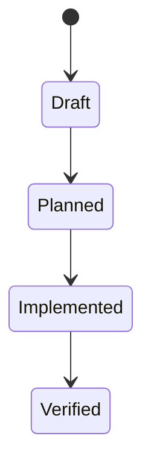

# Data Model: Harness Auto Enforcement and Freshness

> Feature ID: `011-harness-auto-enforcement-and-freshness`

## Entities

| Entity | Fields | Owner | Notes |
| --- | --- | --- | --- |
| `HarnessPhase` | `phase`, `stage`, `requires_feature`, `checks[]` | `marcus-ai-orchestrator` | declarative runtime contract for wrapper commands |
| `HarnessCheckResult` | `command`, `status`, `blocking`, `summary` | `ada-qa-agent` | emitted logically in command output, not persisted as a database row |
| `HarnessContractSurface` | `file`, `required_markers[]`, `reason` | `knowledge-work-architecture` | used by the freshness validator to catch drift |

## State Transitions

## Validation Rules

- `bootstrap` preflight must allow warning-only optional MCP results.
- `execution` preflight and postflight must fail if any blocking validator fails.
- If a feature path is supplied, readiness must be part of execution phases.
- Contract-surface files must contain the markers that prove wrappers are part
  of the supported operating system.
