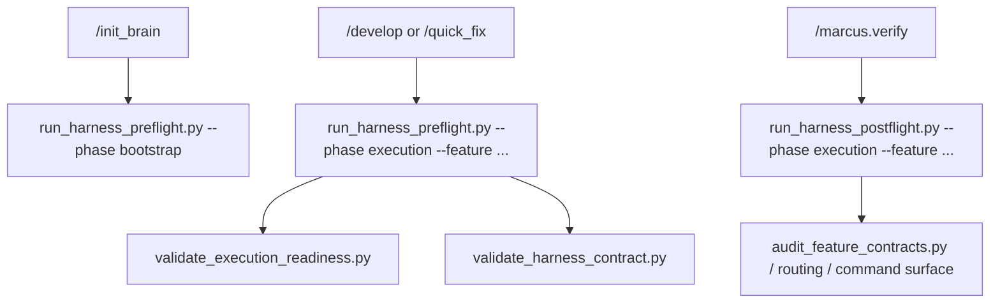

# Implementation Plan: Harness Auto Enforcement and Freshness

> Feature ID: `011-harness-auto-enforcement-and-freshness`
> Spec: `spec.md`
> Constitution: `.agents/memory/constitution.md`

## 1. Technical Summary

This feature adds a thin orchestration layer on top of the existing `.agents`
validators and bootstrap scripts. The goal is not to invent new policy; it is
to make current policy mechanically replayable. The implementation will add
three new scripts:

- `run_harness_preflight.py`
- `run_harness_postflight.py`
- `validate_harness_contract.py`

The first two wrap existing checks into deterministic phase-oriented entry
points. The third proves that docs, workflows, and scripts still describe the
same chain. The surrounding documentation and workflow files will then be
updated so the public operating surface points to those orchestration commands
instead of expecting agents to remember several individual script invocations.

## 2. Constitution Gates

- [x] Specification has no unresolved `[NEEDS CLARIFICATION]` markers, or the
      operator accepted the residual risk.
- [x] Contracts are defined before implementation.
- [x] Verification method is named before implementation.
- [x] No shell `eval` or unbounded command execution is introduced.
- [x] No hardcoded production secret is introduced.
- [x] TypeScript changes avoid `any` unless justified in Complexity Tracking.
- [x] Rollback path is documented for user-facing or operational changes.

## 3. Architecture

### 3.1 Current State

- Existing modules: `sync_project_mcp.py`, `check_mcp_health.py`,
  `print_update_brief.py`, `validate_command_surface.py`,
  `validate_execution_readiness.py`, `validate_routing_regression.py`,
  `audit_feature_contracts.py`, and `check_repo_setup.sh`.
- Current coupling: workflows and docs tell agents which commands to run, but no
  single wrapper proves the sequence end-to-end for bootstrap or execution.
- Known constraints: root path resolution must work both in standalone `.agents`
  and in a parent project that vendors `.agents/`.

### 3.2 Target State

- New or changed modules:
  - add `scripts/run_harness_preflight.py`
  - add `scripts/run_harness_postflight.py`
  - add `scripts/validate_harness_contract.py`
  - extend `scripts/path_utils.py` if needed for reusable process helpers
  - update README, USAGE, and affected workflows
- Data flow:
  - operator chooses a phase (`bootstrap`, `execution`)
  - orchestration script runs the underlying checks in deterministic order
  - failures bubble up with command-specific output
  - docs and workflows point to the wrappers as the canonical path
- Operational flow:
  - `/init_brain` and setup docs call harness preflight for bootstrap
  - `/develop` and behavior-changing `/quick_fix` call harness preflight for execution
  - `/marcus.verify` or closeout guidance calls harness postflight for execution
  - contract freshness validation guards future doc drift

### 3.3 Mermaid Diagram

## 4. Contracts

The contract files below define the supported harness phases and who consumes them.

| Contract | Purpose | Producer | Consumer |
| --- | --- | --- | --- |
| `contracts/harness-phase-contract.md` | Defines bootstrap and execution pre/postflight phases, required checks, and exit semantics | this feature | workflows, docs, verification |

Contract rules:

- Every contract must name its owner.
- Every contract must say how compatibility is checked.
- If a boundary is intentionally undocumented, explain why that is safe.

## 5. Data Model

The feature does not change product data. Its data model is operational:

- phase: `bootstrap` or `execution`
- stage: `preflight` or `postflight`
- feature path: optional target for feature-scoped checks
- check result: `pass`, `warn`, or `fail`

Validation rules and state transitions live in `data-model.md` and are limited
to harness command execution semantics.

## 6. Agent Routing

The ownership model from `agent-routing.md` is restated here for implementation planning.

| Workstream | Primary Agent | Output | Verification |
| --- | --- | --- | --- |
| Spec and command-surface requirements | `sophia-product-manager` | accepted operator-facing contract | spec validation |
| Script architecture and contract design | `david-systems-architect` | wrapper and freshness design | review + replay |
| Harness implementation | `marcus-ai-orchestrator` | scripts and workflow/doc updates | py_compile + command replay |
| Verification and release gate | `ada-qa-agent` | evidence-backed recommendation | `verification.md` |

Execution monitoring:

- Blocking gates before implementation: `validate_specs.py --allow-clarifications`
  during spec fill, then full `validate_specs.py` before implementation.
- Evidence checkpoints during implementation: run positive replay in standalone
  `.agents` root after each major script/doc batch.
- Escalation condition after repeated failure: if the same harness script fails
  three times without new evidence, stop widening scope and patch the failing
  contract directly.

## 7. Migration and Rollback

- Migration steps:
  - add new scripts without removing existing validators
  - update docs/workflows to prefer the wrappers
  - extend setup checks so the wrappers become part of the supported surface
- Rollback steps:
  - remove wrapper references from docs/workflows
  - delete wrapper scripts
  - keep the underlying validators untouched
- Compatibility notes:
  - existing operators can still run underlying scripts directly
  - wrappers must support both root layouts already supported elsewhere
- Blast radius: `.agents` scripts, workflow docs, and verification docs only
- Containment or feature-flag strategy: wrappers are additive; they do not
  replace existing validators until called.

## 8. Complexity Tracking

This section records the deliberate abstractions introduced by this feature and
why they are acceptable.

| Decision | Reason | Alternative Rejected | Review Needed |
| --- | --- | --- | --- |
| Additive wrappers instead of rewriting validators | keeps proven checks intact and lowers migration risk | one giant validator that hides all command boundaries | no |
| Marker-based freshness plus replayed commands | balances bounded scope with real enforcement | full semantic parser for all docs in one pass | no |

## 9. POC Slice and Review Cadence

Define the smallest professional POC slice that can produce evidence without
pretending the full product is done.

- POC slice boundary: standalone `.agents` replay of bootstrap preflight,
  execution preflight, execution postflight, and contract freshness validation
  for feature `011`.
- Success evidence for the slice: the wrappers and validator pass in the
  standalone `.agents` repo; affected docs/workflows mention the same chain.
- What remains intentionally unproven after the slice: long-term trend metrics
  or automatic background collection of harness failures.
- Review cadence:
  - Draft architecture review: after wrapper contract and validator scope are written
  - Challenge review: after docs/workflows are patched
  - Verification readiness review: after positive replay and negative freshness proof
- Stop conditions: wrapper scripts obscure the failing underlying command,
  require unsupported environment state, or create new path-layout regressions.
- Proceed conditions: wrappers remain additive, docs stay aligned, and replay is
  successful in standalone `.agents`.
