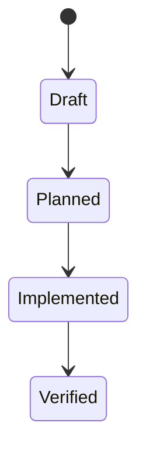

# Data Model: Harness Observability and Dynamic Context

> Feature ID: `012-harness-observability-and-dynamic-context`

## Entities

| Entity | Fields | Owner | Notes |
| --- | --- | --- | --- |
| `HarnessRunEvent` | `timestamp`, `phase`, `stage`, `feature`, `status`, `failing_command`, `commands[]` | `marcus-ai-orchestrator` | append-only JSONL event emitted by wrapper scripts |
| `HarnessCommandEvent` | `command`, `exit_code`, `status` | `marcus-ai-orchestrator` | child record embedded in a run event |
| `DynamicBriefInput` | `changed_files[]`, `failing_evidence` | `david-systems-architect` | operator-supplied context signals for brief generation |

## State Transitions

## Validation Rules

- Each harness run event must include ordered command results.
- `failing_command` is empty on success and populated with the first blocking
  command on failure.
- `changed_files[]` may be empty, but if present each entry should remain a
  bounded path string rather than a blob of file content.
- `failing_evidence` should remain concise enough to fit as a signal, not a full
  incident report.
