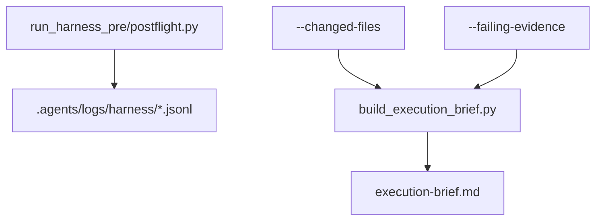

# Implementation Plan: Harness Observability and Dynamic Context

> Feature ID: `012-harness-observability-and-dynamic-context`
> Spec: `spec.md`
> Constitution: `.agents/memory/constitution.md`

## 1. Technical Summary

This feature adds two bounded capabilities on top of the harness introduced in
feature `011`:

- structured JSONL logging for harness wrapper runs
- optional dynamic context inputs for `build_execution_brief.py`

The implementation will reuse local helpers, write append-only logs under
`.agents/logs/harness/`, and extend the execution brief generator with additive
flags such as `--changed-files` and `--failing-evidence`. The generated brief
will gain a small dynamic-signal section without changing the required core
sections already enforced by validators.

## 2. Constitution Gates

- [ ] Specification has no unresolved `[NEEDS CLARIFICATION]` markers, or the
      operator accepted the residual risk.
- [x] Contracts are defined before implementation.
- [x] Verification method is named before implementation.
- [x] No shell `eval` or unbounded command execution is introduced.
- [x] No hardcoded production secret is introduced.
- [x] TypeScript changes avoid `any` unless justified in Complexity Tracking.
- [x] Rollback path is documented for user-facing or operational changes.

## 3. Architecture

### 3.1 Current State

- Existing modules: wrapper scripts from feature `011`, `path_utils.py`, and
  `build_execution_brief.py`.
- Current coupling: wrapper scripts print raw console output but do not write a
  structured local record; the brief uses spec/docs inputs only.
- Known constraints: logs must stay local and cheap; brief validators depend on
  stable section headings.

### 3.2 Target State

- New or changed modules:
  - extend shared helper layer for JSONL harness logging
  - update `run_harness_preflight.py` and `run_harness_postflight.py`
  - extend `build_execution_brief.py` with optional dynamic inputs
  - update README/USAGE/feature docs as needed
- Data flow:
  - wrapper run starts
  - each command result is captured in memory
  - wrapper appends one JSONL event with phase, feature, command results, and summary
  - optional changed files and failing evidence are passed to `build_execution_brief.py`
  - the brief records those signals in a dedicated bounded section
- Operational flow:
  - operators can inspect logs after wrapper runs
  - execution brief rebuilds can stay anchored to the active diff and evidence

### 3.3 Mermaid Diagram

## 4. Contracts

The files below define the new logging schema and dynamic-brief inputs.

| Contract | Purpose | Producer | Consumer |
| --- | --- | --- | --- |
| `contracts/harness-log-contract.md` | defines JSONL event shape and retention assumptions | this feature | wrapper scripts, verification |
| `contracts/execution-brief-dynamic-context-contract.md` | defines changed-file and failing-evidence inputs for brief generation | this feature | `build_execution_brief.py`, workflows |

Contract rules:

- Every contract must name its owner.
- Every contract must say how compatibility is checked.
- If a boundary is intentionally undocumented, explain why that is safe.

## 5. Data Model

The entities are operational and ephemeral: harness runs, per-command results,
changed file signals, and failing evidence snippets. Validation and lifecycle
live in `data-model.md`.

## 6. Agent Routing

The ownership model from `agent-routing.md` is restated here for execution.

| Workstream | Primary Agent | Output | Verification |
| --- | --- | --- | --- |
| Requirements and bounded scope | `sophia-product-manager` | accepted feature contract | spec validation |
| Logging and brief design | `david-systems-architect` | helper design and contracts | plan review |
| Script implementation | `marcus-ai-orchestrator` | JSONL logging and dynamic brief inputs | replay + py_compile |
| Verification and release gate | `ada-qa-agent` | evidence-backed recommendation | verification replay |

Execution monitoring:

- Blocking gates before implementation: `validate_specs.py --feature specs/012-harness-observability-and-dynamic-context`
  and review-loop completion.
- Evidence checkpoints during implementation: wrapper replay after logging
  changes, then brief rebuild replay with dynamic inputs.
- Escalation condition after repeated failure: if logging or brief generation
  breaks required sections three times without new evidence, stop and patch the
  last changed helper or builder layer directly.

## 7. Migration and Rollback

- Migration steps:
  - add helper-backed logging first
  - replay wrappers to confirm no behavioral regression
  - add brief flags and bounded dynamic section
  - update docs and verification
- Rollback steps:
  - stop calling the new flags
  - remove logging helper calls from wrappers
  - keep core wrapper behavior intact
- Compatibility notes:
  - wrappers must still succeed when logging directory does not yet exist
  - brief generation must still work without any dynamic flags
- Blast radius: `.agents` scripts, logs, docs, and feature packages only
- Containment or feature-flag strategy: dynamic inputs are optional flags; logs
  are additive append-only artifacts.

## 8. Complexity Tracking

This section records the deliberate abstractions introduced by this feature and
why they remain bounded.

| Decision | Reason | Alternative Rejected | Review Needed |
| --- | --- | --- | --- |
| JSONL log files under `.agents/logs/harness/` | simple local observability with append-only semantics | bespoke sqlite/db layer | no |
| Optional CLI flags for dynamic brief context | preserves current command compatibility | auto-reading git state in all cases | no |

## 9. POC Slice and Review Cadence

Define the smallest professional POC slice that can produce evidence without
pretending the full product is done.

- POC slice boundary: one wrapper run produces structured logs, and one brief
  rebuild includes both changed files and failing evidence inputs.
- Success evidence for the slice: JSONL log entry exists, wrappers still pass,
  and rebuilt brief contains bounded dynamic context while validators still pass.
- What remains intentionally unproven after the slice: trend dashboards,
  long-term retention policy, or automatic evidence ingestion from external tools.
- Review cadence:
  - Draft architecture review: after contracts and data model are written
  - Challenge review: after helper design and brief section design are set
  - Verification readiness review: after positive and negative replay
- Stop conditions: logging obscures failures, brief sections become placeholder-heavy,
  or validators lose compatibility.
- Proceed conditions: wrappers remain additive, dynamic context stays optional,
  and readiness/freshness continue to pass.
