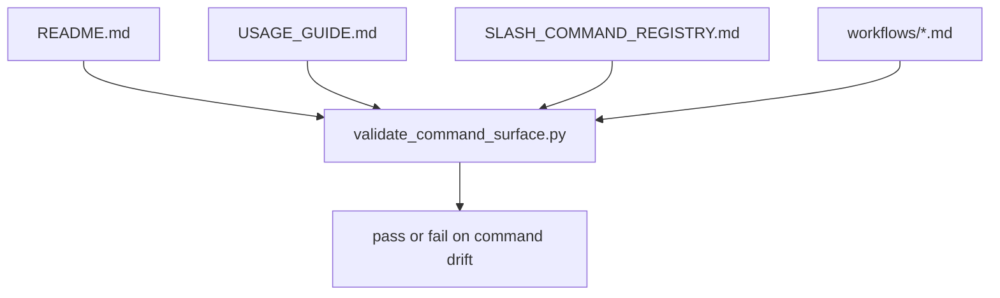

# Implementation Plan: Slash Command Workflow Contract Hardening

> Feature ID: `013-slash-command-workflow-contract-hardening`
> Spec: `spec.md`
> Constitution: `.agents/memory/constitution.md`

## 1. Technical Summary

This feature turns the published slash-command surface into an explicit,
validator-backed contract instead of a loose collection of README prose and
workflow notes. The implementation has three parts:

- add a public command registry that any model can read quickly
- strengthen `validate_command_surface.py` to validate command-by-command
  workflow ownership and script-chain markers
- reconcile README and `USAGE_GUIDE.md` so the published surface matches the
  actual workflow and validator chain

The change stays inside `.agents` and does not alter application code. It is a
governance hardening slice designed to reduce command ambiguity for any model
that enters the repo with partial context.

## 2. Constitution Gates

- [x] Specification has no unresolved `[NEEDS CLARIFICATION]` markers, or the
      operator accepted the residual risk.
- [x] Contracts are defined before implementation.
- [x] Verification method is named before implementation.
- [x] No shell `eval` or unbounded command execution is introduced.
- [x] No hardcoded production secret is introduced.
- [x] TypeScript changes avoid `any` unless justified in Complexity Tracking.
- [x] Rollback path is documented for user-facing or operational changes.

## 3. Architecture

### 3.1 Current State

- Existing modules: `README.md`, `USAGE_GUIDE.md`, workflow files, and a narrow
  `validate_command_surface.py`.
- Current coupling: public command descriptions are split across docs with only
  partial validation coverage.
- Known constraints: existing harness and routing validators must remain green,
  and the command contract must stay legible to humans and models.

### 3.2 Target State

- New or changed modules:
  - add `.agents/SLASH_COMMAND_REGISTRY.md`
  - rewrite `scripts/validate_command_surface.py`
  - patch README and `USAGE_GUIDE.md`
- Data flow:
  - a maintainer changes a public slash command or workflow
  - `validate_command_surface.py` reads README, `USAGE_GUIDE.md`, registry, and
    workflow files
  - the validator fails if any published command loses its workflow or required
    script/gate markers
- Operational flow:
  - any model can read the registry first
  - public docs point to the registry and validator
  - harness postflight can keep using the same command-surface validator, now
    with stronger coverage

### 3.3 Mermaid Diagram

## 4. Contracts

The command contract is documented both for humans and for validator replay.

| Contract | Purpose | Producer | Consumer |
| --- | --- | --- | --- |
| `contracts/slash-command-contract.md` | names the contract boundaries and validation rule for the published surface | this feature | maintainers, reviewers |
| `.agents/SLASH_COMMAND_REGISTRY.md` | public registry of published slash commands, workflows, and required script chains | this feature | any model or operator entering `.agents` |

Contract rules:

- Every contract must name its owner.
- Every contract must say how compatibility is checked.
- If a boundary is intentionally undocumented, explain why that is safe.

## 5. Data Model

The model is document-oriented and static:

- a command entry
- its workflow owner
- its required script or gate markers
- its publication surfaces

`data-model.md` defines these entities and the distinction between
script-backed commands and workflow-only commands.

## 6. Agent Routing

The ownership model from `agent-routing.md` is restated here for execution.

| Workstream | Primary Agent | Output | Verification |
| --- | --- | --- | --- |
| Requirement and scope hardening | `sophia-product-manager` | accepted command-governance spec | spec validation |
| Contract and validator design | `david-systems-architect` | registry shape and validator strategy | plan review |
| Implementation and doc reconciliation | `marcus-ai-orchestrator` | validator rewrite and public-doc patches | validator replay |
| Verification and release gate | `ada-qa-agent` | evidence-backed recommendation | verification replay |

Execution monitoring:

- Blocking gates before implementation: `validate_specs.py --feature specs/013-slash-command-workflow-contract-hardening`
  and completion of the review loop.
- Evidence checkpoints during implementation: first after validator rewrite,
  then after README and `USAGE_GUIDE.md` reconciliation.
- Escalation condition after repeated failure: if command-surface replay fails
  three times on the same command without new evidence, stop and patch the
  specific command contract directly.

## 7. Migration and Rollback

- Migration steps:
  - add the public registry
  - expand `validate_command_surface.py` to validate command contracts
  - patch README and `USAGE_GUIDE.md` to expose missing commands and registry
  - replay command, routing, and harness validators
- Rollback steps:
  - remove the registry and restore the previous narrower validator
  - keep workflow files untouched unless doc changes must revert too
- Compatibility notes:
  - command-surface validation remains file-local and CLI-compatible
  - harness wrappers continue to call the same `validate_command_surface.py`
- Blast radius: `.agents` docs, workflows, and validator code only
- Containment or feature-flag strategy: no runtime flag needed; the validator is
  the contract gate and can be replayed independently

## 8. Complexity Tracking

This section records the deliberate abstractions introduced by this feature and
why they remain bounded.

| Decision | Reason | Alternative Rejected | Review Needed |
| --- | --- | --- | --- |
| Add a standalone command registry file | gives any model one place to read before following command prose | burying all contract detail in validator code only | no |
| Keep command metadata in validator constants | makes failures precise and deterministic without adding a parser for registry markdown | building a new schema/JSON parser layer | no |

## 9. POC Slice and Review Cadence

Define the smallest professional POC slice that can produce evidence without
pretending the full product is done.

- POC slice boundary: one registry-backed validator replay plus one doc-surface
  reconciliation for previously under-specified commands.
- Success evidence for the slice: `validate_command_surface.py` passes, public
  docs mention the registry, and `/bootstrap` plus `/marcus.routecheck` are
  visibly part of the published surface.
- What remains intentionally unproven after the slice: automation for
  workflow-only legacy commands and deeper runtime enforcement beyond doc files.
- Review cadence:
  - Draft architecture review: after the registry and validator shape are fixed
  - Challenge review: after command coverage is reconciled across docs
  - Verification readiness review: after positive replay and one bounded drift proof
- Stop conditions: the validator becomes too brittle, commands are over-claimed
  as script-backed, or harness/routing validators regress.
- Proceed conditions: the contract stays readable, validation is deterministic,
  and existing governance gates remain green.
