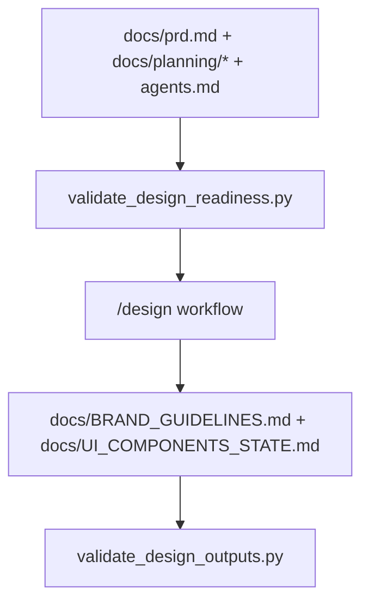

# Implementation Plan: Design Command Readiness Hardening

> Feature ID: `014-design-command-readiness-hardening`
> Spec: `spec.md`
> Constitution: `.agents/memory/constitution.md`

## 1. Technical Summary

This feature converts `/design` from a workflow-only public command into a
script-backed command with explicit preflight and postflight validation. The
design remains intentionally narrow: add a readiness validator for planning
inputs, add an output validator for the two Phase 2 design docs, patch the
workflow to call both scripts, and wire the new chain into the registry and the
shared command-surface validator.

The implementation stays inside `.agents` and keeps `/design` as a docs-first,
non-codegen design phase. It does not attempt to automate the content of the
design artifacts themselves.

## 2. Constitution Gates

- [x] Specification has no unresolved `[NEEDS CLARIFICATION]` markers, or the
      operator accepted the residual risk.
- [x] Contracts are defined before implementation.
- [x] Verification method is named before implementation.
- [x] No shell `eval` or unbounded command execution is introduced.
- [x] No hardcoded production secret is introduced.
- [x] TypeScript changes avoid `any` unless justified in Complexity Tracking.
- [x] Rollback path is documented for user-facing or operational changes.

## 3. Architecture

### 3.1 Current State

- Existing modules: `workflows/design.md`, README, `USAGE_GUIDE.md`,
  `SLASH_COMMAND_REGISTRY.md`, and `validate_command_surface.py`.
- Current coupling: `/design` is publicly documented but relies mostly on prose
  and one TrustGraph query command.
- Known constraints: Phase 2 must remain design-only and should not gain broad
  runtime or code-edit semantics.

### 3.2 Target State

- New or changed modules:
  - add `scripts/validate_design_readiness.py`
  - add `scripts/validate_design_outputs.py`
  - update `workflows/design.md`
  - update README, `USAGE_GUIDE.md`, registry, and command-surface validator
- Data flow:
  - `/design` starts
  - readiness validator checks required planning docs
  - workflow performs the design phase
  - output validator checks `BRAND_GUIDELINES.md` and `UI_COMPONENTS_STATE.md`
  - command-surface validator guarantees public docs still advertise the same chain
- Operational flow:
  - models fail early if planning inputs are missing
  - models fail before closeout if the two required design docs were not produced

### 3.3 Mermaid Diagram

## 4. Contracts

The files below define the `/design` validator-backed command contract.

| Contract | Purpose | Producer | Consumer |
| --- | --- | --- | --- |
| `contracts/design-command-contract.md` | defines the required Phase 2 inputs, outputs, and compatibility check | this feature | maintainers, models, reviewers |

Contract rules:

- Every contract must name its owner.
- Every contract must say how compatibility is checked.
- If a boundary is intentionally undocumented, explain why that is safe.

## 5. Data Model

The model is file-centric and small:

- readiness inputs
  - `agents.md`
  - `docs/prd.md`
  - `docs/planning/screens.md`
  - `docs/planning/flows.md`
- design outputs
  - `docs/BRAND_GUIDELINES.md`
  - `docs/UI_COMPONENTS_STATE.md`

Validation rules and lifecycle are documented in `data-model.md`.

## 6. Agent Routing

The ownership model from `agent-routing.md` is restated here for execution.

| Workstream | Primary Agent | Output | Verification |
| --- | --- | --- | --- |
| Requirement and scope hardening | `sophia-product-manager` | accepted `/design` command contract | spec validation |
| Validator and contract design | `david-systems-architect` | readiness/output gate design | plan review |
| Implementation and public-surface wiring | `marcus-ai-orchestrator` | validator scripts and command-surface updates | validator replay |
| Verification and release gate | `ada-qa-agent` | evidence-backed recommendation | fixture replay |

Execution monitoring:

- Blocking gates before implementation: `validate_specs.py --feature specs/014-design-command-readiness-hardening`
  and completion of the review loop.
- Evidence checkpoints during implementation: replay readiness and output
  validators on `/tmp` fixtures, then replay command-surface validation.
- Escalation condition after repeated failure: if `/design` hardening starts
  requiring nonlocal services or source-edit semantics, stop and rescope.

## 7. Migration and Rollback

- Migration steps:
  - add readiness validator
  - add output validator
  - patch `/design` workflow and public docs
  - update registry and shared command-surface validator
- Rollback steps:
  - remove the two design validators and restore the older workflow prose
  - remove `/design` script-chain markers from the registry and validator
- Compatibility notes:
  - validators run on a project root, not only inside `.agents`
  - `/design` remains public but still halts for human review after the docs are produced
- Blast radius: `.agents` docs, workflow, and validator scripts only
- Containment or feature-flag strategy: not needed; the validators are small and
  can be replayed independently

## 8. Complexity Tracking

This section records the deliberate abstractions introduced by this feature and
why they remain bounded.

| Decision | Reason | Alternative Rejected | Review Needed |
| --- | --- | --- | --- |
| Add two small validators instead of one large `/design` wrapper | keeps entry and exit checks explicit and easy to replay | a single complex orchestration script for all Phase 2 behavior | no |
| Use root-relative file checks only | matches actual design inputs and outputs without parsing design content | semantic validation of design quality inside the gate | no |

## 9. POC Slice and Review Cadence

Define the smallest professional POC slice that can produce evidence without
pretending the full product is done.

- POC slice boundary: one `/tmp` fixture for readiness, one `/tmp` fixture for
  output validation, and one command-surface replay after `/design` is wired in.
- Success evidence for the slice: both new validators pass on minimal valid
  fixtures, command-surface validation passes, and `/design` remains a Phase 2
  docs-only workflow.
- What remains intentionally unproven after the slice: the quality of the
  produced design content and any external design-review process.
- Review cadence:
  - Draft architecture review: after input and output checks are defined
  - Challenge review: after workflow and registry wiring are patched
  - Verification readiness review: after positive replay and one bounded negative proof
- Stop conditions: validators become content-heavy, `/design` drifts into code
  generation, or public command docs diverge.
- Proceed conditions: `/design` has deterministic gates, and the shared
  command-surface contract stays green.
