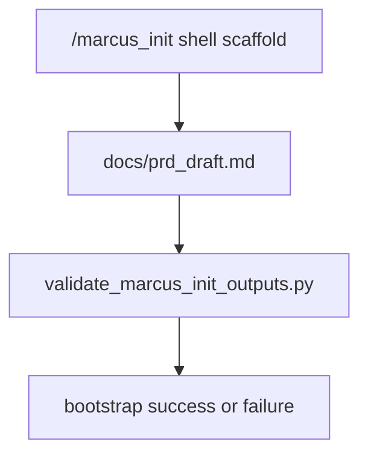

# Implementation Plan: Marcus Init Output Contract Hardening

> Feature ID: `015-marcus-init-output-contract-hardening`
> Spec: `spec.md`
> Constitution: `.agents/memory/constitution.md`

## 1. Technical Summary

This feature converts `/marcus_init` from a workflow-only public command into a
command with deterministic closeout validation. The implementation is narrow:
add one output validator for scaffolded project roots, patch the workflow to run
it after PRD draft seeding, and wire the validator into the shared public
command contract.

The shell-based scaffold remains intact. This slice only hardens the proof that
the expected outputs exist before the command is considered complete.

## 2. Constitution Gates

- [x] Specification has no unresolved `[NEEDS CLARIFICATION]` markers, or the
      operator accepted the residual risk.
- [x] Contracts are defined before implementation.
- [x] Verification method is named before implementation.
- [x] No shell `eval` or unbounded command execution is introduced.
- [x] No hardcoded production secret is introduced.
- [x] TypeScript changes avoid `any` unless justified in Complexity Tracking.
- [x] Rollback path is documented for user-facing or operational changes.

## 3. Architecture

### 3.1 Current State

- Existing modules: `workflows/marcus_init.md`, README, `USAGE_GUIDE.md`,
  `SLASH_COMMAND_REGISTRY.md`, and `validate_command_surface.py`.
- Current coupling: `/marcus_init` describes shell steps and expected files but
  has no local validator proving the scaffold outputs exist.
- Known constraints: the command remains shell-heavy and may be used on empty
  projects, so the validator must stay narrow and file-based.

### 3.2 Target State

- New or changed modules:
  - add `scripts/validate_marcus_init_outputs.py`
  - update `workflows/marcus_init.md`
  - update README, `USAGE_GUIDE.md`, registry, and command-surface validator
- Data flow:
  - `/marcus_init` shell scaffold runs
  - PRD draft is seeded
  - output validator checks the scaffold root
  - command-surface validator ensures public docs still advertise the same chain
- Operational flow:
  - models can validate a scaffold result before claiming success
  - public docs treat `/marcus_init` as script-backed for closeout

### 3.3 Mermaid Diagram

## 4. Contracts

The files below define the `/marcus_init` closeout contract.

| Contract | Purpose | Producer | Consumer |
| --- | --- | --- | --- |
| `contracts/marcus-init-command-contract.md` | defines the required scaffold outputs and compatibility check | this feature | maintainers, models, reviewers |

Contract rules:

- Every contract must name its owner.
- Every contract must say how compatibility is checked.
- If a boundary is intentionally undocumented, explain why that is safe.

## 5. Data Model

The model is file-centric:

- `docs/`
- `.agents/`
- `.clinerules`
- `agents.md`
- `.agents/agents.md`
- `docs/prd_draft.md`

These are the minimum required outputs for the current workflow contract.

## 6. Agent Routing

The ownership model from `agent-routing.md` is restated here for execution.

| Workstream | Primary Agent | Output | Verification |
| --- | --- | --- | --- |
| Requirement and scope hardening | `sophia-product-manager` | accepted `/marcus_init` output contract | spec validation |
| Validator and contract design | `david-systems-architect` | scaffold-output gate design | plan review |
| Implementation and public-surface wiring | `marcus-ai-orchestrator` | output validator and command-surface updates | validator replay |
| Verification and release gate | `ada-qa-agent` | evidence-backed recommendation | fixture replay |

Execution monitoring:

- Blocking gates before implementation: `validate_specs.py --feature specs/015-marcus-init-output-contract-hardening`
  and completion of the review loop.
- Evidence checkpoints during implementation: replay the output validator on a
  valid fixture, then replay command-surface validation after `/marcus_init`
  wiring.
- Escalation condition after repeated failure: if the work starts requiring a
  rewrite of the shell scaffold rather than a closeout validator, stop and
  rescope.

## 7. Migration and Rollback

- Migration steps:
  - add scaffold-output validator
  - patch `/marcus_init` workflow to call it
  - update README, `USAGE_GUIDE.md`, registry, and command-surface validator
- Rollback steps:
  - remove the validator and restore the previous workflow-only `/marcus_init`
    closeout
  - remove `/marcus_init` script-chain markers from the public contract
- Compatibility notes:
  - the validator runs against a target project root passed by `--root`
  - the shell scaffold remains the authoritative creation path in this slice
- Blast radius: `.agents` docs, workflow, and validator scripts only
- Containment or feature-flag strategy: not needed; the validator is replayable
  in isolation

## 8. Complexity Tracking

This section records the deliberate abstractions introduced by this feature and
why they remain bounded.

| Decision | Reason | Alternative Rejected | Review Needed |
| --- | --- | --- | --- |
| Add one output validator instead of replacing the shell scaffold | gives deterministic closeout without rewriting the command | a full Python bootstrap orchestrator | no |
| Validate only explicit workflow outputs | keeps the gate aligned with current contract | guessing framework-specific extra files | no |

## 9. POC Slice and Review Cadence

Define the smallest professional POC slice that can produce evidence without
pretending the full product is done.

- POC slice boundary: one valid scaffold fixture, one missing-output negative
  proof, and one command-surface replay after `/marcus_init` wiring.
- Success evidence for the slice: output validator passes on the valid fixture,
  fails on the bounded negative case, and command-surface validation stays green.
- What remains intentionally unproven after the slice: full runtime bootstrap of
  Docker services and the quality of the PRD draft content.
- Review cadence:
  - Draft architecture review: after required outputs are fixed
  - Challenge review: after workflow and registry wiring are patched
  - Verification readiness review: after positive and negative replay
- Stop conditions: the validator starts enforcing framework-specific content or
  the command-surface contract drifts.
- Proceed conditions: `/marcus_init` has deterministic closeout validation and
  the broader command contract remains green.
