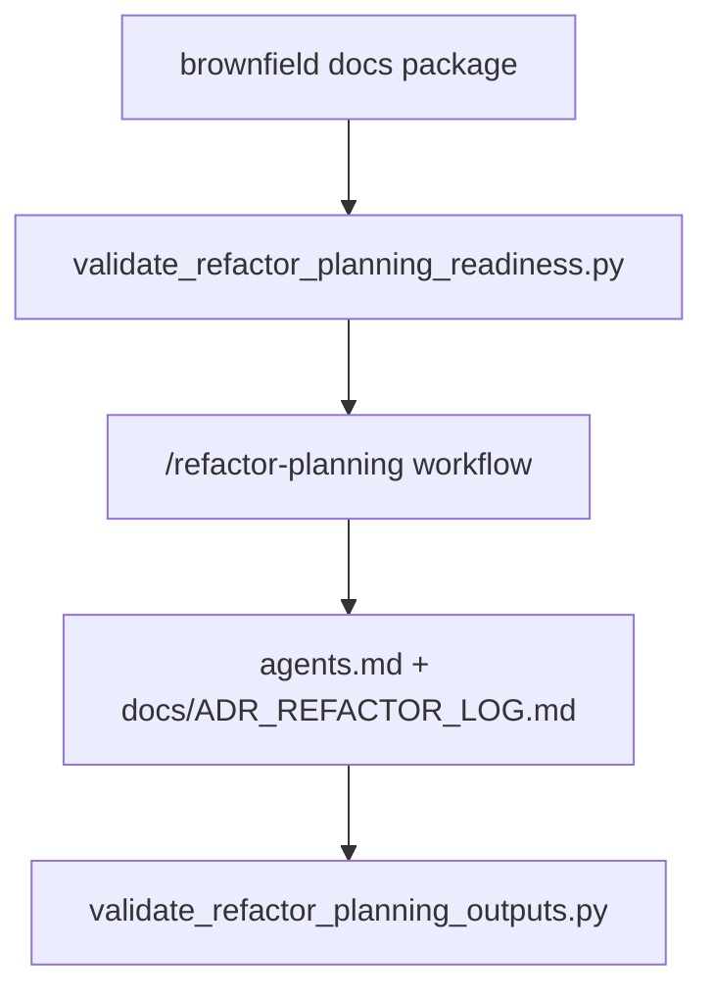

# Implementation Plan: Refactor Planning Command Gates

> Feature ID: `016-refactor-planning-command-gates`
> Spec: `spec.md`
> Constitution: `.agents/memory/constitution.md`

## 1. Technical Summary

This feature adds two deterministic gates to `/refactor-planning`: one
readiness validator for brownfield docs and development-ledger quality, and one
output validator for the closeout artifacts. The workflow, README,
`USAGE_GUIDE.md`, registry, and command-surface validator are updated to expose
that chain explicitly.

The refactor engine itself remains unchanged. This slice only hardens whether
the command is allowed to start and whether it can legitimately claim completion.

## 2. Constitution Gates

- [x] Specification has no unresolved `[NEEDS CLARIFICATION]` markers, or the
      operator accepted the residual risk.
- [x] Contracts are defined before implementation.
- [x] Verification method is named before implementation.
- [x] No shell `eval` or unbounded command execution is introduced.
- [x] No hardcoded production secret is introduced.
- [x] TypeScript changes avoid `any` unless justified in Complexity Tracking.
- [x] Rollback path is documented for user-facing or operational changes.

## 3. Architecture

### 3.1 Current State

- Existing modules: `workflows/refactor-planning.md`, README, `USAGE_GUIDE.md`,
  `SLASH_COMMAND_REGISTRY.md`, and `validate_command_surface.py`.
- Current coupling: brownfield governance requirements are described, but no
  local validator enforces them before the command starts.
- Known constraints: the command remains tool-heavy and brownfield-specific, so
  the hardening must stay file-oriented and not attempt full runtime execution.

### 3.2 Target State

- New or changed modules:
  - add `scripts/validate_refactor_planning_readiness.py`
  - add `scripts/validate_refactor_planning_outputs.py`
  - update `workflows/refactor-planning.md`
  - update README, `USAGE_GUIDE.md`, registry, and command-surface validator
- Data flow:
  - readiness validator checks planning docs and runs the development-doc quality gate
  - workflow runs its existing refactor-planning body
  - output validator checks `agents.md` and `docs/ADR_REFACTOR_LOG.md`
  - command-surface validator keeps the public contract aligned
- Operational flow:
  - models fail closed before brownfield refactor planning on stale docs
  - models fail closeout if the refactor audit trail was not produced

### 3.3 Mermaid Diagram

## 4. Contracts

The files below define the validator-backed `/refactor-planning` contract.

| Contract | Purpose | Producer | Consumer |
| --- | --- | --- | --- |
| `contracts/refactor-planning-command-contract.md` | defines readiness inputs, closeout outputs, and compatibility checks | this feature | maintainers, models, reviewers |

Contract rules:

- Every contract must name its owner.
- Every contract must say how compatibility is checked.
- If a boundary is intentionally undocumented, explain why that is safe.

## 5. Data Model

The model is split into readiness inputs and closeout outputs:

- readiness inputs
  - `agents.md`
  - legacy planning docs under `docs/`
  - development ledger manifest, index, and bucket content
- closeout outputs
  - `agents.md`
  - `docs/ADR_REFACTOR_LOG.md`

`data-model.md` defines the validator expectations.

## 6. Agent Routing

The ownership model from `agent-routing.md` is restated here for execution.

| Workstream | Primary Agent | Output | Verification |
| --- | --- | --- | --- |
| Requirement and scope hardening | `sophia-product-manager` | accepted `/refactor-planning` command contract | spec validation |
| Validator and contract design | `david-systems-architect` | readiness/output gate design | plan review |
| Implementation and public-surface wiring | `marcus-ai-orchestrator` | validator scripts and command-surface updates | validator replay |
| Verification and release gate | `ada-qa-agent` | evidence-backed recommendation | fixture replay |

Execution monitoring:

- Blocking gates before implementation: `validate_specs.py --feature specs/016-refactor-planning-command-gates`
  and completion of the review loop.
- Evidence checkpoints during implementation: first replay readiness and output
  validators on fixtures, then replay command-surface validation.
- Escalation condition after repeated failure: if hardening requires executing
  the full AST/refactor runtime rather than checking command gates, stop and rescope.

## 7. Migration and Rollback

- Migration steps:
  - add readiness validator
  - add output validator
  - patch `/refactor-planning` workflow
  - update README, `USAGE_GUIDE.md`, registry, and command-surface validator
- Rollback steps:
  - remove the two validators and restore the previous mixed command contract
  - remove `/refactor-planning` script-chain markers from the public surface
- Compatibility notes:
  - readiness validator intentionally calls `validate_development_docs.py`
  - output validator only checks artifact existence and non-emptiness
- Blast radius: `.agents` docs, workflow, and validator scripts only
- Containment or feature-flag strategy: not needed; the validators are replayable
  in isolation

## 8. Complexity Tracking

This section records the deliberate abstractions introduced by this feature and
why they remain bounded.

| Decision | Reason | Alternative Rejected | Review Needed |
| --- | --- | --- | --- |
| Call the existing development-doc quality gate from readiness | reuse the repo’s current brownfield standard instead of inventing a duplicate heuristic | a custom readiness-only approximation | no |
| Use a separate output validator for `ADR_REFACTOR_LOG.md` | keep closeout explicit and testable | relying on narrative-only completion claims | no |

## 9. POC Slice and Review Cadence

Define the smallest professional POC slice that can produce evidence without
pretending the full product is done.

- POC slice boundary: one valid readiness fixture, one valid output fixture, one
  missing-doc negative proof, and one passing command-surface replay.
- Success evidence for the slice: readiness and output validators behave
  deterministically and `/refactor-planning` becomes script-backed in the public
  contract.
- What remains intentionally unproven after the slice: runtime execution of AST,
  lint, typecheck, and QA stages.
- Review cadence:
  - Draft architecture review: after readiness/output contracts are fixed
  - Challenge review: after workflow and public-surface wiring are patched
  - Verification readiness review: after positive and negative replay
- Stop conditions: hardening starts rewriting the refactor engine or requiring
  live tool execution beyond the command gates.
- Proceed conditions: `/refactor-planning` has deterministic entry and exit
  gates and the public command contract remains green.
