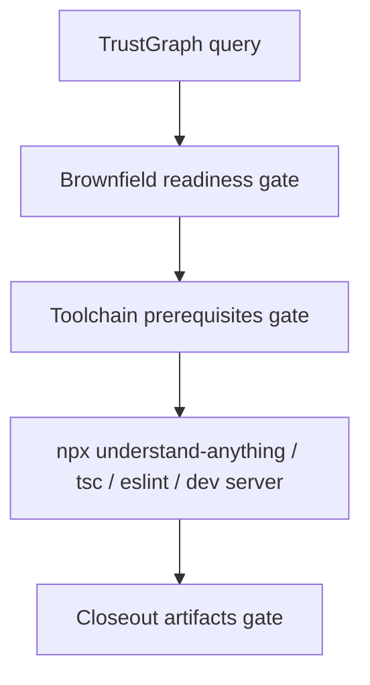

# Plan: Refactor Planning Toolchain Gate

> Feature ID: `017-refactor-planning-toolchain-gate`

## 1. Technical Summary

Add a new validator script `validate_refactor_planning_toolchain.py` and wire it
into `/refactor-planning` workflow and the public command surface contract.

The validator checks:

- `node`, `npm`, `npx` in `PATH`
- ESLint availability via either global `eslint` or local `node_modules/.bin`

## 2. Constitution Gates

- Article I (Scope): this feature only adds a prerequisite gate and wiring; it
  must not widen into refactor engine changes.
- Article IV (Evidence): verification must include a bounded positive fixture
  and a bounded negative fixture, plus command-surface replay evidence.
- Article IX (No improvisation): the workflow must name the exact script call;
  models must not infer prerequisites.
- Article XI (Determinism): the command surface must fail if docs/workflows and
  scripts drift.

## 3. Architecture

The gate is a file-and-PATH check that sits between brownfield readiness and any
runtime-heavy Node commands.

## 4. Contracts

- Contract file: `contracts/refactor-planning-toolchain-contract.md`
- Workflow contract: `.agents/workflows/refactor-planning.md` must run the gate
  before `npx understand-anything`, `npx tsc --noEmit`, `eslint --fix`, or
  `npm run dev`.
- Public command contract: README, `USAGE_GUIDE.md`,
  `SLASH_COMMAND_REGISTRY.md`, and `.agents/scripts/validate_command_surface.py`
  must all name the gate explicitly for `/refactor-planning`.

## 5. Data Model

- Inputs:
  - `root` (target project root)
  - `PATH` (environment executable lookup)
- Required executables:
  - `node`, `npm`, `npx`
  - `eslint` (either global PATH or local `node_modules/.bin/eslint*`)
- Output:
  - pass/fail plus explicit, per-executable diagnostics.

## 6. Agent Routing

- Owner: `marcus-ai-orchestrator`
- Support: optional QA review for bounded fixtures and error messaging
- Write scope: only `/refactor-planning` surfaces and this feature package (no
  app code, no refactor engine changes)
- Handoff: record evidence in `verification.md`, then rebuild the brief so
  `validate_execution_brief_freshness.py` stays green

## 7. Migration and Rollback

- Migration: add the new script and add the workflow stage. Update the registry,
  README, and USAGE so `validate_command_surface.py` can enforce alignment.
- Rollback: remove the stage and script references and delete the validator. The
  command reverts to failing later during runtime-heavy steps.

## 8. Complexity Tracking

- The validator is constant-time relative to repo size. It performs a fixed set
  of PATH lookups and file-existence checks.
- Any attempt to add runtime execution to this gate is considered complexity
  creep and should be rejected during review.

## 9. POC Slice and Review Cadence

POC slice boundary:
- Add the toolchain gate script and wire it into workflow + docs + registry +
  command-surface validation.

Success evidence for the slice:
- Positive fixture passes the toolchain validator.
- Bounded negative fixture fails with the explicit ESLint error.
- `python3 .agents/scripts/validate_command_surface.py --root .` passes.

Stop conditions:
- The gate starts executing runtime commands (`npx understand-anything`, `tsc`,
  `npm run dev`) instead of only checking prerequisites.
- The wiring drifts so command-surface validation fails.

Proceed conditions:
- The gate stays non-invasive and provides actionable failures.
- Evidence is recorded and `execution-brief.md` is rebuilt after evidence changes.

## 10. Implementation Notes

- The validator does not attempt to execute the refactor runtime. It only checks
  the existence of required executables and prints their `--version` output for
  operator diagnostics.
- ESLint is treated as satisfied when either `eslint` is in PATH or when a local
  marker exists under `node_modules/.bin`. This is intentionally pragmatic: most
  enterprise repos install ESLint as a dev dependency, not globally.
- The gate remains portable: it supports Windows-style `eslint.cmd` and `ps1`
  shims.

## 11. Notes

- This feature remains intentionally small. The goal is deterministic workflow
  execution, not richer refactor automation.
