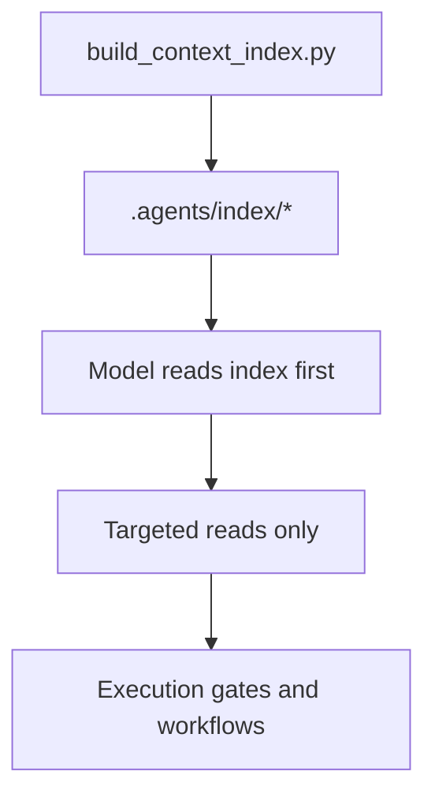

# Plan: Context Index and Architecture Graph

> Feature ID: `018-context-index-and-architecture-graph`

## 1. Technical Summary

Add a deterministic index-first routing layer to `.agents`:

- `build_context_index.py` generates shallow indices + a Mermaid architecture map.
- `validate_context_index.py` enforces presence and bounded freshness.
- Harness execution preflight builds + validates the index before repo-wide gates.
- Core workflows and the slash-command registry reference the index gate so any
  model uses the same entrypoints before reading docs/code/skills.

## 2. Constitution Gates

- Article I/IX: feature is spec-driven and wired into deterministic gates.
- Article IV/XI: verification must include replayable evidence and a smallest
  credible rehearsal (build + validate index + preflight run).
- Article XI: keep the slice cheap; do not escalate into embeddings/vector DB.

## 3. Architecture

## 4. Contracts

- Harness contract: preflight execution must run index build + validate.
- Workflow contract: develop/quick_fix/refactor-planning must mention index-first routing.
- Public contract: slash-command registry and validate_command_surface enforce the presence of index markers.

## 5. Data Model

- `index_manifest.json` records:
  - `generated_at`, `root`, `agents_root`, scan limits, excludes, outputs.

## 6. Agent Routing

- Owner: `marcus-ai-orchestrator`
- Write Scope: `.agents/scripts/*context_index*`, `.agents/index/README.md`,
  `.agents/scripts/run_harness_preflight.py`, `.agents/workflows/*`, README/USAGE,
  `.agents/SLASH_COMMAND_REGISTRY.md`, `.agents/scripts/validate_command_surface.py`,
  and this feature package.

## 7. Migration and Rollback

- Migration: add scripts, wire into harness preflight and workflows, update registry/docs.
- Rollback: remove scripts and references; revert harness preflight command list.

## 8. Complexity Tracking

- O(N) file walk bounded by `--max-files` default (1200) and excludes.
- No semantic summarization, no embeddings, no network.

## 9. POC Slice and Review Cadence

POC slice boundary:
- Generate index on a representative root and validate it.
- Run harness execution preflight and confirm index steps occur first.
- Confirm `validate_command_surface.py` stays green.

Success evidence for the slice:
- Index outputs exist and are non-empty.
- Validator passes immediately after generation.
- Preflight logs show index build/validate before repo-wide gates.

Stop conditions:
- The index becomes expensive (unbounded scans) or starts doing semantic summarization.
- The wiring drifts across README/USAGE/registry/workflows causing contract failures.

Proceed conditions:
- Index remains cheap and deterministic.
- Evidence is recorded in `verification.md` and the brief is rebuilt after updates.

