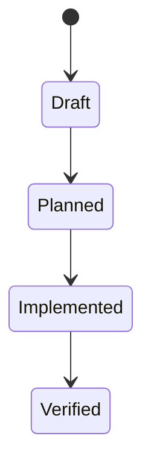

# Data Model: {{FEATURE_TITLE}}

> Feature ID: `{{FEATURE_ID}}`

## Entities

| Entity | Fields | Owner | Notes |
| --- | --- | --- | --- |
| TBD | TBD | TBD | TBD |

## State Transitions

## Validation Rules

- TBD
