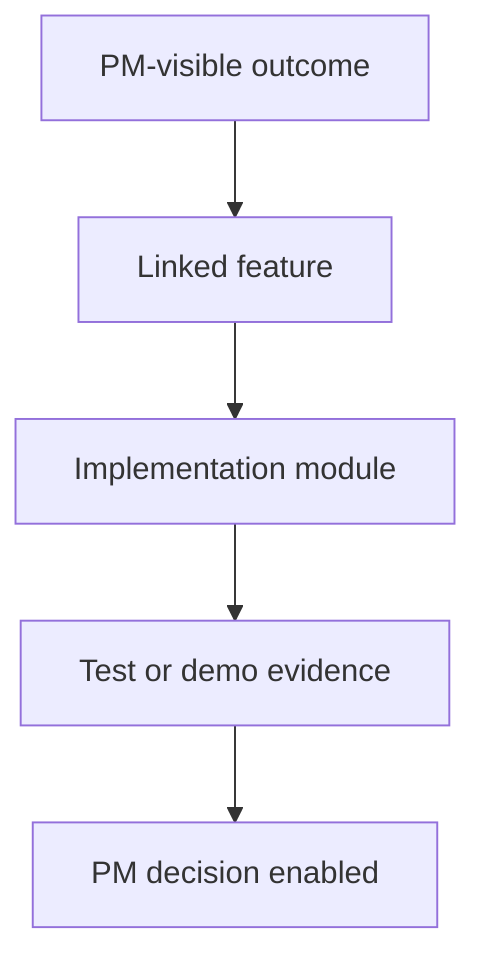

# Epic: <Name>

> QUALITY BAR: replace every placeholder with concrete project facts before
> closing `/develop`. This file must explain PM-visible value, decision
> rationale, evidence, risks, Mermaid diagram, and the exact implementation
> surface. Do not leave `TBD`, `pending`, empty bullets, or unchecked boxes.

## Outcome

Write 2-4 paragraphs explaining the business/user outcome, why this epic matters
for the POC, what changed compared with the original planning docs, and what PM
decision this enables.

## Jira Story

- Story: As a PM, I want this epic outcome delivered so that the POC can prove a measurable business capability.
- Jira issue type: Epic
- Acceptance owner:
- Product hypothesis:
- Research evidence:

## Priority

- Priority: P1
- Severity if missed:
- Rationale:
- Target release:

## PM Notes

- PM-visible status:
- Demo narrative:
- Acceptance impact:
- Scope change since planning:
- Risk or open decision:

## Scope

- Included:
- Excluded:

## Linked Features

- `feature-000`

## Relationship Map

| Relation | Target | Label | Rationale |
| --- | --- | --- | --- |
| Enables | `F-001-001-example` | `ENABLES` | This epic enables the child feature because it defines the outcome boundary. |
| Depends on | `docs/prd.md` | `DEPENDS_ON` | This epic depends on the approved PM problem statement. |

## Issues

| Issue ID | Source | Priority | Status | Owner | Evidence | Resolution |
| --- | --- | --- | --- | --- | --- | --- |
| ISSUE-E-001-001 | QA auto-detect | P1 | Open | `ada-qa-agent` | Validation/manual finding | Pending targeted fix |

## Acceptance Criteria

- [x] Criterion with evidence:

## Mermaid Diagram

## Implementation Notes

- Code paths: `src/example.ts`
- Data/contracts:
- Rollback or feature flag:
- Tradeoffs and rationale:

## Evidence

- Tests:
- Build/lint:
- Review notes:

## Work Log

- Date:
  - Action:
  - Agent/skill:
  - Evidence:
  - Docs updated before code:

## Change Log

- Date:
  - Code change:
  - Documentation update:
  - Evidence:
