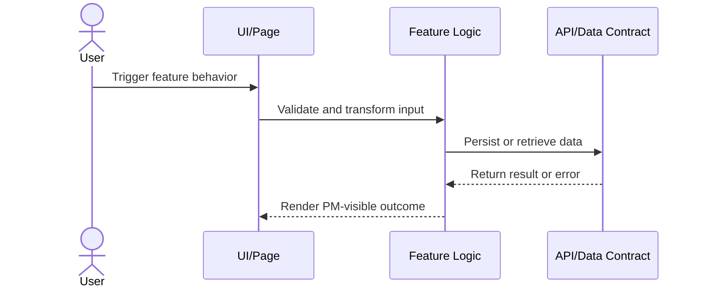

# Feature: <Name>

> QUALITY BAR: this is a PM and engineering handoff, not a stub. Explain user
> value, implementation reasoning, exact code paths, evidence, risks, and what
> changed in docs. Include Mermaid. Do not leave placeholders or unchecked boxes.

## User Value

Write 2-4 paragraphs describing the user-visible behavior, why it matters for
the POC, which requirement it satisfies, and what observable result proves it.

## PM Notes

- Demo scenario:
- Business value:
- Acceptance criteria changed or confirmed:
- Open PM decision:

## Requirements Trace

- PRD requirement:
- Task id:
- Spec id:

## Implementation Plan

- Backend:
- Frontend:
- Data:
- Observability:
- Rationale:

## Code Scope

- Files to create: `src/example.ts`
- Files to modify: `src/example.ts`
- Files intentionally out of scope:

## Mermaid Diagram

## Verification

- [x] Test:
- [x] Build/lint/typecheck:
- [x] Manual scenario:

## Risks

- Risk:
  - Mitigation:

## Change Log

- Date:
  - Code change:
  - Documentation update:
  - Evidence:
