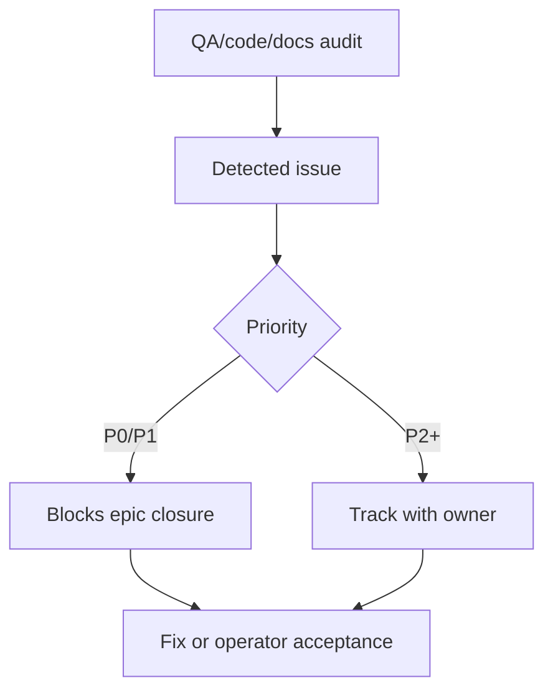

# Epic Issues: <Name>

> QUALITY BAR: this file is the QA and product risk register for one epic. It
> must be generated or reviewed with QA skill reasoning after reading code,
> tests, docs, and related feature relationships. Do not leave template rows,
> pending verification, or generic issue descriptions.

## Jira Story

- Story: As a QA/product team, I want epic issues tracked explicitly so that unresolved risks cannot hide inside narrative docs.
- Jira issue type: Bug/Risk register
- QA owner:
- Product owner:
- Research evidence:

## Priority

- Priority: P1
- Escalation rule:
- Release impact:
- Risk if unresolved:

## QA Issue Register

| Issue ID | Type | Priority | Status | Owner | Source | Evidence | Resolution |
| --- | --- | --- | --- | --- | --- | --- | --- |
| ISSUE-E-001-001 | Risk | P1 | Open | `ada-qa-agent` | Code/docs audit | Validation or manual evidence | Targeted fix required |

## Detection Method

- Code reviewed:
- Tests reviewed:
- Docs reviewed:
- Related features reviewed:
- QA skill used:
- Deep research source checked:

## Open Issues

- Issue:
  - Impact:
  - Affected files:
  - Affected docs:
  - Relationship labels:
  - Resolution plan:

## Relationship Map

| Relation | Target | Label | Rationale |
| --- | --- | --- | --- |
| Blocks epic closure | `E-001-example` | `BLOCKS` | Open P0/P1 issue blocks epic closure until resolved or accepted. |
| Relates to feature | `F-001-001-example` | `RELATES_TO` | Issue impacts or is detected from the related feature. |
| Depends on verification | `T-001-001-001-example` | `DEPENDS_ON` | Issue remains open until verification task passes. |

## Mermaid Diagram

## Work Log

- Date:
  - Action:
  - Agent/skill:
  - Evidence:
  - Docs updated before code:

## Change Log

- Date:
  - Issue change:
  - Documentation update:
  - Evidence:
