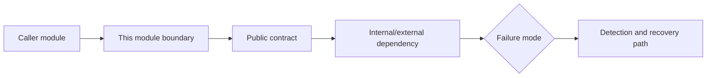

# Module: <Name>

> QUALITY BAR: explain the real module boundary, why the chosen structure is
> correct, what contracts it exposes, how failures are detected, and include
> Mermaid. Do not leave placeholders, pending verification, or generic bullets.

## Responsibility

Write 2-4 paragraphs defining module ownership, why this boundary exists, how it
relates to upstream/downstream modules, and what future agents must not violate.

## Implementation Commentary

- Decision:
- Rationale:
- Tradeoff:
- Impact:
- Risk:

## Code Scope

- Owns: `src/example.ts`
- Reads:
- Writes:
- Must not touch:

## Public Contracts

- API:
- Events:
- Data model:

## Dependencies

- Internal:
- External:

## Failure Modes

- Failure:
  - Detection:
  - Recovery:

## Mermaid Diagram

## Verification

- Unit:
- Integration:
- Runtime:

## Change Log

- Date:
  - Code change:
  - Documentation update:
  - Evidence:
