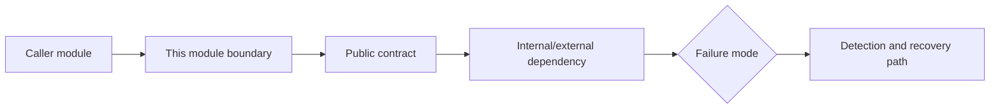

# Module: <Name>

> QUALITY BAR: explain the real module boundary, why the chosen structure is
> correct, what contracts it exposes, how failures are detected, and include
> Mermaid. Do not leave placeholders, pending verification, or generic bullets.

## Responsibility

Write 2-4 paragraphs defining module ownership, why this boundary exists, how it
relates to upstream/downstream modules, and what future agents must not violate.

## Jira Story

- Story: As an engineer, I want this module boundary to be explicit so that dependent features can integrate safely.
- Jira issue type: Story
- Architecture owner:
- Research evidence:

## Priority

- Priority: P1
- Runtime impact:
- Risk if delayed:
- Release target:

## Implementation Commentary

- Decision:
- Rationale:
- Tradeoff:
- Impact:
- Risk:

## Code Scope

- Owns: `src/example.ts`
- Reads:
- Writes:
- Must not touch:

## Relationship Map

| Relation | Target | Label | Rationale |
| --- | --- | --- | --- |
| Provides contract to | `F-001-001-example` | `ENABLES` | This module enables the feature by exposing the required data/behavior contract. |
| Depends on | `M-001-002-example` | `DEPENDS_ON` | This module depends on upstream data or service behavior. |
| Conflicts with | `M-001-003-example` | `CONFLICTS_WITH` | Record overlap or boundary risk when relevant. |

## Public Contracts

- API:
- Events:
- Data model:

## Dependencies

- Internal:
- External:

## Failure Modes

- Failure:
  - Detection:
  - Recovery:

## Mermaid Diagram

## Verification

- Unit:
- Integration:
- Runtime:

## Work Log

- Date:
  - Action:
  - Agent/skill:
  - Evidence:
  - Docs updated before code:

## Change Log

- Date:
  - Code change:
  - Documentation update:
  - Evidence:
