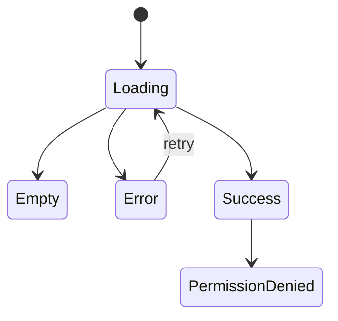

# Page: <Name>

> QUALITY BAR: document the page like a QA-ready product surface. Explain user
> intent, states, accessibility, interaction evidence, and responsive behavior.
> Include Mermaid. Do not leave placeholders, pending verification, or generic
> bullets.

## Route / Surface

- Route:
- Entry component:
- Layout owner:

## PM Notes

- Demo path:
- User promise:
- Acceptance impact:
- Visual or copy change:
- Risk:

## States

- Loading:
- Empty:
- Error:
- Success:
- Permission denied:

## Interactions

- Action:
  - Expected result:
  - Telemetry:

## Accessibility

- Keyboard:
- Screen reader:
- Color/contrast:

## Mermaid Diagram

## Verification

- UI test:
- Screenshot/manual check:
- Responsive check:

## Change Log

- Date:
  - Code change:
  - Documentation update:
  - Evidence:
