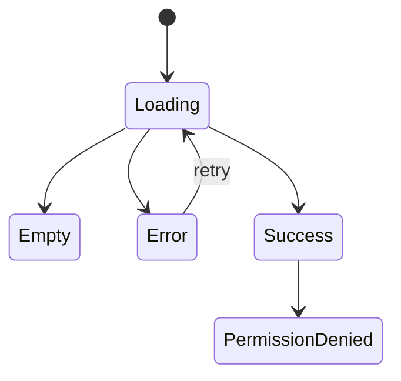

# Page: <Name>

> QUALITY BAR: document the page like a QA-ready product surface. Explain user
> intent, states, accessibility, interaction evidence, and responsive behavior.
> Include Mermaid. Do not leave placeholders, pending verification, or generic
> bullets.

## Route / Surface

- Route:
- Entry component:
- Layout owner:

## Jira Story

- Story: As a user, I want this page to expose the feature clearly so that I can complete the target action.
- Jira issue type: Story
- UX owner:
- Research evidence:

## Priority

- Priority: P1
- Demo impact:
- Risk if delayed:
- Release target:

## PM Notes

- Demo path:
- User promise:
- Acceptance impact:
- Visual or copy change:
- Risk:

## Relationship Map

| Relation | Target | Label | Rationale |
| --- | --- | --- | --- |
| Implements feature | `F-001-001-example` | `IMPLEMENTS` | This page renders the user-visible feature behavior. |
| Uses module | `M-001-001-example` | `USES` | This page uses module data/contracts for state transitions. |
| Related page | `P-001-002-example` | `RELATES_TO` | This page shares navigation or state with another page. |

## States

- Loading:
- Empty:
- Error:
- Success:
- Permission denied:

## Interactions

- Action:
  - Expected result:
  - Telemetry:

## Accessibility

- Keyboard:
- Screen reader:
- Color/contrast:

## Mermaid Diagram

## Verification

- UI test:
- Screenshot/manual check:
- Responsive check:

## Work Log

- Date:
  - Action:
  - Agent/skill:
  - Evidence:
  - Docs updated before code:

## Change Log

- Date:
  - Code change:
  - Documentation update:
  - Evidence:
