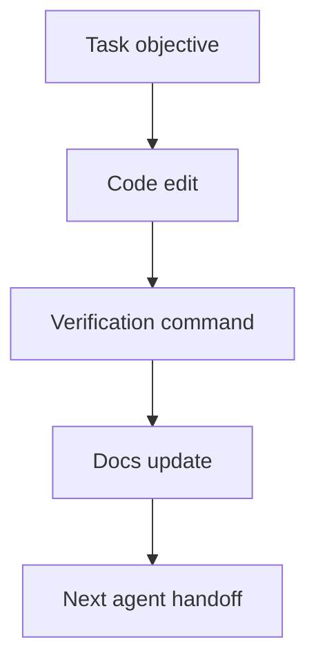

# Task: <Name>

> QUALITY BAR: this note must explain exactly what was done, why it was done,
> what files changed, what evidence exists, and what the next agent should know.
> Include Mermaid. Do not leave placeholders, pending verification, or unchecked
> items.

## Objective

Write 1-2 paragraphs describing the smallest executable work unit, why it is
needed for the POC, and which requirement or bug it resolves.

## Jira Story

- Story: As a delivery team, I want this task completed so that the related story can reach verified status.
- Jira issue type: Task
- Parent story:
- Research evidence:

## Priority

- Priority: P1
- Delivery impact:
- Risk if delayed:
- Target release:

## Implementation Commentary

- Decision:
- Rationale:
- Tradeoff:
- Impact:
- Risk:

## Write Scope

- Allowed files: `src/example.ts`
- Disallowed files:

## Relationship Map

| Relation | Target | Label | Rationale |
| --- | --- | --- | --- |
| Implements | `F-001-001-example` | `IMPLEMENTS` | This task implements a concrete part of the parent story. |
| Blocks | `T-001-001-002-example` | `BLOCKS` | This task must complete before a downstream task can start. |
| Uses | `M-001-001-example` | `USES` | This task edits or verifies the related module contract. |

## Execution Log

- Step:
  - Result:

## Mermaid Diagram

## Verification

- Command:
- Expected output:
- Actual output:

## Handoff

- Next task:
- Blockers:
- Residual risk:

## Work Log

- Date:
  - Action:
  - Agent/skill:
  - Evidence:
  - Docs updated before code:

## Change Log

- Date:
  - Code change:
  - Documentation update:
  - Evidence:
