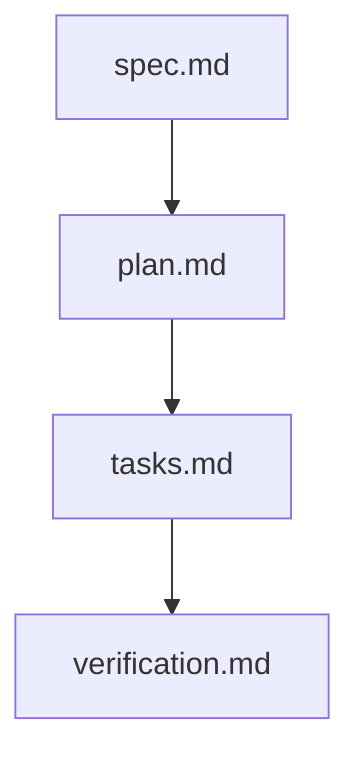

# Implementation Plan: {{FEATURE_TITLE}}

> Feature ID: `{{FEATURE_ID}}`
> Spec: `spec.md`
> Constitution: `.agents/memory/constitution.md`

## 1. Technical Summary

Translate the approved specification into technical design. This document is the
first place where implementation details, libraries, file paths, and migration
strategy belong. Name the code slices, system boundaries, and failure modes that
matter most during execution.

## 2. Constitution Gates

- [ ] Specification has no unresolved `[NEEDS CLARIFICATION]` markers, or the
      operator accepted the residual risk.
- [ ] Contracts are defined before implementation.
- [ ] Verification method is named before implementation.
- [ ] No shell `eval` or unbounded command execution is introduced.
- [ ] No hardcoded production secret is introduced.
- [ ] TypeScript changes avoid `any` unless justified in Complexity Tracking.
- [ ] Rollback path is documented for user-facing or operational changes.

## 3. Architecture

### 3.1 Current State

- Existing modules:
- Current coupling:
- Known constraints:

### 3.2 Target State

- New or changed modules:
- Data flow:
- Operational flow:

### 3.3 Mermaid Diagram

## 4. Contracts

List files under `contracts/` and summarize each contract.

| Contract | Purpose | Producer | Consumer |
| --- | --- | --- | --- |
| TBD | TBD | TBD | TBD |

Contract rules:

- Every contract must name its owner.
- Every contract must say how compatibility is checked.
- If a boundary is intentionally undocumented, explain why that is safe.

## 5. Data Model

Summarize entities from `data-model.md`.

Include validation, lifecycle, and retention constraints where relevant.

## 6. Agent Routing

Summarize ownership from `agent-routing.md`.

| Workstream | Primary Agent | Output | Verification |
| --- | --- | --- | --- |
| TBD | TBD | TBD | TBD |

Execution monitoring:

- Blocking gates before implementation:
- Evidence checkpoints during implementation:
- Escalation condition after repeated failure:

## 7. Migration and Rollback

- Migration steps:
- Rollback steps:
- Compatibility notes:
- Blast radius:
- Containment or feature-flag strategy:

## 8. Complexity Tracking

Use this section only when a constitution gate fails or a new abstraction is
introduced.

| Decision | Reason | Alternative Rejected | Review Needed |
| --- | --- | --- | --- |
| TBD | TBD | TBD | TBD |

## 9. POC Slice and Review Cadence

Define the smallest professional POC slice that can produce evidence without
pretending the full product is done.

- POC slice boundary:
- Success evidence for the slice:
- What remains intentionally unproven after the slice:
- Review cadence:
  - Draft architecture review:
  - Challenge review:
  - Verification readiness review:
- Stop conditions:
- Proceed conditions:
